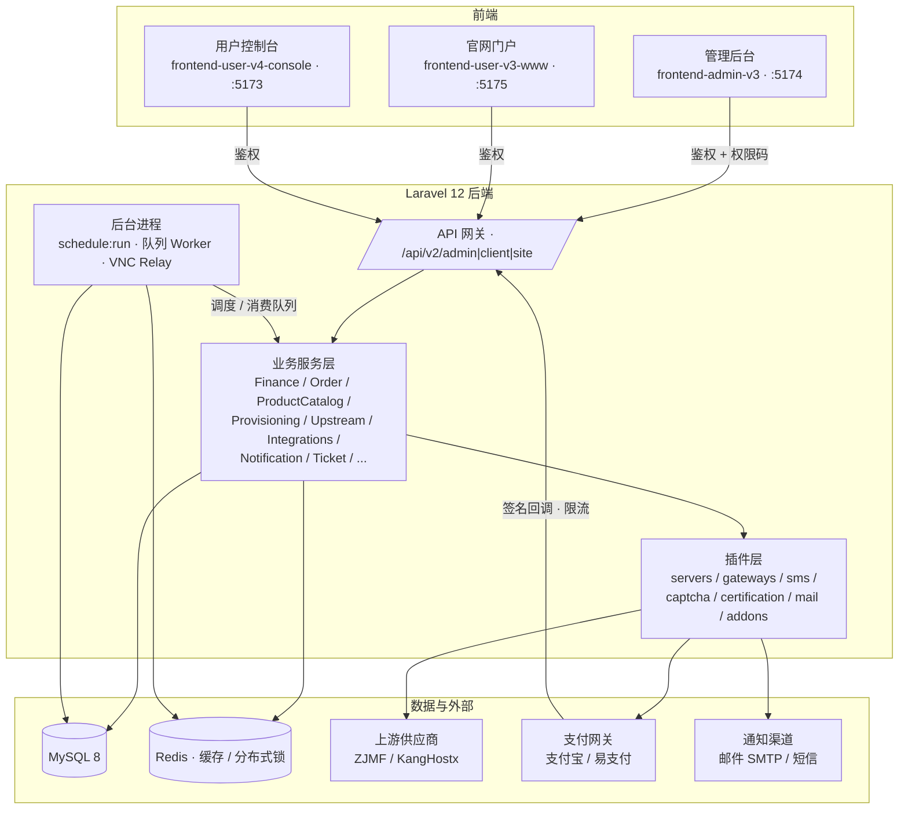

# 创欧云 Caiwu · IDC 业务/财务系统

       [](https://github.com/marketplace/coderabbitai)

面向 IDC / 云服务商的业务与财务经营系统。覆盖商品目录、订单计费、账单结算、自动开通、余额充值、退款、优惠券、分销返佣、提现、工单、通知等完整业务闭环，提供管理后台、官网门户与用户控制台三端前端，并通过可扩展插件机制对接上游供应商与第三方服务。

[文档](docs/README.md) · [架构](docs/ARCHITECTURE.md) · [后端](docs/BACKEND.md) · [前端](docs/FRONTEND.md) · [数据库](docs/DATABASE.md) · [产品规格](docs/产品规格/README.md) · [执行计划](docs/执行计划/README.md)

## ✨ 核心能力

| 能力          | 说明                                                                             |
| ------------- | -------------------------------------------------------------------------------- |
| 🛒 商品与计费 | 三层商品分类、产品配置与定价快照、多计费周期、自动续费、优惠券活动               |
| 📦 订单与开通 | 下单、账单结算、支付回调同步履约、上游自动开通、失败重试与自动挂起/释放          |
| 💰 财务       | 余额账户、充值、退款、账单行项目、分销返佣、推广提现、账务流水                   |
| 🖥️ 服务控制台 | 服务总览、开机/关机/重启、NAT、安全组与状态同步                                  |
| 👤 用户体系   | 注册登录、实名认证（可选）、登录风控（账号 + IP 软锁定、验证码限流）             |
| 🎫 工单系统   | 用户端与管理端工单全流程、催办与关闭                                             |
| 🔔 通知       | 站内信、邮件、短信（模板可配置，渠道插件化）                                     |
| ⚙️ 自动化     | 调度任务、心跳监控、定时对账、自动续费与生命周期管理                             |
| 🔌 插件机制   | 上游服务器、支付、短信、验证码、实名认证、邮件均以插件形式接入，边界清晰、可替换 |

## 🧩 技术栈

| 端         | 技术                                                                                      |
| ---------- | ----------------------------------------------------------------------------------------- |
| 后端       | PHP 8.2+、Laravel 12、Sanctum Token 鉴权、MySQL 8、Redis（缓存与分布式锁）                |
| 管理后台   | Vue 3 + TypeScript + TDesign Vue Next + Vite（`frontend-admin-v3`，开发端口 5174）        |
| 官网门户   | Vue 3 + Element Plus + Vite（`frontend-user-v3-www`，开发端口 5175）                      |
| 用户控制台 | Vue 3 + TypeScript + TDesign Vue Next + Vite（`frontend-user-v4-console`，开发端口 5173） |
| 共享包     | `shared`（跨端会话、HTTP、状态、组件与状态枚举）                                          |

## 🔗 智简魔方财务（ZJMF Finance）兼容

- 作为上游供应商接入：通过 `plugins/servers/zjmf_finance/` 对接智简魔方财务数据面，覆盖商品、库存、开通、续费、状态同步与 ZJMF 专属能力（旧密码兼容、账单恢复）。
- 保持独立 `zjmf_finance_api` provider key，不与其他主机面板适配器混用；适配器显式声明平台可调用方法，不使用动态转发。

## 🔌 插件生态

| 能力域     | 已接入插件                                      |
| ---------- | ----------------------------------------------- |
| 上游服务器 | KangHostx、ZJMF Finance（智简魔方财务）、Demo   |
| 支付网关   | 支付宝（AliPay）、易支付（YiPay）、Demo         |
| 短信服务   | 阿里云短信（Aliyun）、Stay33、Demo              |
| 验证码     | 极验（Geetest）、Vaptcha                        |
| 实名认证   | 百度人脸（BaiduFace）、Stay33、Demo             |
| 邮件       | SMTP、多 SMTP 轮询（MultiSmtpRoundRobin）、Demo |
| 增值扩展   | 演示样式插件（`addons/demo_style`）             |

插件配置中的敏感字段进入加密存储，前端只展示是否已配置和脱敏预览。

## 🏗️ 架构总览



关键边界（详见 [ARCHITECTURE.md](docs/ARCHITECTURE.md)）：

- **记录职责分离**：`orders` 是购买契约（含配置定价快照）、`invoices` 是结算凭证、`payments` 只记录真实第三方资金流入且禁止物理删除。
- **分层调用**：Controller 保持薄层，业务收敛到 Service；第三方与上游调用只走插件目录或 `Services/Upstream` 专用层，业务控制器不直接 `Http::*`。
- **路由统一**：业务接口统一为 `/api/v2/admin|client|site/*`，管理端走 `auth:sanctum` + `ensure.admin` + 权限码，用户端走 `auth:sanctum` + `ensure.client`，回调入口带独立签名与限流。
- **幂等与一致**：支付回调、订单创建、返利计算等关键业务依赖 Redis 锁与唯一约束保证幂等；财务、订单、余额、返佣、开通、回调均要求事务、幂等与审计字段。
- **并发兜底**：生产每分钟 `schedule:run` 并行消费业务队列（`provision,referral,notification,coupon,default`）与 `automation` 队列，各自独立互斥；VNC Relay 独立常驻，不影响心跳、支付、新购或续费；支付回调查询全程限流防重放。

## ✅ 工程与安全基线

- **服务端权威计算**：订单、账单金额由服务端按规则重算，客户端参数不参与计费金额裁决。
- **凭据不落地客户端**：上游凭据仅由服务端插件层持有，客户端与匿名请求无法获得原始上游令牌。
- **无越权读取**：资源查询与操作一律绑定当前用户所有权与权限码，未授权访问统一返回 403/404。
- **防支付重放**：支付网关回调幂等 + 队列互斥，同一笔交易只入账、只履约一次。
- **插件边界**：插件按能力域收敛于 `backend/plugins/{domain}/{slug}/`，不注册系统级路由、调度或全局中间件。
- **审计留痕**：关键资金、订单、后台操作保留审计字段，账务支持导出与归档。

## 🗺️ Roadmap

当前进行中的工作见 [docs/执行计划/README.md](docs/执行计划/README.md)，包括：

- 命名空间统一方案（收敛 composer 包名与 npm workspace 名的孤立不一致）
- 日志归档系统可靠性重构（技术债，冻结未排期）
- 报表中心方案（需评审）
- 日志检索与归档协同（技术债，冻结未排期）
- 产品类型与一级菜单重构方案（需评审）

## 📁 目录结构

```text
caiwu/
├── backend/                  # Laravel 12 后端
│   ├── app/                  # 控制器 / 服务 / 模型 / 命令 / 中间件
│   ├── config/               # 配置（含可选集成占位）
│   ├── database/
│   │   ├── schema/           # 完整结构基线 mysql-schema.sql（新环境初始化）
│   │   ├── migrations/       # 增量迁移（只新增，不修改历史）
│   │   └── seeders/          # 系统默认配置
│   ├── plugins/              # 插件（服务器 / 支付 / 短信 / 验证码 / 实名 / 邮件）
│   ├── routes/               # api.php / v2-admin.php / v2-client.php / web.php / console.php
│   └── scripts/              # 构建、安装与运维脚本
├── frontend-admin-v3/        # 管理后台（开发端口 5174）
├── frontend-user-v3-www/     # 官网门户（开发端口 5175）
├── frontend-user-v4-console/ # 用户控制台（开发端口 5173）
├── shared/                   # 跨前端共享包（会话、HTTP、状态、组件）
└── docs/                     # 长期文档记录系统（索引见 docs/README.md）
```

## 🔧 环境要求

- PHP 8.2+（扩展：`pdo_mysql`、`redis`、`mbstring`、`openssl`、`zip` 等）
- MySQL 8.0+
- Redis 6.0+
- Composer 2.x
- Node.js 20.19+（前端 workspace 约束）

## 🚀 快速开始（开发环境）

> 本地联调统一使用 `127.0.0.1`，不要混用 `localhost`。完整步骤见 [本地启动指南](docs/参考资料/运维/本地启动指南.md)。

### 1. 后端

```bash
cd backend
composer install
cp .env.example .env
# 编辑 .env：DB_HOST / DB_PORT / DB_DATABASE / DB_USERNAME / DB_PASSWORD，
# 以及 APP_URL / FRONTEND_URL / CLIENT_CONSOLE_URL / ADMIN_URL（四个必须互不相同且协议一致）
php artisan key:generate
php artisan migrate
php artisan db:seed --class=Database\\Seeders\\SettingsSeeder
```

初始化新库也可先导入 `database/schema/mysql-schema.sql` 完整基线再执行增量迁移（高影响操作，参见安装脚本 `backend/scripts/install_db.py`）。

创建管理员：

```bash
php artisan tinker
App\Models\AdminUser::create([
    'username' => 'admin',
    'password' => 'password',
    'role_id'  => 1,
    'nickname' => '管理员',
]);
```

启动开发服务（统一入口，会拉起 HTTP、VNC Relay 与业务队列 Worker）：

```bash
php artisan app:serve
```

### 2. 前端

```bash
# 仓库根目录安装依赖（npm workspaces）
npm install

# 分别启动三端（官网 5175 / 控制台 5173 / 管理端 5174）
npm run dev:user-v3-www
npm run dev:user-v4-console
npm run dev:admin-v3
```

### 3. 后台进程（生产）

生产环境不使用 `app:serve` 常驻：PHP-FPM 指向 `backend/public`，宝塔每分钟执行 `php artisan schedule:run`（并行消费业务队列与 `automation` 队列），并单独常驻 `php artisan vnc:relay`。详见 [部署与调度指南](docs/参考资料/运维/部署与调度指南.md)。

## 🏗️ 构建前端产物

`npm run build:frontends` 读取 `backend/.env` 中的 `APP_URL` / `FRONTEND_URL` / `CLIENT_CONSOLE_URL` / `ADMIN_URL`（四个地址必须互不相同且协议一致），依次构建三端并输出到各自 `dist/`。

## 🧪 验证与测试

```bash
# 后端（静态分析 / 格式检查）
cd backend && composer analyse && composer format:check

# 文档（目录、链接与状态一致性）
npm run docs:check

# 前端（类型 / 构建 / 重构校验）
npm run typecheck:frontends
npm run build:frontends
npm run verify:frontends
```

## 📚 文档

- [文档记录系统 docs/README.md](docs/README.md) —— 全部长期文档的唯一入口
- [架构 ARCHITECTURE.md](docs/ARCHITECTURE.md) · [后端 BACKEND.md](docs/BACKEND.md) · [前端 FRONTEND.md](docs/FRONTEND.md) · [数据库 DATABASE.md](docs/DATABASE.md) · [视觉约束 DESIGN.md](docs/DESIGN.md)
- [产品规格](docs/产品规格/README.md) · [执行计划](docs/执行计划/README.md) · [参考资料](docs/参考资料/README.md) · [自动生成](docs/自动生成/README.md)

## 💬 交流群

财务系统开发交流群：`994857138`


## 📄 开源许可

本项目采用**双轨授权**模式（详见 [COMMERCIAL_LICENSE.md](COMMERCIAL_LICENSE.md)）：

- **开源授权**：GNU Affero General Public License v3.0 或更高版本（AGPL-3.0-or-later），见根目录 [LICENSE](LICENSE)。网络服务（SaaS）同样适用，防止闭源分叉。
- **商业授权**：需要在闭源或受限条件下部署、修改、二次开发的企业用户，可联系项目方获取，免除 AGPL 第 13 条网络交互开源义务。

前端 `frontend-admin-v3` 与 `frontend-user-v4-console` 基于 [TDesign Vue Next Starter](https://github.com/Tencent/tdesign-vue-next-starter) 构建，其原始代码与许可声明继续遵循 MIT（见各前端目录 `LICENSE`）。
