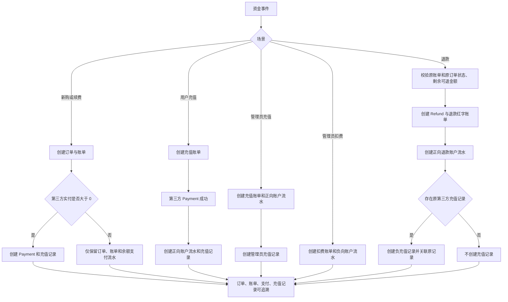

# 财务单据生成规则

## 1. 范围与实体映射

本规则覆盖新购、续费、用户充值、退款、管理员扣费、管理员充值、补录账单、补录订单八类资金事件。

项目内的术语映射如下：

| 业务术语   | 权威实体                                      | 作用                                                                                     |
| ---------- | --------------------------------------------- | ---------------------------------------------------------------------------------------- |
| 订单       | `orders` / `Order`                            | 记录服务交易和履约明细；纯账户充值、管理员余额调整可省略。                               |
| 账单       | `invoices` / `Invoice`                        | 财务主单据，记录应收、已收、充值、扣费和退款红字账单。                                   |
| 账户流水   | `account_transactions` / `AccountTransaction` | 记录现金账户余额变化，是账单支付和余额入账的流水凭证。                                   |
| 第三方支付 | `payments` / `Payment`                        | 仅记录支付宝、微信等真实外部资金流入；余额、免费、人工开通不得创建 `Payment`。           |
| 充值记录   | `recharge_records` / `RechargeRecord`         | 记录余额入账来源或退款对原第三方入账来源的冲抵。                                         |
| 退款单     | `refunds` / `Refund`                          | 记录一次退款操作；同时生成关联原账单的退款红字账单。                                     |

`Invoice` 是当前架构中的账单主体，不能另建平行的 `bills` 表。`AccountTransaction` 是余额变动流水，补足账单支付、充值、扣费和退款的可审计证据。

补录场景（管理员登记系统外收付）是 `Payment` 语义的唯一例外：补录入账会创建 `gateway=manual` 的 `Payment` 行，仅作为审计凭证（`callback_raw.source=admin_manual_entry` 记录操作人与交易号），不代表任何第三方资金流入，也不生成充值记录。

## 2. 设计决策

- 每个写入由 `PaymentService` 在数据库事务和业务锁内协调，`FinanceDocumentService` 只负责单据关联、金额校验和幂等创建。
- 所有新增金额列使用 `decimal(12,2)`，所有单据和账户流水币种固定写入 `CNY`。
- 充值记录以 `payment_id` 或 `account_transaction_id` 唯一约束实现幂等；支付回调、状态轮询重复触发时不会重复建档。
- 退款使用独立 `refunds` 行和 `invoices.type=refund` 红字账单，而不物理删除原订单、原账单或原支付记录。
- `Payment` 仍只记录第三方资金。纯余额支付退款允许没有 `Payment`，但仍必须生成退款单、红字账单和账户流水。

## 3. 数据库设计

迁移文件：

- `backend/database/migrations/2026_07_18_190000_create_finance_document_records.php`
- `backend/database/migrations/2026_07_18_191000_add_currency_to_finance_documents.php`

### 3.1 既有表的新增字段

| 表                     | 字段                | 约束/默认值                          | 用途                     |
| ---------------------- | ------------------- | ------------------------------------ | ------------------------ |
| `invoices`             | `origin_invoice_id` | 可空，外键 → `invoices.id`，删除置空 | 退款红字账单关联原账单。 |
| `orders`               | `currency`          | `char(3)`，默认 `CNY`                | 订单币种。               |
| `invoices`             | `currency`          | `char(3)`，默认 `CNY`                | 账单币种。               |
| `payments`             | `currency`          | `char(3)`，默认 `CNY`                | 第三方支付币种。         |
| `account_transactions` | `currency`          | `char(3)`，默认 `CNY`                | 账户流水币种。           |

默认值会将历史行补为 `CNY`，新写入不允许省略币种语义。

### 3.2 `refunds`

| 字段                                                                                 | 说明                                     |
| ------------------------------------------------------------------------------------ | ---------------------------------------- |
| `refund_no`                                                                          | 唯一退款单号。                           |
| `user_id`、`invoice_id`                                                              | 退款所属用户与原账单。                   |
| `refund_invoice_id`                                                                  | 关联本次创建的退款红字账单。             |
| `payment_id`                                                                         | 原第三方支付，可空；纯余额支付退款为空。 |
| `amount`、`currency`、`refund_method`、`status`                                      | 退款金额、币种、渠道和状态。             |
| `reason`、`operator_type`、`operator_id`、`operator_name`、`refunded_at`、`trace_id` | 退款原因、管理员审计信息、时间和链路号。 |

### 3.3 `recharge_records`

| 字段                                            | 说明                                                                     |
| ----------------------------------------------- | ------------------------------------------------------------------------ |
| `record_no`                                     | 唯一充值记录号。                                                         |
| `user_id`、`order_id`、`invoice_id`             | 用户、订单和账单关联；无订单场景允许 `order_id` 为空。                   |
| `payment_id`                                    | 第三方支付关联，唯一且可空。                                             |
| `account_transaction_id`                        | 账户流水关联，唯一且可空。                                               |
| `refund_id`、`origin_recharge_record_id`        | 退款单及被冲抵的原充值记录。                                             |
| `scene`                                         | `new_purchase`、`renewal`、`user_recharge`、`admin_recharge`、`refund`。 |
| `direction`、`amount`、`currency`、`entry_type` | 收入/冲抵方向、两位小数金额、`CNY`、具体来源类型。                       |
| `remark`、`operator_*`、`trace_id`              | 业务备注、管理员审计和链路追踪。                                         |

关键索引：`invoice_id`、`order_id`、`origin_recharge_record_id`、`user_id + created_at`；退款冲抵通过自关联记录可完整追溯。

## 4. 八类场景规则

| 场景       | 必建单据                                         | 充值记录                           | 金额与关联规则                                                                               |
| ---------- | ------------------------------------------------ | ---------------------------------- | -------------------------------------------------------------------------------------------- |
| 新购       | `Order` + `Invoice`                              | 仅第三方实付金额大于 0 时创建      | 充值记录关联订单、账单、支付；混合支付仅记录第三方部分。                                     |
| 续费       | `Order` + `Invoice`，`type=renew`                | 同新购                             | 支付完成时校验 `账单金额 = 余额支付额 + 第三方支付额`。                                      |
| 用户充值   | `Invoice(type=recharge)` + `AccountTransaction`  | 必建                               | 充值记录绑定账单、第三方支付和余额入账流水；当前纯账户充值不建订单。                         |
| 退款       | `Refund` + `Invoice(type=refund)` + 账户流水     | 仅有原第三方充值记录时创建负数记录 | 红字账单以 `origin_invoice_id` 指向原账单；负记录以 `origin_recharge_record_id` 指向原来源。 |
| 管理员扣费 | `Invoice(type=deduction)` + `AccountTransaction` | 禁止创建                           | 记录操作人、时间、原因、用户和链路号。                                                       |
| 管理员充值 | `Invoice(type=recharge)` + `AccountTransaction`  | 必建                               | `remark` 固定为“管理员手工充值”，并记录操作人、时间、原因。                                  |
| 补录账单   | `Invoice(type=manual)` + `Payment(gateway=manual)` | 禁止创建，不动余额               | 仅记账：无订单、无账户流水；`callback_raw.source=admin_manual_entry` 留操作人/交易号审计。   |
| 补录订单   | `Order(直接已支付)` + `Invoice(投影 type)` + `Payment(gateway=manual)` | 禁止创建，不动余额 | 仅 `renew`/`upgrade`，实例归属强校验；固定不触发开通/续期业务流转；同实例有待支付订单时拒绝。 |

金额约束：

1. 新购和续费：订单金额、账单金额、余额支付额与第三方支付额之和必须一致；存在充值记录时，记录金额等于第三方实付额。
2. 用户充值、管理员充值：充值记录金额必须与充值账单和正向账户流水金额一致。
3. 管理员扣费：账户流水金额为负数，不得创建充值记录。
4. 退款：退款金额不得超过原单剩余可退金额；负充值记录金额的绝对值不得超过原充值记录剩余可冲抵金额。混合支付退款可包含余额部分，此部分不生成负充值记录。
5. 所有金额以数据库 `decimal(12,2)` 保存，服务写入时统一格式化为两位小数。

## 5. 业务流程图



## 6. 对外接口契约

系统复用既有 v2 管理端路由，不新增平行接口。统一成功响应保持 `code = 0`。

### 6.1 管理员余额调整

`POST /api/v2/admin/users/{user}/recharges`

- 权限：`user.recharge`
- 请求体：

```json
{
  "amount": 100.0,
  "remark": "活动补偿充值"
}
```

- `amount > 0` 为管理员充值，`amount < 0` 为管理员扣费；不得为 0。
- `remark` 必填，最大 200 个字符。
- 响应中的 `detail.documents` 为新增关联信息：

```json
{
  "code": 0,
  "data": {
    "id": 42,
    "status": "completed",
    "message": "余额增加成功",
    "detail": {
      "type": "balance_adjustment",
      "user": { "id": 42 },
      "adjustment": { "amount": "100.00", "direction": "increase" },
      "documents": {
        "invoice_id": 501,
        "account_transaction_id": 801,
        "recharge_record_id": 901
      }
    }
  }
}
```

扣费时 `recharge_record_id` 为 `null`。

### 6.2 管理员退款到账户余额

`POST /api/v2/admin/users/{user}/invoices/{invoice}/refunds`

- 权限：`invoice.manage`
- 请求体：

```json
{
  "refund_method": "balance",
  "amount": 100.0,
  "remark": "服务无法交付，退款到余额",
  "scope": ["order", "payment"]
}
```

- `refund_method` 仅接受 `balance` 或 `original`；`balance` 走本规则的退款闭环。
- 原账单必须为已支付，关联订单必须为已支付（对应 `OrderStatus::PAID`）。
- `amount` 可省略（表示剩余可退金额），填写时不得超过剩余可退金额。
- 响应中的 `detail.documents` 用于立即查询本次生成的单据：

```json
{
  "refund_id": 1001,
  "refund_invoice_id": 1002,
  "recharge_record_id": 1003
}
```

纯余额支付退款没有原第三方充值记录时，`recharge_record_id` 为 `null`。

### 6.3 管理员补录账单

`POST /api/v2/admin/users/{user}/manual-invoices`

- 权限：`invoice.manual_entry`（专用权限码，默认不下发任何内置角色，仅 super_admin 可授权）
- 语义：登记系统外收付，仅记账，不改变用户余额、不产生账户流水与充值记录。
- 请求体：

```json
{
  "amount": 88.5,
  "paid_at": "2026-09-23 10:00:00",
  "trade_no": "OFFLINE-20260923-001",
  "payment_gateway": "bank_transfer",
  "remark": "线下收款补录"
}
```

- `amount` 必填，`0.01 ~ 999999`，最多两位小数；`type` 服务端锁死 `manual`，不接受前端传入。
- `paid_at` 可省略（默认当前时间），不得晚于当前时间；`trade_no` 可省略，填写时按用户查重（同用户已有相同交易号的支付记录即拒绝）。
- `payment_gateway` 必填，枚举 `cash|bank_transfer|alipay|wechat|other`（线下收款渠道）。**仅作审计记录**：写入 `Payment.callback_raw.payment_gateway` 与操作日志，`Payment.gateway` 对账权威口径固定 `manual`，此值不参与网关路由与对账。
- 入账为两步一事务：`createDirect`（`type=manual`、待支付）→ `markPaidManually`（`sync_business_flow=false`），产出 `Invoice(type=manual, status=PAID)` 与 `Payment(gateway=manual, status=SUCCESS)`。
- 审计：`Payment.callback_raw` 记录 `source=admin_manual_entry`、`operator_id`、`operator_name`、`trade_no`、`remark`；`OperationLogService` 写 `invoice.payment.mark_paid`。

### 6.4 管理员补录订单

`POST /api/v2/admin/users/{user}/manual-orders`

- 权限：`order.manual_entry`（专用权限码，默认不下发）
- 约束：仅接受 `type=renew|upgrade`（新购走「添加实例」`POST /users/{user}/services`）；`service_id` 必填且必须归属路由用户；该实例存在待支付订单时拒绝；固定不触发开通/续期业务流转（实例状态与到期时间不变）。
- 请求体：

```json
{
  "service_id": 12,
  "type": "renew",
  "amount": 200.0,
  "billing_cycle": "monthly",
  "trade_no": "OFFLINE-20260923-002",
  "payment_gateway": "bank_transfer",
  "remark": "线下续费补录"
}
```

- 入账为同一事务三步：`Order::create`（待支付）→ `InvoiceService::createFromOrder` 投影账单（`renew→Invoice(type=renew)`、`upgrade→Invoice(type=upgrade)`）→ `markPaidManually`，订单与账单被置为已支付并补 `Payment(gateway=manual)`。
- `billing_cycle` 可省略，默认跟随实例当前周期；`payment_gateway` 语义同 6.3（必填枚举，仅审计记录）。

### 6.5 充值幂等键

`POST /api/v2/admin/users/{user}/recharges` 请求体新增可选 `idempotency_key`（最长 64 字符）：

- 传入时以 `lock:admin:balance-adjust:{user_id}:{md5(key)}` 做缓存占位（10 分钟）：同一键 10 分钟内仅入账一次，重复请求直接拒绝；入账失败释放占位允许修正重试，成功后保留占位拦截重放。
- 前端在打开充值对话框时生成 UUID，提交复用；省略该键时保持既有行为（仅用户行锁）。

## 7. 审计与安全边界

- 管理端接口使用 Sanctum 管理员认证与既有权限中间件；控制器只传递已校验请求给服务层。
- 管理员充值、扣费和退款都写入操作人、操作时间、原因/备注、用户、账单和 `trace_id`；退款账户流水同步记录操作人和链路号。
- 补录账单/补录订单挂专用权限码 `invoice.manual_entry` / `order.manual_entry`，两者均不在 `adminDefaultPermissions()` 默认下发清单中，避免随 `invoice.manage` / `order.manage` 对全体管理员静默提权；服务层强制 `service_id` 归属校验与 `trade_no` 按用户查重。
- 已入账的手工补录账单暂无撤销接口（cancel 仅限待支付）：错录需先走红字冲抵方案（未实现，见执行计划）；不要引导用户使用「退款到余额」，那会把系统外收款错误地转为余额。
- 退款、充值回调和余额调整均在事务内处理；支付回调和充值记录以唯一键保证幂等，管理员充值额外支持 `idempotency_key` 占位幂等。
- 不返回第三方回调原文、密钥、令牌或敏感账户信息；接口只返回可追溯的内部单据 ID。
