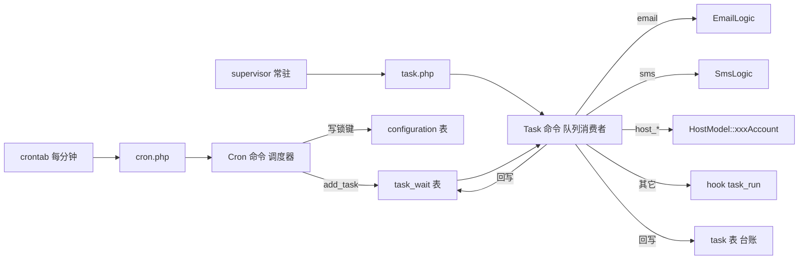
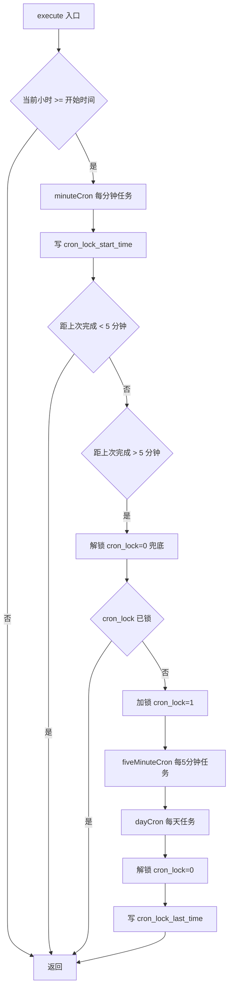
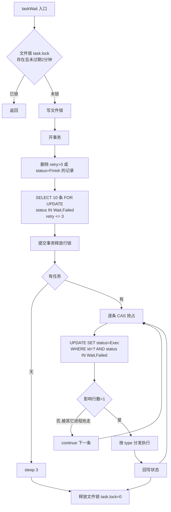
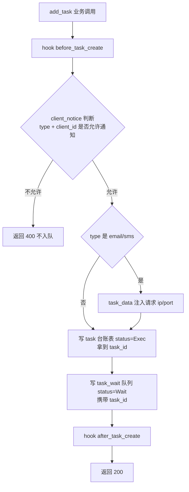
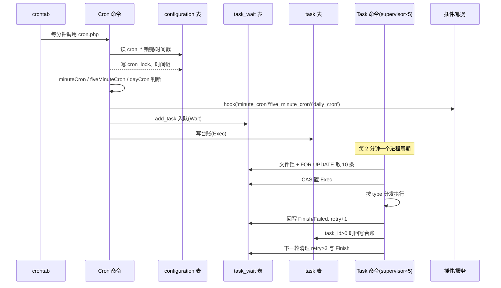

# Zjmf 定时任务系统解析（v10.4.6）

- 文档性质：智简魔方（ZJMF-CBAP 10.4.6）定时任务系统源码深度解析，仅描述 Zjmf 自身方案
- 解析真源：`ZJMF-CBAP-10.4.6/10.4.6/cron/`、`ZJMF-CBAP-10.4.6/10.4.6/app/command/Cron.php`、`Task.php`、`app/common.php`、`app/common/model/TaskModel.php`、`TaskWaitModel.php`、`app/admin/controller/TaskController.php`、`public/install/idcsmart.sql`
- 当前状态：静态审查完成；未变更任何代码与数据。

## 概述

Zjmf 定时任务系统由**两个相互独立的 ThinkPHP 控制台命令**组成：

- `cron` 命令（调度器）：由系统 crontab 每分钟调用一次，内部按"每分钟 / 每 5 分钟 / 每天"三个粒度分发业务任务；业务动作不直接执行，而是投递到任务队列。
- `task` 命令（队列消费者）：由 supervisor 常驻拉起，消费 `task_wait` 表中的任务，执行邮件、短信、主机操作与插件任务，并回写 `task`/`task_wait` 双表台账。

整体数据流：



## 1. 入口与命令注册

两个入口脚本只做框架引导，业务全部在命令类：

```php
// cron/cron.php
$output = (new App())->console->call('cron');
echo $output->fetch();
```

```php
// cron/task.php
$output = (new App())->console->call('task');
echo $output->fetch();
```

命令注册于 `config/console.php`：

```php
'commands' => [
    'cron' => 'app\command\Cron',
    'task' => 'app\command\Task',
],
```

部署形态：

| 命令   | 拉起方式                   | 说明                                                                                           |
| ------ | -------------------------- | ---------------------------------------------------------------------------------------------- |
| `cron` | crontab 每分钟一次         | 每次调用完成"判断 + 入队"后即退出                                                              |
| `task` | supervisor 建议 5 进程常驻 | 每个进程单次最多运行 2 分钟自动退出，由 supervisor 再次拉起；多进程互斥靠文件锁 + 数据库悲观锁 |

## 2. 调度器：Cron 命令

### 2.1 主流程（`execute()`）



关键行为：

1. 分钟任务 `minuteCron()` 不设防重，每次 crontab 调用都执行。
2. 5 分钟与日任务通过 `configuration` 表时间戳防重（见 2.2）。
3. 整个调度器只做"判断 + 入队（`add_task`）"，任何耗时动作都在队列消费者里完成。
4. 调度器入口的首行 `if (date('G')<($config['cron_day_start_time']??1))` 中 `$config` 在赋值前使用，实际恒取默认值 1，即"凌晨 0 点整直接返回"。

### 2.2 锁与时间戳体系（`configuration` 表）

所有 `cron_` 前缀键存于 `idcsmart_configuration` 表，`cronConfig()` 统一读取，并在读取时对异常值做初始化兜底：

| 键                                | 用途                                            | 空值兜底           |
| --------------------------------- | ----------------------------------------------- | ------------------ |
| `cron_lock`                       | 进程锁 0/1                                      | —                  |
| `cron_lock_start_time`            | 本次执行开始时间                                | 重置为 now-15 分钟 |
| `cron_lock_last_time`             | 上次完成时间；间隔 <5 分钟跳过，>5 分钟自动解锁 | 重置为 now-10 分钟 |
| `cron_lock_five_minute_last_time` | 5 分钟任务上次执行时间                          | 重置为 now-10 分钟 |
| `cron_lock_day_last_time`         | 日任务上次执行时间；当天已执行则跳过            | 重置为昨天         |

### 2.3 三层任务分发

| 层级               | 触发条件                                            | 业务内容                                                                                                       |
| ------------------ | --------------------------------------------------- | -------------------------------------------------------------------------------------------------------------- |
| `minuteCron()`     | 每次调用                                            | 删除到期回收站订单；`hook('minute_cron')`                                                                      |
| `fiveMinuteCron()` | 距上次 >= 5 分钟                                    | 刷新短信模板状态；主机到期暂停/删除入队；下游商品同步；`hook('five_minute_cron')`；对象存储异常通知            |
| `dayCron()`        | 距上次 >= 24 小时、当天未执行、当前小时 >= 开始时间 | 主机续费提醒（2 次）、逾期提醒（3 次）、订单未付款通知、未付款订单自动删除、下游商品同步；`hook('daily_cron')` |

### 2.4 业务方法明细

#### minuteCron：删除到期回收站订单

```php
$id = $OrderModel->where('is_recycle', 1)
    ->where('will_delete_time', '>', 0)
    ->where('will_delete_time', '<=', $time)
    ->limit(1000)->column('id');
// 命中后 OrderModel::batchDeleteOrder(..., 'recycle_bin')
```

回收站订单到期后由分钟任务批量物理清理，单批上限 1000 条，每分钟最多清一批。

#### fiveMinuteCron：短信模板状态刷新

对启用状态（`status=1`）的短信模板按 `sms_name` 分组，逐个调用 `SmsTemplateModel::statusSmsTemplate()` 重新校验模板在短信服务商侧的状态。

#### fiveMinuteCron：主机到期暂停/删除（`hostModule`）

扫描窗口统一为"**到期日 == 今天**"（`due_time` 落在今天 0 点至当前时刻之间）：

- 暂停：`status=Active`、`billing_cycle` 非 `free/onetime`、逾期 `cron_due_suspend_day` 天 → 入队 `host_suspend`
- 删除：`status=Active,Suspended`、逾期 `cron_due_terminate_day` 天 → 入队 `host_terminate`

#### dayCron：主机续费提醒（`hostDue`，2 次）

| 次序   | 开关                              | 触发窗口                                                       | 动作                                      |
| ------ | --------------------------------- | -------------------------------------------------------------- | ----------------------------------------- |
| 第一次 | `cron_due_renewal_first_swhitch`  | `due_time` 落在"到期前 `cron_due_renewal_first_day` 天"的当天  | 入队 email + sms（`host_renewal_first`）  |
| 第二次 | `cron_due_renewal_second_swhitch` | `due_time` 落在"到期前 `cron_due_renewal_second_day` 天"的当天 | 入队 email + sms（`host_renewal_second`） |

约束：`status=Active`、`billing_cycle` 非 `free/onetime`。第一次提醒前先触发 `hook('before_host_renewal_first')`，且入队前复查 `due_time` 仍在窗口内（防止执行期间变化导致误发）。

#### dayCron：主机逾期提醒（`hostOverdue`，3 次）

| 次序   | 开关                          | 触发窗口                              | 动作                                      |
| ------ | ----------------------------- | ------------------------------------- | ----------------------------------------- |
| 第一次 | `cron_overdue_first_swhitch`  | 逾期 `cron_overdue_first_day` 天当天  | 入队 email + sms（`host_overdue_first`）  |
| 第二次 | `cron_overdue_second_swhitch` | 逾期 `cron_overdue_second_day` 天当天 | 入队 email + sms（`host_overdue_second`） |
| 第三次 | `cron_overdue_third_swhitch`  | 逾期 `cron_overdue_third_day` 天当天  | 入队 email + sms（`host_overdue_third`）  |

约束：`status=Active,Suspended`、`billing_cycle` 非 `free/onetime`。

后台保存配置时强制校验天数升序：**第一次逾期提醒 < 第二次 < 第三次 < 到期删除天数**（`ConfigurationModel` 保存逻辑），保证提醒节奏与暂停/删除动作不冲突。

#### dayCron：订单未付款通知（`orderOverdue`）

`status=Unpaid`、`is_recycle=0`、`create_time` 落在"未付款 `cron_order_overdue_day` 天"当天 → 入队 email + sms（`order_overdue`）。

#### dayCron：未付款订单自动删除（`orderUnpaidDelete`）

`type<>artificial`、`status=Unpaid`、`is_recycle=0`、`create_time <=` 目标日 23:59:59 → 逐个 `OrderModel::deleteOrder(['id'=>..., 'delete_host'=>1])`（删除订单同时删除关联主机）。

#### dayCron / fiveMinuteCron：下游商品同步（`downstreamSyncProduct`）

对每个上游供应商：调用上游商品列表接口，按汇率与利润率（`profit_type`：1 固定加价 / 2 百分比）重算本地商品价格与周期，刷新供应商汇率，并同步上游自定义字段。`type=finance`（魔方财务）特殊处理 `pay_type`。

#### fiveMinuteCron：对象存储异常通知（`ossExceptionNotice`）

反射调用已启用的对象存储插件联通性检查；异常时向配置的管理员分别入队 email + sms（`oss_exception_notice`）。

### 2.5 全部 cron 配置项与默认值（idcsmart.sql）

| 键                                                      | 默认值  | 含义                                                           |
| ------------------------------------------------------- | ------- | -------------------------------------------------------------- |
| `cron_lock`                                             | 0       | 定时任务进程锁                                                 |
| `cron_lock_start_time`                                  | —       | 本次执行开始时间                                               |
| `cron_lock_last_time`                                   | —       | 上次完成时间                                                   |
| `cron_lock_five_minute_last_time`                       | —       | 5 分钟任务上次执行时间                                         |
| `cron_lock_day_last_time`                               | —       | 日任务上次执行时间                                             |
| `task_time`                                             | —       | 队列消费者进程执行时长上限，超时程序退出                       |
| `cron_day_start_time`                                   | 0       | 自动任务开始小时                                               |
| `cron_due_suspend_swhitch` / `cron_due_suspend_day`     | 1 / 2   | 到期 2 天后暂停                                                |
| `cron_due_unsuspend_swhitch`                            | 1       | 财务暂停付款后自动解封（支付流程触发，非 cron 命令）           |
| `cron_due_terminate_swhitch` / `cron_due_terminate_day` | 1 / 7   | 到期 7 天后删除                                                |
| `cron_due_renewal_first_swhitch` / `_day`               | 1 / 7   | 提前 7 天第一次续费提醒                                        |
| `cron_due_renewal_second_swhitch` / `_day`              | 1 / 3   | 提前 3 天第二次续费提醒                                        |
| `cron_overdue_first_swhitch` / `_day`                   | 1 / 3   | 逾期 3 天第一次提醒                                            |
| `cron_overdue_second_swhitch` / `_day`                  | 1 / 4   | 逾期 4 天第二次提醒                                            |
| `cron_overdue_third_swhitch` / `_day`                   | 1 / 6   | 逾期 6 天第三次提醒                                            |
| `cron_ticket_close_swhitch` / `_day`                    | 1 / 3   | 自动关闭工单开关/时长（小时；由插件消费，cron 命令不含此逻辑） |
| `cron_aff_swhitch`                                      | 1       | 推介月报开关（由插件消费）                                     |
| `cron_order_overdue_swhitch` / `_day`                   | 1 / 1   | 订单未付款通知                                                 |
| `cron_order_unpaid_delete_swhitch` / `_day`             | 空 / 空 | 订单未付款自动删除（默认关闭）                                 |

## 3. 队列消费者：Task 命令

### 3.1 进程生命周期（`execute()`）

```php
ignore_user_abort(true);
set_time_limit(0);
// 启动时把 task_time 置为当前时间
do {
    if ((time() - $task_time) >= 2 * 60) {
        $programEnd = false;              // 运行满 2 分钟，结束进程
        // task_time 置 0，下次启动时重新计时
    }
    $this->taskWait();                    // 消费一批
} while ($programEnd);
```

- 单次进程最多运行 **2 分钟**（`task_time` 键记录启动时刻），时间到即退出，由 supervisor 重新拉起。
- 这是"半常驻"设计：既避免进程长时间挂死，又避免频繁冷启动。

### 3.2 消费流程（`taskWait()`）



要点：

1. **文件锁**：`app/command/task.lock` 写入启动时刻；已存在且未超过 2 分钟则本进程直接跳过，防止 5 个 supervisor 进程同时消费。
2. **悲观锁取数**：事务内 `SELECT ... FOR UPDATE` 取 10 条，提交后行锁释放；此时其它进程可能取到同一批，但 CAS 更新会拦下重复。
3. **CAS 抢占**：`UPDATE ... SET status='Exec' WHERE id=? AND status IN ('Wait','Failed')`，影响行数为 0 表示已被其他进程抢占，`continue`。
4. **回写**：执行后更新 `task_wait` 状态（`Finish`/`Failed`）并 `retry+1`；若关联 `task_id>0` 同时更新 `task` 表（状态、完成时间、失败原因）。
5. 取不到任务时 `sleep(3)` 再回循环，避免空转打爆数据库。
6. 执行循环内不持有事务，异常只回滚取数事务（整批放弃，下次再取）。

### 3.3 任务分发（按 `type`）

| type 前缀 | 分发目标                        | 细节                                                                                                                             |
| --------- | ------------------------------- | -------------------------------------------------------------------------------------------------------------------------------- |
| `host_`   | `HostModel::{$action}Account()` | 反射检查方法存在；`suspendAccount` 传 `suspend_reason`（固定为逾期暂停文案）；`upgradeAccount` 传 `upgrade_id`；其余传 `host_id` |
| `email`   | `EmailLogic::send(task_data)`   | 返回 200 即 `Finish`，否则 `Failed` 并记录 msg                                                                                   |
| `sms`     | `SmsLogic::send(task_data)`     | 同上                                                                                                                             |
| 其它      | `hook('task_run', 整条记录)`    | 插件自定义任务入口，取首个监听器返回值作为状态                                                                                   |

### 3.4 状态机与重试

```text
Wait ──CAS 抢占──> Exec ──执行成功──> Finish（下次消费前被清理）
   │                │
   └── Failed ──────┘
        retry +1，retry <= 3 时回到 Wait/Failed 参与下一轮
        retry > 3  时在下一轮取数前被 DELETE 清理
```

- 失败即自动重试，不区分错误类型；重试上限 3 次。
- `Finish` 与超限记录在取数前直接删除，不保留历史。
- 后台"重试"动作（见第 5 节）与消费重试是两套独立机制：后台重试只允许对 `Failed` 且 `retry=0` 的 `task` 台账发起。

## 4. 入队链路：add_task

全局函数（`app/common.php`）→ `TaskWaitModel::createTaskWait()`：



入队参数约定（`add_task` 文档注释）：

| 参数          | 说明                                                                                                                                |
| ------------- | ----------------------------------------------------------------------------------------------------------------------------------- |
| `type`        | `sms` 短信、`email` 邮件、`host_create` 开通、`host_suspend` 暂停、`host_unsuspend` 解除暂停、`host_terminate` 删除、插件自定义任务 |
| `rel_id`      | 关联业务 ID                                                                                                                         |
| `description` | 描述（后台任务列表展示，如 `#host#123#到期暂停`）                                                                                   |
| `task_data`   | 执行数据（`name` 动作名、`host_id`、`order_id`、`email`/`phone`、`data` 扩展参数等）                                                |
| `client_id`   | 客户 ID，用于通知开关判断                                                                                                           |

真实调用方覆盖：`app/command/Cron.php`（提醒/暂停/删除）、`idcsmart_certification`（实名认证）、`idcsmart_cloud`（安全组）、`idcsmart_refund`（退款）、`idcsmart_renew`（续费）、`idcsmart_sub_account`（子账户）、`idcsmart_ticket`（工单）等插件，统一走 `add_task` 异步发送。

## 5. 双表台账与后台管理

### 5.1 双表分工

| 表                   | 角色                                                            | 生命周期                  |
| -------------------- | --------------------------------------------------------------- | ------------------------- |
| `idcsmart_task`      | 面向后台展示的任务台账；入队即写（status=`Exec`），支持手动重试 | 常驻保留，供管理端查询    |
| `idcsmart_task_wait` | 实际消费队列；消费者只读此表                                    | 完成/超限即删，短生命周期 |

两表通过 `task_id` 关联；`task_wait` 入队时若 `task` 写入失败则不带关联（`task_id=0`），消费者只回写 `task_wait`。

### 5.2 后台管理接口（`TaskController`）

| 接口                           | 说明                                                                                                                  |
| ------------------------------ | --------------------------------------------------------------------------------------------------------------------- |
| `GET /admin/v1/task`           | 任务列表：关键字（ID/描述）、状态、时间范围、分页、排序（`id/description/status/start_time/finish_time`）             |
| `PUT /admin/v1/task/:id/retry` | 任务重试：仅 `Failed` 且 `retry=0` 可重试；事务内把台账标 `retry=1` 并向 `task_wait` 插入新 `Wait` 记录，记录操作日志 |

## 6. 数据表结构（idcsmart.sql）

`idcsmart_task`：

```sql
CREATE TABLE `idcsmart_task` (
  `id` int(11) unsigned NOT NULL AUTO_INCREMENT COMMENT '任务ID',
  `type` varchar(100) NOT NULL DEFAULT '' COMMENT '关联类型',
  `rel_id` int(11) NOT NULL DEFAULT '0' COMMENT '关联ID',
  `status` varchar(20) NOT NULL DEFAULT '' COMMENT '状态Wait未开始Exec执行中Finish完成Failed失败',
  `retry` tinyint(1) NOT NULL DEFAULT '0' COMMENT '是否已重试0否1是',
  `description` varchar(1000) NOT NULL DEFAULT '' COMMENT '描述',
  `task_data` text NOT NULL COMMENT '任务数据',
  `start_time` int(11) NOT NULL DEFAULT '0' COMMENT '开始时间',
  `finish_time` int(11) NOT NULL DEFAULT '0' COMMENT '完成时间',
  `create_time` int(11) NOT NULL DEFAULT '0' COMMENT '创建时间',
  `update_time` int(11) NOT NULL DEFAULT '0' COMMENT '更新时间',
  `fail_reason` varchar(1000) NOT NULL DEFAULT '' COMMENT '执行失败原因',
  PRIMARY KEY (`id`),
  KEY `rel_id` (`type`,`rel_id`),
  KEY `status` (`status`)
) ENGINE=InnoDB DEFAULT CHARSET=utf8mb4 ROW_FORMAT=COMPACT COMMENT='任务表';
```

`idcsmart_task_wait`：结构同 `task`，但**无 `fail_reason`**，索引为 `KEY (type, task_id)`、`KEY (status)`；`TaskWaitModel` 的 schema 额外声明了未落库的 `client_id`、`lock` 字段。

## 7. 钩子扩展机制

### 7.1 机制实现

`hook()` 与 `add_hook()` 是 ThinkPHP `Event`（`think\facade\Event`）的封装：

```php
function hook($hook, $params = null) { return Event::trigger($hook, $params); }          // 触发全部监听
function hook_one($hook, $params = null) { return Event::trigger($hook, $params, true); } // 只执行第一个监听
function add_hook($hook, $fun) { return Event::listen($hook, $fun); }                    // 注册监听
```

监听器为同步顺序执行，`Event::trigger` 返回各监听器返回值数组。

### 7.2 系统钩子清单

| 钩子                                       | 触发时机                          | 说明                                  |
| ------------------------------------------ | --------------------------------- | ------------------------------------- |
| `minute_cron`                              | 每次 crontab 调用（分钟任务尾部） | 周期最短的扩展点                      |
| `five_minute_cron`                         | 5 分钟任务尾部                    | —                                     |
| `daily_cron`                               | 日任务尾部                        | —                                     |
| `before_task_create` / `after_task_create` | `add_task` 入队前后               | `before` 中抛异常会终止入队           |
| `task_run`                                 | 队列消费者分发到未知 type         | 插件自定义任务入口，返回状态字符串    |
| `before_host_renewal_first`                | 首次续费提醒入队前                | 插件可拦截/补动作，异常仅记日志不阻断 |

### 7.3 插件接入模式（真实例子）

插件在自身 `hooks.php` 中注册周期钩子：

```php
// idcsmart_common 服务器插件
add_hook("five_minute_cron", function ($param) {
    if (class_exists("\server\idcsmart_common\logic\ProvisionLogic") && $exist) {
        (new \server\idcsmart_common\logic\ProvisionLogic())->fiveMinuteCron();
    }
});
add_hook("daily_cron", function ($param) {
    (new \server\idcsmart_common\logic\ProvisionLogic())->dailyCron();
});
```

```php
// mf_dcim 服务器插件：每日处理流量清零/超额暂停
add_hook('daily_cron', function ($param) {
    // 查询 HostLinkModel 关联主机，按流量计费周期处理清零与暂停
});
```

其中 `idcsmart_common` 的 `ProvisionLogic` 再按服务器模块（module）转发，形成"系统周期钩子 → 插件 → 模块函数"两级扩展：

```php
public function fiveMinuteCron() {
    foreach ($this->getModules() as $v) {
        // 模块表存在且接口函数存在时
        if (function_exists($module.'_FiveMinuteCron')) {
            call_user_func($module.'_FiveMinuteCron');
        }
    }
}
public function dailyCron() {
    // 同上，调用 {module}_DailyCron()
}
```

周期钩子之外，插件内部业务动作统一通过 `add_task()` 异步入队（认证、云安全组、退款、续费、子账户、工单等插件均有调用），自定义任务类型由消费者经 `hook('task_run')` 回抛给插件执行。

## 8. 完整时序



## 9. 行为边界

以下为代码中客观存在的边界行为，供二次开发与运维参考：

1. **扫描窗口以"天"为界**：暂停/删除/各提醒只处理"到期日 == 今天"的记录（`due_time` 落在当天 0 点至当前时刻），调度器停摆错过当天窗口的业务不会被补处理。
2. **`Exec` 无超时回收**：消费者进程异常退出后，已置 `Exec` 的记录没有回收机制，会一直停留在"执行中"。
3. **重试即删**：`retry>3` 或 `Finish` 的记录在取数前被直接 `DELETE`，不保留审计痕迹；消费侧失败重试不区分错误是否可重试。
4. **进程锁非原子**：`cron_lock` 的读与写分离，极端并发下存在双跑窗口；5 分钟频率判断只是缩小概率。
5. **消费者进程 2 分钟上限**：任务堆积超过 2 分钟处理能力时，剩余任务留到 supervisor 下一次拉起；`sleep(3)` 空转等待。
6. **多进程一致性**：依赖"文件锁 + 悲观锁取数 + CAS 抢占"三层，任一进程异常退出最多造成一批任务滞留（见第 2 点），不会重复执行同一条。
7. **配置校验**：逾期提醒天数必须升序且小于到期删除天数，后台保存时强校验，避免提醒节奏与暂停/删除倒挂。
8. **工单自动关闭、推介月报**：配置项存在但 `cron` 命令内无实现，由对应插件消费钩子完成。

## 附录：关键文件清单

| 角色         | 文件                                                                                                                     |
| ------------ | ------------------------------------------------------------------------------------------------------------------------ |
| 调度器入口   | `cron/cron.php`                                                                                                          |
| 消费者入口   | `cron/task.php`                                                                                                          |
| 命令注册     | `config/console.php`                                                                                                     |
| 调度器实现   | `app/command/Cron.php`                                                                                                   |
| 消费者实现   | `app/command/Task.php`                                                                                                   |
| 全局入队函数 | `app/common.php`（`add_task`/`hook`/`add_hook`/`client_notice`）                                                         |
| 入队模型     | `app/common/model/TaskWaitModel.php`                                                                                     |
| 台账模型     | `app/common/model/TaskModel.php`                                                                                         |
| 后台管理     | `app/admin/controller/TaskController.php`、`route/admin.php`                                                             |
| 配置模型     | `app/common/model/ConfigurationModel.php`（cron 键读写与校验）                                                           |
| 表结构       | `public/install/idcsmart.sql`（`idcsmart_task`、`idcsmart_task_wait`）                                                   |
| 插件接入示例 | `public/plugins/server/idcsmart_common/hooks.php`、`logic/ProvisionLogic.php`、`public/plugins/server/mf_dcim/hooks.php` |
