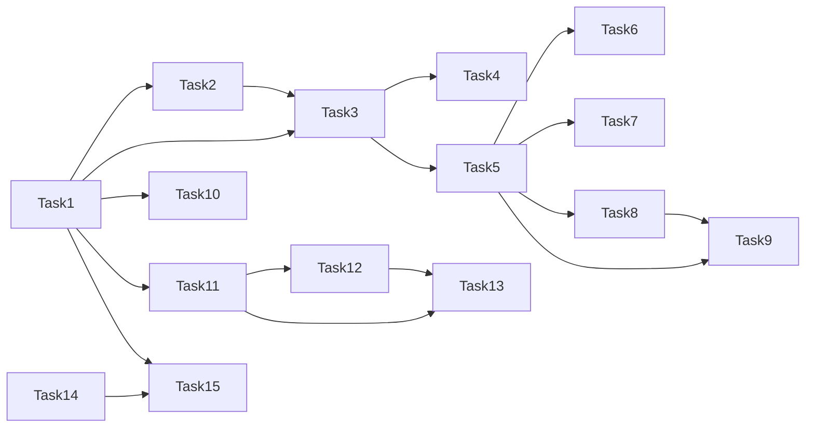

# 优惠券系统修复 — AI 执行方案

> 本文档是给 AI Agent 读的任务分解和执行流程，包含完整的技术上下文。配套的用户文档请见《优惠券系统修复-用户方案-2026-06-23.md》。

## 一、项目上下文

- **涉及前端项目**: `frontend-user-v4-console`（用户控制台）、`frontend-user-v3-www`（官网）
- **涉及后端模块**: `backend/app/Services/Finance/CouponService.php`、`backend/app/Services/Order/OrderService.php`、`backend/app/Services/Finance/PaymentService.php`、`backend/app/Models/UserCoupon.php`、`backend/app/Models/Coupon.php`、`backend/app/Http/Controllers/Client/CouponController.php`、`backend/app/Http/Controllers/Admin/CouponController.php`、`backend/app/Constants/UserCouponStatus.php`（新增）、`backend/app/Jobs/SyncInvoiceCouponUsageJob.php`（新增）、`backend/app/Console/Commands/BackfillUserCouponUid.php`（新增）
- **数据库表**: `coupons`、`user_coupons`、`invoices` 字段追加迁移
- **UI 框架**: TDesign（用户控制台）、Element Plus（官网）
- **关键约束**: 严格遵守 `AGENTS.md`、`文档/开发文档/后端/API格式规范.md`；Payment 记录只允许修改状态禁止物理删除；表名/字段名 snake_case；迁移必须新增文件、不改历史迁移；上游 HTTP 不写在 Controller；Payment 模型不硬删
- **参考文件**:
  - 既有领取/核销实现: `backend/app/Services/Finance/CouponService.php`
  - 既有结算预占: `backend/app/Services/Order/OrderService.php#L191`
  - 既有支付回写: `backend/app/Services/Finance/PaymentService.php#L1551`
  - 前端类型: `frontend-user-v4-console/src/types/client.ts#L339`
  - 前端领券 UI: `frontend-user-v4-console/src/pages/client/coupons/index.vue`
  - 前端用券 composable: `frontend-user-v4-console/src/domains/marketing/useCoupons.ts`
  - 官网待用券携带: `frontend-user-v3-www/src/utils/websiteCoupon.js`

## 二、业务规则默认决策

| # | 默认决策 | 说明 |
|---|---------|------|
| Q1 | 退款**返还**使用配额 | 普通券（非首单限定）退款后回到可用 |
| Q2 | `first_order_only` 退款**不返还**（核销即占用） | "首单"是身份判定 |
| Q3 | 预占实现选 `reserved_until` 字段 | 比锁行更可控，10 分钟自动过期 |
| Q4 | 异步用**队列 Job** 替代 `app()->terminating()` | 持久化、可重试 |

> 任何一项与最终业务预期不符，必须先回头修对应步骤，再继续后续 Task。

## 三、任务分解

> **重要规则**:
> - 每个 Task 使用 `- [ ] **Task N: {名称}**` 格式（Markdown 复选框）
> - AI Agent 执行时，**完成一个 Task 立即将其 `- [ ]` 改为 `- [X]`**，并同步更新本文档
> - **严禁跳过任何 Task 或攒到最后批量打勾** — 必须完成即打勾，通过验证后才能进入下一个 Task

- [X] **Task 1: 数据库迁移：user_coupons 新增字段**

| 属性 | 值 |
|------|-----|
| 涉及项目 | backend |
| 涉及文件 | `backend/database/migrations/2026_06_23_200000_upgrade_user_coupons_for_redemption.php`（新增） |
| 依赖 | 无 |
| 预估改动量 | 小 |

**执行步骤**:
1. 新建迁移文件，`up()` 中使用 `Schema::table('user_coupons', ...)` 追加：
   - `uid` string(32) nullable unique after id
   - `used_at` timestamp nullable after claimed_at
   - `revoked_at` timestamp nullable after used_at
   - `reserved_until` timestamp nullable after revoked_at
   - 索引 `(user_id, status)` 命名 `user_coupons_user_status_uidx`
2. `down()` 中 dropIndex + dropColumn 4 个新列
3. 注意：所有列必须 nullable，保证老代码可运行

**关键实现细节**:
- 字段名严格遵守 snake_case
- unique 必须建索引，避免后续回填脚本的并发碰撞
- 不改历史迁移

**验收标准**:
- [ ] 迁移可正常 `php artisan migrate`
- [ ] 可 `php artisan migrate:rollback` 干净回滚
- [ ] 老代码在新表结构下能正常运行

**Task 完成验证**:
`cd backend && php artisan migrate && php artisan migrate:rollback && php artisan migrate`
通过后把 `- [ ]` 改为 `- [X]`，进入 Task 2。

- [X] **Task 2: 新增 UserCouponStatus 枚举**

| 属性 | 值 |
|------|-----|
| 涉及项目 | backend |
| 涉及文件 | `backend/app/Constants/UserCouponStatus.php`（新建） |
| 依赖 | 无 |
| 预估改动量 | 小 |

**执行步骤**:
1. 新建文件 `backend/app/Constants/UserCouponStatus.php`
2. 定义常量：
   - `OWNED = 1` `USED = 2` `REVOKED = 3`
3. 定义静态 `$labels` 数组：`1=>'可使用'` `2=>'已使用'` `3=>'已作废'`

**验收标准**:
- [ ] 类被 `App\Constants\UserCouponStatus` 命名空间正确加载
- [ ] `$labels` 三个文案完全一致

**Task 完成验证**:
`cd backend && php artisan test --filter=UserCouponStatusTest`
（如未写此测试，至少跑 `php -r "require 'vendor/autoload.php'; ..."` 简单加载检查）
通过后打 `- [X]`，进入 Task 3。

- [X] **Task 3: 修改 UserCoupon 模型（fillable、casts、creating 钩子）**

| 属性 | 值 |
|------|-----|
| 涉及项目 | backend |
| 涉及文件 | `backend/app/Models/UserCoupon.php` |
| 依赖 | Task 1, Task 2 |
| 预估改动量 | 小 |

**执行步骤**:
1. `$fillable` 追加 `uid`、`used_at`、`revoked_at`、`reserved_until`
2. `casts()` 追加 `used_at=>'datetime'`、`revoked_at=>'datetime'`、`reserved_until=>'datetime'`
3. 添加 `protected static function booted()` 使用 `static::creating(function (UserCoupon $uc) { ... })`：
   - `$uc->uid ??= 'uc_' . bin2hex(random_bytes(6));`
   - `$uc->status ??= UserCouponStatus::OWNED;`

**关键实现细节**:
- 不要破坏现有关系方法 `coupon()` / `user()`
- `bin2hex(random_bytes(6))` 产生 12 位 hex，熵足够
- creating 钩子避免漏设 uid

**验收标准**:
- [ ] `UserCoupon::factory()->create()` 后实例 uid 形如 `uc_xxxxxxxxxxxx`
- [ ] status 默认为 1
- [ ] 老代码 `UserCoupon::create(['coupon_id'=>..., 'user_id'=>...])` 仍正常

**Task 完成验证**:
`cd backend && php artisan test --filter=UserCouponModelTest`
通过后打 `- [X]`，进入 Task 4。

- [X] **Task 4: 新增回填命令（uid + 已使用态）**

| 属性 | 值 |
|------|-----|
| 涉及项目 | backend |
| 涉及文件 | `backend/app/Console/Commands/BackfillUserCouponUid.php`（新建） |
| 依赖 | Task 1, Task 3 |
| 预估改动量 | 小 |

**执行步骤**:
1. 新建 Laravel 命令，签名 `coupons:backfill-uid`
2. 两个 pass：
   - Pass 1：`UserCoupon::whereNull('uid')->lazyByIdById(500)->each(...)` 给每条生成 `uc_<12hex>`，`save(['timestamps'=>false])`
   - Pass 2：`UserCoupon::where('status', 1)->whereNotNull('last_used_at')->update(['status'=>UserCouponStatus::USED, 'used_at'=>DB::raw('last_used_at')])`
3. 输出每 pass 影响行数

**关键实现细节**:
- `lazyByIdById` 避免大表游标漂移
- 回补 USED 的 SQL 用 DB::raw 引用 `last_used_at` 一次性写入
- `save(['timestamps'=>false])` 不污染 updated_at

**验收标准**:
- [ ] 在测试库上跑命令后所有 user_coupons 都有 uid
- [ ] 历史上 last_used_at 不为 null 的实例 status=2、used_at 有值
- [ ] 无并发碰撞错误

**Task 完成验证**:
`cd backend && php artisan coupons:backfill-uid`
手动用 `\DB::table('user_coupons')->whereNull('uid')->count()` 检查为 0
通过后打 `- [X]`，进入 Task 5。

- [X] **Task 5: 重写 CouponService::syncInvoiceCouponUsage（核心状态机）**

| 属性 | 值 |
|------|-----|
| 涉及项目 | backend |
| 涉及文件 | `backend/app/Services/Finance/CouponService.php` |
| 依赖 | Task 1, Task 2, Task 3 |
| 预估改动量 | 中 |

**执行步骤**:
1. 在 `syncInvoiceCouponUsage` 内套 `DB::transaction`
2. 维持 `coupons.used_count` 同步逻辑（保留 `countCouponUsedInvoices`）
3. 新增 user_coupon 状态机分支：
   - 取 `$uc` by id + `lockForUpdate`
   - `$hasActivePaidInvoice = Invoice::where('user_coupon_id', $userCouponId)->whereIn('status', self::USED_INVOICE_STATUSES)->exists()`
   - 若 `$hasActivePaidInvoice`：
     - `$uc->status = USED`
     - `$uc->used_at ??= resolveUserCouponLastUsedAt($userCouponId)`
     - `$uc->last_used_at = resolveUserCouponLastUsedAt($userCouponId)`
     - `$uc->reserved_until = null`
     - **特殊**：若 `$uc->coupon && $uc->coupon->first_order_only` → 保持 USED（不返还）
   - 否则：
     - 若该 user_coupon 的 coupon 是 `first_order_only` 且曾经被核销过（hist痕迹）→ 保持 USED
     - 否则回滚：`status=OWNED, used_at=null, last_used_at=null, reserved_until=null`

**关键实现细节**:
- `USED_INVOICE_STATUSES` 常量已存在，沿用
- 必须保持调用链 `PaymentService::syncInvoiceCouponUsageAfterResponse` 不变
- `first_order_only` 不返还的判断依据简单：`$uc->coupon->first_order_only && $uc->used_at != null` → 即使退款也保持 USED
- 用 `forceFill` 跳过 fillable 限制（字段已在 fillable 中）

**验收标准**:
- [ ] 已支付 invoice → user_coupon.status=2、used_at 不空
- [ ] 全部退款（普通券）→ status=1、used_at=null
- [ ] 首单券退款 → status 仍为 2
- [ ] 已作废 status=3 的实例不被回滚
- [ ] reserved_until 在核销时被清 null

**Task 完成验证**:
`cd backend && php artisan test --filter=CouponSyncTest`
通过后打 `- [X]`，进入 Task 6。

- [X] **Task 6: reserveOwnedCouponForInvoice 添加预占字段**

| 属性 | 值 |
|------|-----|
| 涉及项目 | backend |
| 涉及文件 | `backend/app/Services/Finance/CouponService.php` |
| 依赖 | Task 5 |
| 预估改动量 | 小 |

**执行步骤**:
1. 在 `reserveOwnedCouponForInvoice` 查询里追加条件：
   ```php
   ->where(function ($q) {
       $q->whereNull('reserved_until')->orWhere('reserved_until', '<', now());
   })
   ```
2. 校验通过后写入 `$userCoupon->forceFill(['reserved_until' => now()->addMinutes(10)])->save()`
3. 在 `syncInvoiceCouponUsage` 核销时已清 `reserved_until`（Task 5 已做）

**关键实现细节**:
- 10 分钟预占与 quote_token TTL 一致
- 不引入 Redis 锁，保持单机行锁 + 字段
- `releaseInvoiceCoupon`（退款释放）也要清 `reserved_until`（已在 Task 5 中做了）

**验收标准**:
- [ ] 同一 userCouponId 在两个浏览器同时下单，只有 1 个成功
- [ ] 预占超过 10 分钟可再次被预占
- [ ] 支付成功后 reserved_until=null
- [ ] 订单取消/退款后 reserved_until=null

**Task 完成验证**:
`cd backend && php artisan test --filter=CouponReserveTest --filter=CheckoutConcurrencyTest`
通过后打 `- [X]`，进入 Task 7。

- [X] **Task 7: resolveOwnedCouponStatus 改为优先读实例状态**

| 属性 | 值 |
|------|-----|
| 涉及项目 | backend |
| 涉及文件 | `backend/app/Services/Finance/CouponService.php` |
| 依赖 | Task 5 |
| 预估改动量 | 小 |

**执行步骤**:
1. 在 `resolveOwnedCouponStatus` 开头追加：
   ```php
   if ((int) $userCoupon->status === UserCouponStatus::USED) {
       return ['status' => 'used_up', 'label' => '已使用', 'reason' => '优惠券已被核销'];
   }
   if ((int) $userCoupon->status === UserCouponStatus::REVOKED) {
       return ['status' => 'expired', 'label' => '已作废', 'reason' => '管理员已作废'];
   }
   ```
2. 保留原有的 distribution_type / coupon.status / starts/expires / first_order_only / per_user_limit 判断逻辑

**验收标准**:
- [ ] status=2 实例返回 used_up + 已使用
- [ ] status=3 实例返回 expired + 已作废
- [ ] 其它原有逻辑不受影响

**Task 完成验证**:
`cd backend && php artisan test --filter=CouponServiceStatusTest`
通过后打 `- [X]`，进入 Task 8。

- [X] **Task 8: 队列化后置核销 Job**

| 属性 | 值 |
|------|-----|
| 涉及项目 | backend |
| 涉及文件 | `backend/app/Jobs/SyncInvoiceCouponUsageJob.php`（新建）、`backend/app/Services/Finance/PaymentService.php`、`backend/app/Services/Finance/CouponService.php` |
| 依赖 | Task 5 |
| 预估改动量 | 中 |

**执行步骤**:
1. 新建 Job `backend/app/Jobs/SyncInvoiceCouponUsageJob.php`：
   - `$tries = 3`、`$backoff = 5`、`ShouldQueue`
   - 构造接收 `int $invoiceId`，`handle(CouponService $service)` 内查 invoice 并调用 `syncInvoiceCouponUsage`
2. 修改 `CouponService::syncInvoiceCouponUsageAfterResponse`：
   - 删除 `app()->terminating()` 逻辑
   - 调用 `SyncInvoiceCouponUsageJob::dispatch($invoice->id)->onQueue('coupon')`
3. 队列已在 `schedule:run` 消费（队列名包含 `coupon`，见 `routes/console.php#L497`）

**关键实现细节**:
- Job 失败会自动重试，幂等性已在 `syncInvoiceCouponUsage` 中通过 `lockForUpdate + forceFill` 保证
- `runningInConsole` 分支删除，直接走队列
- `ShouldQueue` + `ShouldBeUnique` 可选；本任务只用 `ShouldQueue`

**验收标准**:
- [ ] HTTP 支付回调返回时不再立即同步券状态
- [ ] 队列任务跑完后券状态正确
- [ ] 模拟队列失败重试 3 次后任务进 failed_jobs 表但仍能人工补
- [ ] 进程被 kill 后下次队列消费时仍能正确同步

**Task 完成验证**:
`cd backend && php artisan test --filter=CheckoutWithCouponTest`
通过后打 `- [X]`，进入 Task 9。

- [X] **Task 9: 标注/移除废弃方法 syncOrderCouponUsage / releaseOrderCoupon**

| 属性 | 值 |
|------|-----|
| 涉及项目 | backend |
| 涉及文件 | `backend/app/Services/Finance/CouponService.php`、`backend/app/Services/Order/OrderService.php`、`backend/app/Services/Finance/PaymentService.php` |
| 依赖 | Task 5, Task 8 |
| 预估改动量 | 小 |

**执行步骤**:
1. 用 `vscode_listCodeUsages` 工具找出 `syncOrderCouponUsage` / `releaseOrderCoupon` 的所有引用点
2. 若 `OrderService`、`PaymentService` 中仍调用，先确认是否能直接删（应已走 invoice 路径）
3. 把这两个方法标 `@deprecated` 加注释指向 `syncInvoiceCouponUsage`
4. 删除调用点中已走 invoice 路径的死代码

**验收标准**:
- [ ] 编译通过 (`php artisan route:list` 无报错)
- [ ] 现有下单、支付、退款流程回归通过
- [ ] grep `syncOrderCouponUsage` 只剩方法定义本身和 @phpstan-ignore

**Task 完成验证**:
`cd backend && php artisan test --filter=OrderTest --filter=PaymentTest`
通过后打 `- [X]`，进入 Task 10。

- [X] **Task 10: 新增外键约束迁移**

| 属性 | 值 |
|------|-----|
| 涉及项目 | backend |
| 涉及文件 | `backend/database/migrations/2026_06_23_201000_add_coupon_foreign_keys.php`（新建） |
| 依赖 | Task 1 |
| 预估改动量 | 小 |

**执行步骤**:
1. 先检查 `user_coupons.coupon_id` 与 `invoices.user_coupon_id` 是否存在已有孤儿数据，若有先告警不阻塞
2. 追加外键：
   - `user_coupons.coupon_id` → `coupons.id`，`onDelete('restrict')`
   - `invoices.user_coupon_id` → `user_coupons.id`，`onDelete('set null')`
3. `down()` 删除外键

**关键实现细节**:
- MySQL 加外键前必须确保数据一致；可先跑查询
  ```sql
  SELECT COUNT(*) FROM user_coupons uc LEFT JOIN coupons c ON c.id=uc.coupon_id WHERE c.id IS NULL;
  ```
- 任何 >0 必须先清理

**验收标准**:
- [ ] 迁移可正常执行
- [ ] 删除有引用的 coupon 报约束错误
- [ ] 删除 user_coupon 后 invoices.user_coupon_id 被自动置 null

**Task 完成验证**:
`cd backend && php artisan migrate`
通过后打 `- [X]`，进入 Task 11。

- [X] **Task 11: API 输出补 uid / used_at 字段**

| 属性 | 值 |
|------|-----|
| 涉及项目 | backend |
| 涉及文件 | `backend/app/Services/Finance/CouponService.php`（`transformOwnedCouponForUser` 等输出函数） |
| 依赖 | Task 1, Task 3 |
| 预估改动量 | 小 |

**执行步骤**:
1. 在owned 输出 payload 里追加：
   - `'uid' => (string) $userCoupon->uid`
   - `'used_at' => $userCoupon->used_at?->format('Y-m-d H:i:s')`
   - `'revoked_at' => $userCoupon->revoked_at?->format('Y-m-d H:i:s')`
2. 在已失效分支里也补 `uid`、`used_at=null`
3. `transformPublicCouponForUser` 不用改（公开券列表无 user_coupon_id）

**验收标准**:
- [ ] `/client/coupons` 返回项含 `uid` 字段
- [ ] 已作废券 `revoked_at` 有值
- [ ] 已使用券 `used_at` 有值

**Task 完成验证**:
`cd backend && php artisan test --filter=CouponControllerTest`
通过后打 `- [X]`，进入 Task 12。

- [X] **Task 12: 前端类型补字段**

| 属性 | 值 |
|------|-----|
| 涉及项目 | frontend-user-v4-console |
| 涉及文件 | `frontend-user-v4-console/src/types/client.ts` |
| 依赖 | Task 11 |
| 预估改动量 | 小 |

**执行步骤**:
1. 在 `CouponRecord` 接口内追加：
   ```ts
   uid?: string;
   per_user_limit?: number | null;
   used_times?: number;
   remaining_times?: number | null;
   first_order_only?: boolean;
   total_usage_limit?: number | null;
   remaining_stock?: number | null;
   used_at?: string | null;
   revoked_at?: string | null;
   ```
2. 不破坏现有 `[key: string]: unknown` 兜底

**验收标准**:
- [ ] `npm run build` 通过
- [ ] 在源码里访问 `item.uid`、`item.remaining_times` 不报类型错误

**Task 完成验证**:
`cd frontend-user-v4-console && npm run build`
通过后打 `- [X]`，进入 Task 13。

- [X] **Task 13: 前端优惠券中心：补展示 chip 和状态文案**

| 属性 | 值 |
|------|-----|
| 涉及项目 | frontend-user-v4-console |
| 涉及文件 | `frontend-user-v4-console/src/pages/client/coupons/index.vue`、`frontend-user-v4-console/src/domains/marketing/useCoupons.ts` |
| 依赖 | Task 12 |
| 预估改动量 | 小 |

**执行步骤**:
1. `coupons/index.vue` 卡片在已有 chip 基础上确认显示：
   - `item.first_order_only` → "限首单"
   - `item.per_user_limit` → "可使用 {{ remaining_times }}/{{ per_user_limit }} 次"
   - 否则 → "不限次"
   - 公共（plaza）侧显示 "剩余 {{ remaining_stock }}/{{ total_usage_limit }} 张"
2. 详情弹层显示 `item.uid`（券实例编号）
3. `useCoupons.ts` 已默认 status='available'（不必再改）
4. `resolveStatusTheme` 增加：revoked 状态用 `danger`；used 实例（status_label=已使用）用 `default`

**关键实现细节**:
- 不重新造 chip 组件，沿用 `.coupon-item__chips > span` 现有样式
- 状态标签不再依赖 `status_label` 文本，可参考 `last_used_at` 直接走 status

**验收标准**:
- [ ] `npm run build` 通过
- [ ] 浏览器手测：限首单券显示"限首单"、显示"可使用 1/1 次"

**Task 完成验证**:
`cd frontend-user-v4-console && npm run build`
打开 `http://127.0.0.1:5173/client/coupons` 视检
通过后打 `- [X]`，进入 Task 14。

- [X] **Task 14: 官网跨子域：URL 兜底传 pending_coupon_id**

| 属性 | 值 |
|------|-----|
| 涉及项目 | frontend-user-v3-www |
| 涉及文件 | `frontend-user-v3-www/src/utils/websiteCoupon.js`、`frontend-user-v3-www/src/views/website/ProductDetail/index.vue`（如有跳转）、`frontend-user-v4-console` 的 `/client/checkout-resume` 页 |
| 依赖 | 无 |
| 预估改动量 | 小 |

**执行步骤**:
1. `websiteCoupon.js` 中新增 `buildPendingCouponRedirectUrl(targetPath, userCouponId)`：把 couponId 写入 URL 查询参数 `pending_coupon_id`
2. 跳转控制台的代码带上此 URL 参数
3. 控制台 `checkout-resume` 页同时读 `route.query.pending_coupon_id` 和 sessionStorage，优先 query

**关键实现细节**:
  - 不删除 sessionStorage 路径，保留兼容
  - URL 兜底只在跨子域场景生效

**验收标准**:
- [ ] `cd frontend-user-v3-www && npm run build` 通过
- [ ] `cd frontend-user-v4-console && npm run build` 通过
- [ ] 在跨子域用手测能保留 couponId 进入结算页

**Task 完成验证**:
两端分别 `npm run build`
通过后打 `- [X]`，进入 Task 15。

- [X] **Task 15: 编写并跑测试套件**

| 属性 | 值 |
|------|-----|
| 涉及项目 | backend / frontend-user-v4-console |
| 涉及文件 | `backend/tests/Unit/Models/UserCouponModelTest.php`、`backend/tests/Unit/Services/Finance/CouponServiceStatusTest.php`、`backend/tests/Unit/Services/Finance/CouponReserveTest.php`、`backend/tests/Unit/Services/Finance/CouponSyncTest.php`、`backend/tests/Feature/Client/CouponControllerTest.php`、`backend/tests/Feature/Order/CheckoutWithCouponTest.php`、`backend/tests/Feature/Order/CheckoutConcurrencyTest.php`、`frontend-user-v4-console/tests/domains/useCoupons.spec.ts` |
| 依赖 | Task 1 ~ Task 14 |
| 预估改动量 | 中 |

**执行步骤**:
1. 按《优惠券系统修复-用户方案》同时参考已有的 `backend/tests/Database/Factories/CouponFactory.php` 创建/扩展 `UserCouponFactory.php`
2. 写 5 个单元测试 + 4 个集成测试 + 1 个并发测试 + 前端单元测试，详见《优惠券系统修复-用户方案-2026-06-23.md》和本仓库的 copilot-instructions 中关于测试的部分
3. 跑全套后端 `php artisan test --filter=Coupon --filter=Checkout`
4. 跑前端 `npm run test`

**验收标准**:
- [ ] 单元测试覆盖率：CouponService::syncInvoiceCouponUsage ≥ 95%、reserve ≥ 95%、resolveOwnedCouponStatus = 100%
- [ ] 集成测试覆盖：下单 → 预占 → 支付 → 核销 → 退款 → 回滚全流程
- [ ] 并发测试：同一 userCouponId 两个并发只成功 1 个
- [ ] 前端单项：resolveStatusTheme、resolveDiscountValue 全部通过

**Task 完成验证**:
```
cd backend && php artisan test --filter=Coupon
cd backend && php artisan test --filter=Checkout
cd frontend-user-v4-console && npm run test
```
通过后打 `- [X]`。

## 四、任务依赖图



## 五、测试方案

### 功能测试

| 编号 | 测试场景 | 操作步骤 | 预期结果 | 涉及任务 |
|------|---------|---------|---------|---------|
| T1 | 已使用状态写入 | 测试支付 invoice | user_coupon.status=2, used_at 不空 | Task5 |
| T2 | 普通券退款回滚 | 测试退款 invoice | status=1, used_at=null | Task5 |
| T3 | 首单券退款不回滚 | 退款后查状态 | status 仍为 2 | Task5 |
| T4 | 预占防并发 | 两个并发请求下单同一券 | 只 1 个成功 | Task6 |
| T5 | 预占超时可再用 | 模拟 reserved_until 过期 | 再次预占成功 | Task6 |
| T6 | 标签映射正确 | 实例 status=2/3 → resolveOwnedCouponStatus | used_up + 已使用 / expired + 已作废 | Task7 |
| T7 | 队列失败重试 | 抛 3 次异常 | 进 failed_jobs 但状态最终不漂 | Task8 |
| T8 | 外键阻删 | 删除有引用的 coupon | 报约束错误 | Task10 |
| T9 | API 输出 uid | GET /client/coupons | 列表项含 uid | Task11 |
| T10 | 前端 chip | 浏览器拉优惠券中心 | 显"限首单" / "可使用 1/1 次" | Task13 |
| T11 | 官网跨子域 | 主域选券跳控制台 | 仍能识别 couponId | Task14 |

### 边界测试

- 极限值：uid 大量重复生成无碰撞（100 次循环）
- 并发：同 userCouponId 同时支付 + 退款 → 最终状态与最后一次 invoice 状态一致
- 权限：非本人 user_coupon 不能预占（service 已校验 user_id）
- 数据缺失：user_coupon.coupon 被误删时返回已失效而不报错

### 回归测试（按 Task 粒度）

> **核心原则: 每完成一个 Task 立即跑其回归测试, 不要攒到最后。**
> 这是最小范围的防翻车策略 — 改一点测一点,确保每个 Task 都不会破坏已有功能。

| Task | 回归范围 | 验证操作 | 验证命令 |
|------|---------|---------|---------|
| Task1 | DB 迁移可逆 | migrate / rollback / migrate | `cd backend && php artisan migrate && php artisan migrate:rollback && php artisan migrate` |
| Task2 | 常量类加载 | 简单 require | `cd backend && php artisan test --filter=UserCouponStatusTest` |
| Task3 | 模型创建钩子 | factory->create 后 uid 自动生成 | `php artisan test --filter=UserCouponModelTest` |
| Task4 | 回填脚本 | coupons:backfill-uid + 查空 | 同上 |
| Task5 | syncInvoiceCouponUsage 状态机 | 退款 / 已支付 / 首单不回滚 | `php artisan test --filter=CouponSyncTest` |
| Task6 | 预占防并发 | 两个并发 | `php artisan test --filter=CouponReserveTest --filter=CheckoutConcurrencyTest` |
| Task7 | 状态映射 | status=2/3 → 标签 | `php artisan test --filter=CouponServiceStatusTest` |
| Task8 | 队列 Job 重试 | 模拟 job 失败重试 | `php artisan test --filter=CheckoutWithCouponTest` |
| Task9 | 废弃方法标注 | grep 仅留定义 | `php artisan test --filter=OrderTest --filter=PaymentTest` |
| Task10 | 外键约束 | 删除有引用 coupon 报错 | `php artisan migrate` |
| Task11 | API 输出 | GET /client/coupons 含 uid | `php artisan test --filter=CouponControllerTest` |
| Task12 | 前端类型 | 访问 item.uid 不报错 | `cd frontend-user-v4-console && npm run build` |
| Task13 | 前端 UI chip | 浏览器视检 | `cd frontend-user-v4-console && npm run build` |
| Task14 | 跨子域跳转 | 主域选券跳控制台 | `cd frontend-user-v3-www && npm run build && cd ../frontend-user-v4-console && npm run build` |
| Task15 | 全套 | 单元 + 集成 + 并发 + 前端 | `php artisan test --filter=Coupon --filter=Checkout` + `npm run test` |

### 全量验证

全部 Task 完成后执行:
- `cd backend && php artisan test --filter=Coupon`
- `cd backend && php artisan test --filter=Checkout`
- `cd frontend-user-v4-console && npm run build && npm run test`
- `cd frontend-user-v3-www && npm run build`
- 手动全流程走查：领券 → 下单 → 预占 → 支付 → 核销 → 退款 → 浏览器手测（见用户方案"验证方式"）

## 六、执行约束

- **严格遵循 AGENTS.md**: 所有代码变更必须符合项目规范
- **Task 级回归（防翻车核心）**: 每完成一个 Task 立即跑其回归测试,通过后打勾 `[X]`,再进入下一个 Task。**严禁攒到最后全量测** — 改一点测一点,确保不翻车
- **UI 框架隔离**: 控制台用 TDesign 禁止引入 Element Plus，官网用 Element Plus 禁止引入 TDesign
- **状态复用**: 状态展示使用 `@caiwu/shared/statusConfig`、`StatusTag.vue`
- **请求收敛**: API 调用走 `src/api/`,禁止直接创建 axios 实例
- **图标统一**: TDesign 端用 `tdesign-icons-vue-next`,Element Plus 端用 `@element-plus/icons-vue`
- **不可做**:
  - 不要物理删除 Payment 或 UserCoupon 记录
  - 不要把 `mofang_finance_api` 别名为 `hosting_panel_api`
  - 不要改历史迁移
  - 不要在 Controller 里直接 Http 调上游
  - 不要重写券全程 API（仅做修复）
- **必须先做**: Task 1 → Task 5（数据库+状态机）必须最先落地，其他 Task 依赖此核心改动才有意义
- **公共组件**:
  - 状态 chip 沿用 `.coupon-item__chips > span`
  - 状态 tag 沿用 TDesign `t-tag`，不引入新组件
  - 详情面板沿用已有弹层结构

## 七、参考文件
- 类似功能的已有实现: `backend/app/Services/Finance/CouponService.php`
- 共享状态映射: `shared/statusConfig.js`
- 共享组件: `shared/components/`
- 测试模板: 已有 `backend/tests/Database/Factories/CouponFactory.php`（按此风格扩展 UserCouponFactory）
- 既有预占模板: `backend/app/Services/Order/OrderService.php#L191`
- 既有支付回写: `backend/app/Services/Finance/PaymentService.php#L1551`
