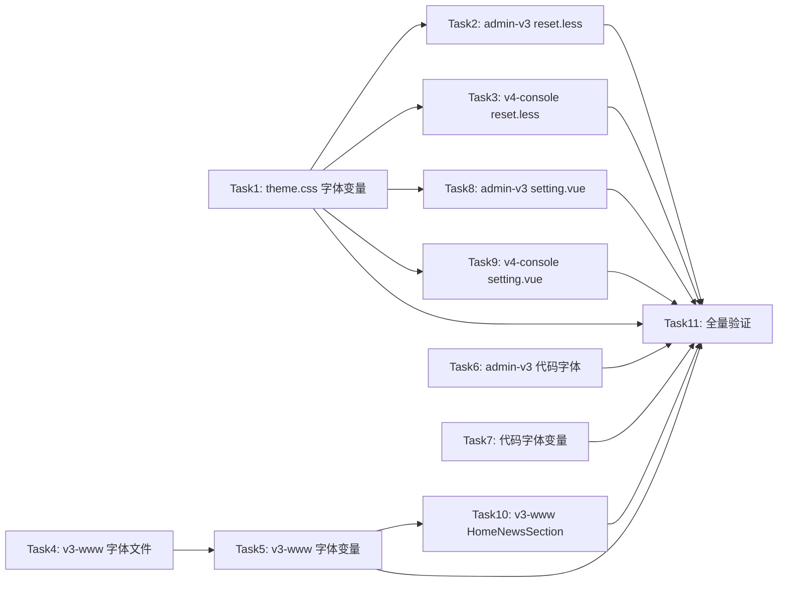

# 全站字体统一换用腾讯 TencentSans — AI 执行方案

> 本文档是给 AI Agent 读的任务分解和执行流程，包含完整的技术上下文。
> 审查修订版 v3 — 修复邮件预览遗漏、Task 顺序、CSS 变量引用一致性、v4-console 代码字体等问题。

## 一、项目上下文

- **涉及前端项目**: frontend-admin-v3、frontend-user-v3-www、frontend-user-v4-console
- **涉及后端模块**: 无
- **UI 框架**: admin-v3 和 v4-console 用 TDesign Vue Next；v3-www 用 Element Plus
- **关键约束**:
  - admin-v3 禁止混用 Element Plus；v3-www 禁止引入 TDesign
  - 修改以最小必要范围为原则，不做无关重构
  - 字体文件使用 base64 内嵌方式（WOFF 格式），不新增独立字体文件
- **参考文件**:
  - admin-v3 字体定义: `frontend-admin-v3/src/style/font-family.less`
  - v4-console 字体定义: `frontend-user-v4-console/src/style/font-family.less`
  - v3-www 字体变量: `frontend-user-v3-www/src/assets/styles/variables.scss`
  - 全局主题覆盖: `theme.css`

### 字体规范

根据 TDesign 官方字体规范 (https://tdesign.tencent.com/design/fonts)：

**正文字体回退链**（移动端优先兼容）：
```
TencentSansW7, "PingFang SC", "Microsoft YaHei", "Hiragino Sans GB", "WenQuanYi Micro Hei", "Noto Sans CJK SC", sans-serif
```

**代码字体回退链**：
```
"SF Mono", "Menlo", "Consolas", "Liberation Mono", monospace
```

### 当前状态

| 项目 | 当前 font-family | TencentSans | 代码字体 |
|------|-----------------|-------------|---------|
| admin-v3 | `--td-font-family` (PingFang SC, Microsoft YaHei, Arial Regular) | 有 W7 base64，但未应用到正文 | 多种不统一 |
| v4-console | `--td-font-family` (PingFang SC, Microsoft YaHei, Arial, sans-serif) via theme.css | 有 W7 base64，但未应用到正文 | 无独立代码字体 |
| v3-www | `$font-family-main` (Inter, -apple-system, BlinkMacSystemFont, "Segoe UI", "PingFang SC", "Microsoft YaHei", sans-serif) | 无 | 无独立代码字体 |

## 二、任务分解

> **重要规则**:
> - 每个 Task 使用 `- [ ] **Task N: {名称}**` 格式（Markdown 复选框）
> - AI Agent 执行时，**完成一个 Task 立即将其 `- [ ]` 改为 `- [X]`**，并同步更新本文档
> - **严禁跳过任何 Task 或攒到最后批量打勾** — 必须完成即打勾，通过验证后才能进入下一个 Task

- [ ] **Task 1: 更新 theme.css 中的 TDesign 字体变量**

| 属性 | 值 |
|------|-----|
| 涉及项目 | 全局（影响 admin-v3 和 v4-console） |
| 涉及文件 | `theme.css` |
| 依赖 | 无 |
| 预估改动量 | 小 |

**执行步骤**:
1. 打开 `theme.css`，找到 `--td-font-family` 和 `--td-font-family-medium` 变量定义
2. 将 `--td-font-family` 的值改为：`TencentSansW7, "PingFang SC", "Microsoft YaHei", "Hiragino Sans GB", "WenQuanYi Micro Hei", "Noto Sans CJK SC", sans-serif`
3. 将 `--td-font-family-medium` 的值改为同上

**关键实现细节**:
- 当前值：`PingFang SC, Microsoft YaHei, Arial, sans-serif`
- 新值：`TencentSansW7, "PingFang SC", "Microsoft YaHei", "Hiragino Sans GB", "WenQuanYi Micro Hei", "Noto Sans CJK SC", sans-serif`
- TencentSansW7 放在首位，确保字体加载后优先使用
- 回退链覆盖：macOS (PingFang SC) → Windows (Microsoft YaHei) → Linux (WenQuanYi/Noto) → 通用 (sans-serif)
- 去掉 Arial，因为 TencentSansW7 已覆盖拉丁字符

**验收标准**:
- [ ] `--td-font-family` 首选字体为 TencentSansW7
- [ ] `--td-font-family-medium` 首选字体为 TencentSansW7
- [ ] 回退链覆盖 macOS/Windows/Linux/Android

**Task 完成验证**:
- 前端: `cd frontend-admin-v3 && npm run build`
- 前端: `cd frontend-user-v4-console && npm run build`
- 手动验证: 打开 admin-v3 页面，F12 检查 body 的 computed font-family，确认 TencentSansW7 在首位

---

- [ ] **Task 2: 更新 admin-v3 的 reset.less 字体声明**

| 属性 | 值 |
|------|-----|
| 涉及项目 | frontend-admin-v3 |
| 涉及文件 | `frontend-admin-v3/src/style/reset.less` |
| 依赖 | Task 1 |
| 预估改动量 | 小 |

**执行步骤**:
1. 打开 `frontend-admin-v3/src/style/reset.less`
2. 找到 body 的 `font-family: -apple-system, BlinkMacSystemFont, var(--td-font-family);`
3. 改为 `font-family: var(--td-font-family);`（因为 `--td-font-family` 已包含完整回退链，不需要额外的 -apple-system, BlinkMacSystemFont 前缀）
4. 找到 pre 的 `font-family: var(--td-font-family);`
5. 改为 `font-family: "SF Mono", "Menlo", "Consolas", "Liberation Mono", monospace;`（代码区域用等宽字体）

**关键实现细节**:
- body 字体直接用 `var(--td-font-family)` 即可，因为 Task 1 已将 TencentSansW7 设为首选
- pre 标签是代码展示区域，应使用等宽字体而非正文字体

**验收标准**:
- [ ] body font-family 使用 `var(--td-font-family)`
- [ ] pre font-family 使用 SF Mono 回退链

**Task 完成验证**:
- 前端: `cd frontend-admin-v3 && npm run build`

---

- [ ] **Task 3: 更新 v4-console 的 reset.less 字体声明**

| 属性 | 值 |
|------|-----|
| 涉及项目 | frontend-user-v4-console |
| 涉及文件 | `frontend-user-v4-console/src/style/reset.less` |
| 依赖 | Task 1 |
| 预估改动量 | 小 |

**执行步骤**:
1. 打开 `frontend-user-v4-console/src/style/reset.less`
2. 找到 body 的 `font-family: -apple-system, BlinkMacSystemFont, var(--td-font-family);`
3. 改为 `font-family: var(--td-font-family);`
4. 找到 pre 的 `font-family: var(--td-font-family);`
5. 改为 `font-family: "SF Mono", "Menlo", "Consolas", "Liberation Mono", monospace;`

**关键实现细节**:
- 与 Task 2 完全相同的修改逻辑

**验收标准**:
- [ ] body font-family 使用 `var(--td-font-family)`
- [ ] pre font-family 使用 SF Mono 回退链

**Task 完成验证**:
- 前端: `cd frontend-user-v4-console && npm run build`

---

- [ ] **Task 4: 为 v3-www 新增 TencentSansW7 字体定义**

| 属性 | 值 |
|------|-----|
| 涉及项目 | frontend-user-v3-www |
| 涉及文件 | `frontend-user-v3-www/src/assets/styles/_font-family.scss`（新建） |
| 依赖 | 无 |
| 预估改动量 | 中 |

**执行步骤**:
1. 读取 `frontend-admin-v3/src/style/font-family.less` 的完整内容（包含 TencentSansW7 的 base64 数据）
2. 在 `frontend-user-v3-www/src/assets/styles/` 目录下新建 `_font-family.scss` 文件
3. 将 font-family.less 中的 `@font-face` 定义转换为 SCSS 格式写入（内容完全一致，只是文件后缀从 .less 改为 .scss）
4. 格式如下：
```scss
@font-face {
  font-family: 'TencentSansW7';
  src: url('data:application/font-woff;charset=utf-8;base64,{从 admin-v3 复制的完整 base64 数据}')
    format('woff');
  font-weight: normal;
  font-style: normal;
}
```

**关键实现细节**:
- base64 数据必须从 `frontend-admin-v3/src/style/font-family.less` 完整复制，不能截断
- 文件名用下划线前缀 `_font-family.scss`，符合 SCSS partial 约定
- v3-www 使用 SCSS 而非 Less，但 `@font-face` 语法两者完全一致

**验收标准**:
- [ ] `_font-family.scss` 文件已创建
- [ ] 包含完整的 TencentSansW7 base64 数据（与 admin-v3 一致）
- [ ] `@font-face` 语法正确

**Task 完成验证**:
- 前端: `cd frontend-user-v3-www && npm run build`（此时字体还未被引用，但需确认文件语法无误）

---

- [ ] **Task 5: 更新 v3-www 的字体变量和引用**

| 属性 | 值 |
|------|-----|
| 涉及项目 | frontend-user-v3-www |
| 涉及文件 | `frontend-user-v3-www/src/assets/styles/variables.scss`、`frontend-user-v3-www/src/assets/styles/global.scss` |
| 依赖 | Task 4 |
| 预估改动量 | 小 |

**执行步骤**:
1. 打开 `frontend-user-v3-www/src/assets/styles/variables.scss`
2. 找到 `$font-family-main: Inter, -apple-system, BlinkMacSystemFont, "Segoe UI", "PingFang SC", "Microsoft YaHei", sans-serif;`
3. 改为：`$font-family-main: TencentSansW7, "PingFang SC", "Microsoft YaHei", "Hiragino Sans GB", "WenQuanYi Micro Hei", "Noto Sans CJK SC", sans-serif;`
4. 新增代码字体变量：`$font-family-code: "SF Mono", "Menlo", "Consolas", "Liberation Mono", monospace;`
5. 打开 `frontend-user-v3-www/src/assets/styles/global.scss`
6. 在文件顶部（`@use` 或 `@import` 区域）添加对 `_font-family.scss` 的引用：`@use './font-family' as *;` 或 `@import './font-family';`（根据文件中已有的引用方式选择）
7. 确认 `html, body, #app` 的 `font-family: $font-family-main;` 保持不变（变量值已在步骤 3 更新）

**关键实现细节**:
- 去掉 Inter（英文字体），TencentSansW7 已包含拉丁字符
- 去掉 -apple-system, BlinkMacSystemFont, "Segoe UI"（系统 UI 字体），TencentSansW7 优先
- 回退链与 TDesign 端保持一致
- `_font-family.scss` 必须在 `global.scss` 中被引用，否则 `@font-face` 不会生效

**验收标准**:
- [ ] `$font-family-main` 首选为 TencentSansW7
- [ ] `$font-family-code` 已定义
- [ ] `global.scss` 引用了 `_font-family.scss`
- [ ] Element Plus 的 `$font-family` 覆盖自动跟随 `$font-family-main`

**Task 完成验证**:
- 前端: `cd frontend-user-v3-www && npm run build`
- 手动验证: 打开 v3-www 页面，F12 检查 body 的 computed font-family，确认 TencentSansW7 在首位

---

- [ ] **Task 6: 统一 admin-v3 代码字体为 SF Mono 回退链**

| 属性 | 值 |
|------|-----|
| 涉及项目 | frontend-admin-v3 |
| 涉及文件 | `frontend-admin-v3/src/pages/settings/index.less`、`frontend-admin-v3/src/pages/logs/index.less`、`frontend-admin-v3/src/pages/notifications/email-template-detail/index.less`、`frontend-admin-v3/src/pages/dashboard/base/index.vue` |
| 依赖 | 无 |
| 预估改动量 | 小 |

**执行步骤**:
1. 打开 `frontend-admin-v3/src/pages/settings/index.less`，找到第 167 行：
   `font-family: "SF Mono", "Menlo", "Consolas", monospace;`
   改为：`font-family: "SF Mono", "Menlo", "Consolas", "Liberation Mono", monospace;`

2. 打开 `frontend-admin-v3/src/pages/logs/index.less`，找到第 228 行：
   `font-family: Consolas, 'Courier New', monospace;`
   改为：`font-family: "SF Mono", "Menlo", "Consolas", "Liberation Mono", monospace;`

3. 打开 `frontend-admin-v3/src/pages/notifications/email-template-detail/index.less`，找到第 114 行：
   `font-family: "Cascadia Code", "SFMono-Regular", Consolas, "Liberation Mono", monospace;`
   改为：`font-family: "SF Mono", "Menlo", "Consolas", "Liberation Mono", monospace;`

4. 打开 `frontend-admin-v3/src/pages/dashboard/base/index.vue`，找到第 231 行：
   `font-family: SFMono-Regular, Consolas, 'Liberation Mono', monospace;`
   改为：`font-family: "SF Mono", "Menlo", "Consolas", "Liberation Mono", monospace;`

**关键实现细节**:
- 统一使用 `"SF Mono"` 而非 `"SFMono-Regular"`（TDesign 规范用 SF Mono）
- 去掉 `"Cascadia Code"` 和 `'Courier New'`（非标准回退）
- 所有代码区域使用完全相同的回退链

**验收标准**:
- [ ] 4 个文件的代码字体全部统一为 `"SF Mono", "Menlo", "Consolas", "Liberation Mono", monospace`
- [ ] 无残留的 Cascadia Code、SFMono-Regular、Courier New

**Task 完成验证**:
- 前端: `cd frontend-admin-v3 && npm run build`

---

- [ ] **Task 7: 在 admin-v3 和 v4-console 的 typography/variables 中定义代码字体变量**

| 属性 | 值 |
|------|-----|
| 涉及项目 | frontend-admin-v3、frontend-user-v4-console |
| 涉及文件 | `frontend-admin-v3/src/style/typography.less`、`frontend-user-v4-console/src/style/variables.less` |
| 依赖 | 无 |
| 预估改动量 | 小 |

**执行步骤**:
1. 打开 `frontend-admin-v3/src/style/typography.less`
2. 在 `:root { ... }` 块中新增 CSS 变量：
   ```less
   --td-font-family-code: "SF Mono", "Menlo", "Consolas", "Liberation Mono", monospace;
   ```
3. 打开 `frontend-user-v4-console/src/style/variables.less`
4. 查看文件内容，在合适位置新增相同的 CSS 变量定义（如果 v4-console 没有 typography.less，则在 variables.less 或 index.less 中新增 `:root` 块）

**关键实现细节**:
- 定义为 CSS 变量而非 Less 变量，方便在组件中通过 `var(--td-font-family-code)` 引用
- 后续新增代码展示区域时可直接使用此变量

**验收标准**:
- [ ] admin-v3 的 `:root` 中有 `--td-font-family-code` 变量
- [ ] v4-console 的 `:root` 中有 `--td-font-family-code` 变量

**Task 完成验证**:
- 前端: `cd frontend-admin-v3 && npm run build`
- 前端: `cd frontend-user-v4-console && npm run build`

---

- [ ] **Task 8: 更新 admin-v3 layout setting.vue 中的字体引用**

| 属性 | 值 |
|------|-----|
| 涉及项目 | frontend-admin-v3 |
| 涉及文件 | `frontend-admin-v3/src/layouts/setting.vue` |
| 依赖 | Task 1 |
| 预估改动量 | 小 |

**执行步骤**:
1. 打开 `frontend-admin-v3/src/layouts/setting.vue`
2. 找到 `.setting-group-title` 的 `font-family: 'PingFang SC', var(--td-font-family);`
3. 改为 `font-family: var(--td-font-family);`（因为 `--td-font-family` 已包含 TencentSansW7 和 PingFang SC 回退）

**验收标准**:
- [ ] `.setting-group-title` 使用 `var(--td-font-family)`

**Task 完成验证**:
- 前端: `cd frontend-admin-v3 && npm run build`

---

- [ ] **Task 9: 更新 v4-console layout setting.vue 中的字体引用**

| 属性 | 值 |
|------|-----|
| 涉及项目 | frontend-user-v4-console |
| 涉及文件 | `frontend-user-v4-console/src/layouts/setting.vue` |
| 依赖 | Task 1 |
| 预估改动量 | 小 |

**执行步骤**:
1. 打开 `frontend-user-v4-console/src/layouts/setting.vue`
2. 找到 `.setting-group-title` 的 `font-family: 'PingFang SC', var(--td-font-family);`
3. 改为 `font-family: var(--td-font-family);`

**验收标准**:
- [ ] `.setting-group-title` 使用 `var(--td-font-family)`

**Task 完成验证**:
- 前端: `cd frontend-user-v4-console && npm run build`

---

- [ ] **Task 10: 更新 v3-www HomeNewsSection.vue 中的字体引用**

| 属性 | 值 |
|------|-----|
| 涉及项目 | frontend-user-v3-www |
| 涉及文件 | `frontend-user-v3-www/src/views/website/Home/components/HomeNewsSection.vue` |
| 依赖 | Task 5 |
| 预估改动量 | 小 |

**执行步骤**:
1. 打开 `frontend-user-v3-www/src/views/website/Home/components/HomeNewsSection.vue`
2. 找到第 279 行的 `font-family: "PingFang SC", "Microsoft YaHei", "SimHei", sans-serif;`
3. 改为 `font-family: $font-family-main;`（如果该样式在 `<style lang="scss">` 中）或改为 `font-family: TencentSansW7, "PingFang SC", "Microsoft YaHei", "Hiragino Sans GB", "WenQuanYi Micro Hei", "Noto Sans CJK SC", sans-serif;`（如果无法引用 SCSS 变量）

**关键实现细节**:
- 需要确认该组件的 `<style>` 是否有 `lang="scss"` 且是否已引入 variables
- 如果是纯 CSS，则直接写完整回退链

**验收标准**:
- [ ] HomeNewsSection 的字体与全站一致

**Task 完成验证**:
- 前端: `cd frontend-user-v3-www && npm run build`

---

- [ ] **Task 11: 全量验证**

| 属性 | 值 |
|------|-----|
| 涉及项目 | 全部 |
| 涉及文件 | 无 |
| 依赖 | Task 1-10 |
| 预估改动量 | 小 |

**执行步骤**:
1. 执行 admin-v3 构建：`cd frontend-admin-v3 && npm run build`
2. 执行 v4-console 构建：`cd frontend-user-v4-console && npm run build`
3. 执行 v3-www 构建：`cd frontend-user-v3-www && npm run build`
4. 全局搜索确认无残留的旧字体引用：
   - 搜索 `Inter,` 确认 v3-www 已移除
   - 搜索 `Cascadia Code` 确认已移除
   - 搜索 `SFMono-Regular` 确认已移除
   - 搜索 `'Courier New'` 确认代码区域已移除
   - 搜索 `Arial Regular` 确认 theme.css 已移除

**验收标准**:
- [ ] 三个项目构建全部通过
- [ ] 无残留旧字体引用

**Task 完成验证**:
- 全部构建通过即为完成

## 三、任务依赖图



## 四、测试方案

### 功能测试

| 编号 | 测试场景 | 操作步骤 | 预期结果 | 涉及任务 |
|------|---------|---------|---------|---------|
| T1 | admin-v3 正文字体 | 打开管理后台任意页面，F12 检查 body computed font-family | TencentSansW7 在首位 | Task1,2 |
| T2 | v4-console 正文字体 | 打开控制台任意页面，F12 检查 body computed font-family | TencentSansW7 在首位 | Task1,3 |
| T3 | v3-www 正文字体 | 打开官网任意页面，F12 检查 body computed font-family | TencentSansW7 在首位 | Task4,5 |
| T4 | admin-v3 代码字体 | 打开日志页面，F12 检查代码区域 font-family | SF Mono 在首位 | Task6 |
| T5 | admin-v3 设置页代码字体 | 打开设置页面代码区域，F12 检查 font-family | SF Mono 在首位 | Task6 |
| T6 | 字体回退 | 在 Network 面板禁用字体加载，刷新页面 | 文字仍正常显示，使用 PingFang SC 或 Microsoft YaHei | Task1,5 |

### 边界测试
- 极慢网络：字体文件加载超时时，回退到系统字体是否正常
- 移动端：iOS Safari / Android Chrome 下字体渲染是否正常
- 中文+英文混排：TencentSansW7 对拉丁字符的渲染质量

### 回归测试(按 Task 粒度)

| Task | 回归范围 | 验证操作 | 验证命令 |
|------|---------|---------|---------|
| Task1 | TDesign 端字体变量 | 确认 theme.css 变量值正确 | `cd frontend-admin-v3 && npm run build` + `cd frontend-user-v4-console && npm run build` |
| Task2 | admin-v3 body 字体 | 确认 reset.less 修改正确 | `cd frontend-admin-v3 && npm run build` |
| Task3 | v4-console body 字体 | 确认 reset.less 修改正确 | `cd frontend-user-v4-console && npm run build` |
| Task4 | v3-www 字体文件 | 确认 _font-family.scss 创建正确 | `cd frontend-user-v3-www && npm run build` |
| Task5 | v3-www 字体变量 | 确认 variables.scss 和 global.scss 修改正确 | `cd frontend-user-v3-www && npm run build` |
| Task6 | admin-v3 代码字体 | 确认 4 个文件代码字体统一 | `cd frontend-admin-v3 && npm run build` |
| Task7 | 代码字体变量 | 确认 CSS 变量定义正确 | `cd frontend-admin-v3 && npm run build` + `cd frontend-user-v4-console && npm run build` |
| Task8 | admin-v3 setting.vue | 确认字体引用正确 | `cd frontend-admin-v3 && npm run build` |
| Task9 | v4-console setting.vue | 确认字体引用正确 | `cd frontend-user-v4-console && npm run build` |
| Task10 | v3-www HomeNewsSection | 确认字体引用正确 | `cd frontend-user-v3-www && npm run build` |
| Task11 | 全量验证 | 三个项目全部构建通过 | 见 Task11 步骤 |

### 全量验证

全部 Task 完成后执行:
- 前端: `cd frontend-admin-v3 && npm run build`
- 前端: `cd frontend-user-v4-console && npm run build`
- 前端: `cd frontend-user-v3-www && npm run build`
- 手动全流程走查: 三个项目各打开一个页面，F12 检查 font-family，确认 TencentSansW7 在首位；检查代码区域，确认 SF Mono 在首位

## 五、执行约束

- **严格遵循 AGENTS.md**: 所有代码变更必须符合项目规范
- **Task 级回归（防翻车核心）**: 每完成一个 Task 立即跑其回归测试，通过后打勾 `[X]`，再进入下一个 Task。**严禁攒到最后全量测** — 改一点测一点，确保不翻车
- **UI 框架隔离**: admin-v3 和 v4-console 用 TDesign，v3-www 用 Element Plus，禁止混用
- **请求收敛**: 本次不涉及 API 调用
- **图标统一**: 本次不涉及图标变更
- **不可做**:
  - 不引入 TencentSansW4 字体文件
  - 不修改字号、行高、间距等排版参数
  - 不新增独立字体文件托管
  - 不修改后端代码
- **必须先做**: Task 1 (theme.css) 必须先完成，因为 Task 2/3/8/9 依赖它
- **公共组件**: shared 目录无字体相关配置，无需修改

## 六、参考文件

- admin-v3 字体定义: `frontend-admin-v3/src/style/font-family.less`
- v4-console 字体定义: `frontend-user-v4-console/src/style/font-family.less`
- v3-www 字体变量: `frontend-user-v3-www/src/assets/styles/variables.scss`
- v3-www Element Plus 主题: `frontend-user-v3-www/src/assets/styles/element/index.scss`
- 全局主题覆盖: `theme.css`
- admin-v3 排版工具: `frontend-admin-v3/src/style/typography.less`
- TDesign 官方字体规范: https://tdesign.tencent.com/design/fonts
