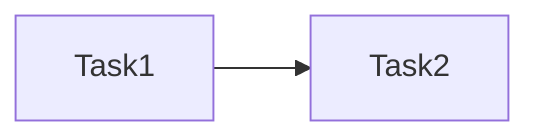

# 控制台侧边栏分类细分 — AI 执行方案

> 本文档是给 AI Agent 读的任务分解和执行流程，包含完整的技术上下文。

## 一、项目上下文

- **涉及前端项目**: frontend-user-v4-console
- **涉及后端模块**: 无（纯前端菜单配置调整）
- **UI 框架**: TDesign Vue Next
- **关键约束**: 只改路由配置文件中的分组结构和排序，不改任何页面、接口、隐藏路由
- **参考文件**:
  - `frontend-user-v4-console/src/router/modules/client.ts` — **唯一需要改的文件**
  - `frontend-user-v4-console/src/layouts/components/MenuContent.vue` — 菜单渲染组件（只读参考，不改）
  - `frontend-user-v4-console/src/store/modules/permission.ts` — 路由转菜单逻辑（只读参考，不改）

## 二、当前菜单结构

```
概览 (orderNo: 10, icon: DashboardIcon)
  ├── 控制台          orderNo: 10
  ├── 我的服务        orderNo: 20
  └── 产品目录        orderNo: 30

财务 (orderNo: 20, icon: MoneyIcon)
  ├── 订单记录        orderNo: 5
  ├── 账单记录        orderNo: 10
  ├── 账户充值        orderNo: 20
  ├── 充值记录        orderNo: 40
  ├── 优惠券中心      orderNo: 60
  └── 推荐奖励        orderNo: 70

支持 (orderNo: 30, icon: ServiceIcon)
  ├── 工单支持        orderNo: 10
  ├── 系统公告        orderNo: 20
  └── 帮助中心        orderNo: 30

账户 (orderNo: 40, icon: UserCircleIcon)
  ├── 实名认证        orderNo: 10
  └── 个人资料        orderNo: 20
```

## 三、目标菜单结构

```
首页 (orderNo: 10, icon: DashboardIcon)
  └── 控制台          orderNo: 10

产品与服务 (orderNo: 20, icon: ServerIcon)
  ├── 我的服务        orderNo: 10
  └── 产品目录        orderNo: 20

交易记录 (orderNo: 30, icon: FileIcon)
  ├── 订单记录        orderNo: 10
  └── 账单记录        orderNo: 20

钱包与充值 (orderNo: 40, icon: WalletIcon)
  ├── 账户充值        orderNo: 10
  └── 充值记录        orderNo: 20

优惠与活动 (orderNo: 50, icon: CouponIcon)
  ├── 优惠券中心      orderNo: 10
  └── 推荐奖励        orderNo: 20

帮助与支持 (orderNo: 90, icon: ServiceIcon)
  ├── 工单支持        orderNo: 10
  ├── 系统公告        orderNo: 20
  └── 帮助中心        orderNo: 30

账户设置 (orderNo: 100, icon: UserCircleIcon)
  ├── 实名认证        orderNo: 10
  └── 个人资料        orderNo: 20
```

**变化摘要**:
- "概览" → 改名"首页"，移除"我的服务""产品目录"
- "财务" → 拆为"交易记录""钱包与充值""优惠与活动"三个分组
- "支持" → 改名"帮助与支持"，orderNo 从 30 改为 90
- "账户" → 改名"账户设置"，orderNo 从 40 改为 100
- 所有子菜单项的 orderNo 统一为 10、20 的整齐排列
- 所有路由路径（URL）、组件引用、hidden 路由均不变

## 四、任务分解

> **重要规则**:
> - 每个 Task 使用 `- [ ] **Task N: {名称}**` 格式（Markdown 复选框）
> - AI Agent 执行时，**完成一个 Task 立即将其 `- [ ]` 改为 `- [X]`**，并同步更新本文档
> - **严禁跳过任何 Task 或攒到最后批量打勾** — 必须完成即打勾，通过验证后才能进入下一个 Task

- [X] **Task 1: 修改路由配置文件中的分组结构**

| 属性 | 值 |
|------|-----|
| 涉及项目 | frontend-user-v4-console |
| 涉及文件 | src/router/modules/client.ts |
| 依赖 | 无 |
| 预估改动量 | 中 |

**执行步骤**:

1. 打开 `frontend-user-v4-console/src/router/modules/client.ts`
2. **保留已有的 import**，新增一个图标导入：

```ts
// 在现有 import 块中添加 BookOpenIcon 已经存在，确认是否还需要新增图标
// 当前已导入: BookOpenIcon, CatalogIcon, CouponIcon, DashboardIcon, FileIcon,
//   GiftIcon, HelpCircleIcon, MoneyIcon, NotificationIcon, ServerIcon,
//   ServiceIcon, UserCircleIcon, UserSafetyIcon, WalletIcon
// 所需图标全部已导入，无需新增
```

3. **改"概览"分组为"首页"**（约第 68-99 行）：

将:
```ts
{
  path: '/client/overview',
  redirect: '/client/dashboard',
  meta: { title: title('概览', 'Overview'), icon: icon(DashboardIcon), requireAuth: true, orderNo: 10 },
  children: [
    {
      path: '/client/dashboard',
      name: 'ClientDashboard',
      component: () => import('@/pages/client/dashboard/index.vue'),
      meta: {
        title: title('控制台', 'Console'),
        icon: icon(DashboardIcon),
        requireAuth: true,
        robots: 'noindex,nofollow',
        orderNo: 10,
      },
    },
    {
      path: '/client/services',
      name: 'ClientServices',
      component: () => import('@/pages/client/services/index.vue'),
      meta: { title: title('我的服务'), icon: icon(ServerIcon), requireAuth: true, orderNo: 20 },
    },
    {
      path: '/client/catalog',
      name: 'ClientCatalog',
      component: () => import('@/pages/client/catalog/index.vue'),
      meta: { title: title('产品目录'), icon: icon(CatalogIcon), requireAuth: true, orderNo: 30 },
    },
  ],
},
```

改为:
```ts
{
  path: '/client/overview',
  redirect: '/client/dashboard',
  meta: { title: title('首页', 'Home'), icon: icon(DashboardIcon), requireAuth: true, orderNo: 10 },
  children: [
    {
      path: '/client/dashboard',
      name: 'ClientDashboard',
      component: () => import('@/pages/client/dashboard/index.vue'),
      meta: {
        title: title('控制台', 'Console'),
        icon: icon(DashboardIcon),
        requireAuth: true,
        robots: 'noindex,nofollow',
        orderNo: 10,
      },
    },
  ],
},
```

4. **在"首页"分组后面新增"产品与服务"分组**（紧跟在首页 children 数组闭合之后）：

```ts
{
  path: '/client/products',
  redirect: '/client/services',
  meta: { title: title('产品与服务', 'Products'), icon: icon(ServerIcon), requireAuth: true, orderNo: 20 },
  children: [
    {
      path: '/client/services',
      name: 'ClientServices',
      component: () => import('@/pages/client/services/index.vue'),
      meta: { title: title('我的服务'), icon: icon(ServerIcon), requireAuth: true, orderNo: 10 },
    },
    {
      path: '/client/catalog',
      name: 'ClientCatalog',
      component: () => import('@/pages/client/catalog/index.vue'),
      meta: { title: title('产品目录'), icon: icon(CatalogIcon), requireAuth: true, orderNo: 20 },
    },
  ],
},
```

5. **替换"财务"分组为三个新分组**。将原来的整个 `/client/finance` 分组（约第 100-140 行）替换为：

```ts
{
  path: '/client/trade',
  redirect: '/client/orders',
  meta: { title: title('交易记录', 'Trade'), icon: icon(FileIcon), requireAuth: true, orderNo: 30 },
  children: [
    {
      path: '/client/orders',
      name: 'ClientOrders',
      component: () => import('@/pages/client/orders/index.vue'),
      meta: { title: title('订单记录'), icon: icon(FileIcon), requireAuth: true, orderNo: 10 },
    },
    {
      path: '/client/invoices',
      name: 'ClientInvoices',
      component: () => import('@/pages/client/invoices/index.vue'),
      meta: { title: title('账单记录'), icon: icon(FileIcon), requireAuth: true, orderNo: 20 },
    },
  ],
},
{
  path: '/client/wallet',
  redirect: '/client/recharge',
  meta: { title: title('钱包与充值', 'Wallet'), icon: icon(WalletIcon), requireAuth: true, orderNo: 40 },
  children: [
    {
      path: '/client/recharge',
      name: 'ClientRecharge',
      component: () => import('@/pages/client/recharge/index.vue'),
      meta: { title: title('账户充值'), icon: icon(WalletIcon), requireAuth: true, orderNo: 10, keepAlive: false },
    },
    {
      path: '/client/payments',
      name: 'ClientPayments',
      component: () => import('@/pages/client/payments/index.vue'),
      meta: { title: title('充值记录'), icon: icon(WalletIcon), requireAuth: true, orderNo: 20 },
    },
  ],
},
{
  path: '/client/promo',
  redirect: '/client/coupons',
  meta: { title: title('优惠与活动', 'Promotions'), icon: icon(CouponIcon), requireAuth: true, orderNo: 50 },
  children: [
    {
      path: '/client/coupons',
      name: 'ClientCoupons',
      component: () => import('@/pages/client/coupons/index.vue'),
      meta: { title: title('优惠券中心'), icon: icon(CouponIcon), requireAuth: true, orderNo: 10 },
    },
    {
      path: '/client/referral',
      name: 'ClientReferral',
      component: () => import('@/pages/client/referral/index.vue'),
      meta: { title: title('推荐奖励'), icon: icon(GiftIcon), requireAuth: true, orderNo: 20 },
    },
  ],
},
```

6. **修改"支持"分组**（约第 142-168 行）：
   - `path` 保持 `/client/support` 不变
   - `title` 改为 `title('帮助与支持', 'Help & Support')`
   - `orderNo` 改为 `90`
   - 子菜单项 orderNo 统一为 10、20、30（当前已经是，确认即可）

```ts
{
  path: '/client/support',
  redirect: '/client/tickets',
  meta: { title: title('帮助与支持', 'Help & Support'), icon: icon(ServiceIcon), requireAuth: true, orderNo: 90 },
  children: [
    {
      path: '/client/tickets',
      name: 'ClientTickets',
      component: () => import('@/pages/client/tickets/index.vue'),
      meta: { title: title('工单支持'), icon: icon(ServiceIcon), requireAuth: true, orderNo: 10 },
    },
    {
      path: '/client/notices',
      name: 'ClientNotices',
      component: () => import('@/pages/client/notices/index.vue'),
      meta: { title: title('系统公告'), icon: icon(NotificationIcon), requireAuth: true, orderNo: 20 },
    },
    {
      path: '/client/help',
      name: 'ClientHelp',
      component: () => import('@/pages/client/help/index.vue'),
      meta: { title: title('帮助中心'), icon: icon(HelpCircleIcon), requireAuth: true, orderNo: 30 },
    },
  ],
},
```

7. **修改"账户"分组**（约第 170-190 行）：
   - `path` 保持 `/client/account` 不变
   - `title` 改为 `title('账户设置', 'Settings')`
   - `orderNo` 改为 `100`
   - 子菜单项 orderNo 确认为 10、20（当前已经是）

```ts
{
  path: '/client/account',
  redirect: '/client/verification',
  meta: { title: title('账户设置', 'Settings'), icon: icon(UserCircleIcon), requireAuth: true, orderNo: 100 },
  children: [
    {
      path: '/client/verification',
      name: 'ClientVerification',
      component: () => import('@/pages/client/verification/index.vue'),
      meta: { title: title('实名认证'), icon: icon(UserSafetyIcon), requireAuth: true, orderNo: 10 },
    },
    {
      path: '/client/profile',
      name: 'ClientProfile',
      component: () => import('@/pages/client/profile/index.vue'),
      meta: { title: title('个人资料'), icon: icon(UserCircleIcon), requireAuth: true, orderNo: 20 },
    },
  ],
},
```

8. **不动隐藏路由**。从 `order/create` 开始往下的所有 hidden 路由保持原样，不改任何内容。

**关键实现细节**:
- **只改一个文件**: `src/router/modules/client.ts`，其他文件不动
- **路由路径不变**: `/client/orders`、`/client/invoices` 等 URL 全部保持原样
- **组件引用不变**: 所有 `import(...)` 路径不变
- **hidden 路由不变**: 详情页、操作页的路由配置完全不动，它们的 `activeMenu` 指向的路径也没变，所以高亮状态依然正确
- **新增的分组 path**: `/client/products`、`/client/trade`、`/client/wallet`、`/client/promo` 这些是分组的虚拟路径，只用于侧边栏折叠，不会实际导航
- **图标**: 所需图标（DashboardIcon、ServerIcon、FileIcon、WalletIcon、CouponIcon、ServiceIcon、UserCircleIcon）全部已在 import 块中，无需新增
- **`BookOpenIcon` 和 `MoneyIcon`**: 已导入但新结构中不再使用，可以保留 import 不动（避免引入无关变更），也可以清理掉

**验收标准**:
- [ ] 侧边栏显示 7 个分组：首页、产品与服务、交易记录、钱包与充值、优惠与活动、帮助与支持、账户设置
- [ ] 每个分组的菜单项与目标结构完全一致
- [ ] 分组从上到下的顺序正确
- [ ] 所有隐藏路由不受影响（详情页、操作页正常工作）

**Task 完成验证**:
完成本 Task 后，**必须立即执行以下最小验证，通过后才能打勾 `[X]` 并进入下一个 Task**:
- 编译检查: `cd frontend-user-v4-console && npm run build`
- 手动验证: 打开 `http://127.0.0.1:5173/client/dashboard`，确认侧边栏显示 7 个分组，各分组菜单项正确

> **操作流程**: 改代码 → 跑本 Task 的回归测试 → 测试通过 → 将本 Task 的 `- [ ]` 改为 `- [X]` → 进入下一个 Task

- [X] **Task 2: 验证隐藏路由的高亮状态**

| 属性 | 值 |
|------|-----|
| 涉及项目 | frontend-user-v4-console |
| 涉及文件 | 无需修改，手动验证 |
| 依赖 | Task 1 |
| 预估改动量 | 无改动，仅验证 |

**执行步骤**:

1. 打开浏览器访问以下页面，确认侧边栏高亮正确的菜单项：

| 访问页面 | 应该高亮的菜单项 | 验证方式 |
|---------|----------------|---------|
| `/client/invoices/123` | 交易记录 → 账单记录 | 点击账单列表中任一条进入详情 |
| `/client/orders/123` | 交易记录 → 订单记录 | 点击订单列表中任一条进入详情 |
| `/client/payments/123` | 钱包与充值 → 充值记录 | 点击充值记录列表中任一条进入详情 |
| `/client/services/123` | 产品与服务 → 我的服务 | 点击服务列表中任一条进入实例控制台 |
| `/client/order/create` | 产品与服务 → 产品目录 | 从产品目录点击购买 |
| `/client/invoices/123/pay` | 交易记录 → 账单记录 | 从账单详情进入支付页 |
| `/client/notices/123` | 帮助与支持 → 系统公告 | 点击公告列表中任一条进入详情 |
| `/client/tickets/123` | 帮助与支持 → 工单支持 | 点击工单列表中任一条进入详情 |

2. 逐个访问，检查侧边栏高亮是否匹配上表

**验收标准**:
- [ ] 所有隐藏路由页面的侧边栏高亮指向正确的菜单项

**Task 完成验证**:
- 手动验证: 逐个访问上表中的页面路径，确认高亮正确
- 如发现高亮错误，检查 `client.ts` 中对应 hidden 路由的 `activeMenu` 值是否与新分组中的路径一致

> **操作流程**: 改代码 → 跑本 Task 的回归测试 → 测试通过 → 将本 Task 的 `- [ ]` 改为 `- [X]` → 进入下一个 Task

## 五、任务依赖图



## 六、测试方案

### 功能测试

| 编号 | 测试场景 | 操作步骤 | 预期结果 | 涉及任务 |
|------|---------|---------|---------|---------|
| T1 | 侧边栏分组数量 | 打开控制台，数侧边栏分组数 | 7 个分组 | Task1 |
| T2 | 首页分组 | 展开"首页"分组 | 只有"控制台"一个菜单项 | Task1 |
| T3 | 产品与服务分组 | 展开"产品与服务"分组 | "我的服务""产品目录"两个菜单项 | Task1 |
| T4 | 交易记录分组 | 展开"交易记录"分组 | "订单记录""账单记录"两个菜单项 | Task1 |
| T5 | 钱包与充值分组 | 展开"钱包与充值"分组 | "账户充值""充值记录"两个菜单项 | Task1 |
| T6 | 优惠与活动分组 | 展开"优惠与活动"分组 | "优惠券中心""推荐奖励"两个菜单项 | Task1 |
| T7 | 帮助与支持分组 | 展开"帮助与支持"分组 | "工单支持""系统公告""帮助中心"三个菜单项 | Task1 |
| T8 | 账户设置分组 | 展开"账户设置"分组 | "实名认证""个人资料"两个菜单项 | Task1 |
| T9 | 系统公告角标 | 发送一条新公告后打开控制台 | "系统公告"菜单项旁显示未读角标 | Task1 |
| T10 | 分组顺序 | 观察侧边栏从上到下 | 首页→产品与服务→交易记录→钱包与充值→优惠与活动→帮助与支持→账户设置 | Task1 |

### 边界测试
- 手机端/窄屏：侧边栏折叠状态下，分组展开/收起是否正常
- 页面刷新：刷新后侧边栏状态是否保持

### 回归测试（按 Task 粒度）

> **核心原则: 每完成一个 Task 立即跑其回归测试，不要攒到最后。**

| Task | 回归范围 | 验证操作 | 验证命令 |
|------|---------|---------|---------|
| Task1 | 编译通过 + 侧边栏渲染正确 | `npm run build` + 打开控制台目视确认 | `cd frontend-user-v4-console && npm run build` |
| Task2 | 隐藏路由高亮正确 | 逐个访问详情页确认高亮 | 手动验证 |

### 全量验证

全部 Task 完成后执行:
- 前端: `cd frontend-user-v4-console && npm run build`
- 手动全流程走查: 打开控制台 → 逐个点击每个分组的每个菜单项 → 确认页面正常加载 → 访问至少 3 个详情页 → 确认高亮正确

## 七、执行约束

- **严格遵循 AGENTS.md**: 所有代码变更必须符合项目规范
- **Task 级回归（防翻车核心）**: 每完成一个 Task 立即跑其回归测试，通过后打勾 `[X]`，再进入下一个 Task。**严禁攒到最后全量测**
- **UI 框架隔离**: TDesign 端禁止引入 Element Plus
- **只改一个文件**: `src/router/modules/client.ts`，不改任何其他文件
- **路由路径不变**: 所有 `/client/*` URL 保持原样，用户书签和外部链接不受影响
- **hidden 路由不动**: 详情页、操作页的路由配置完全保持原样
- **不可做**:
  - 不改任何页面组件
  - 不改路由 URL 路径
  - 不改菜单项的图标或名称（只改分组名和分组图标）
  - 不改 MenuContent.vue 或 permission.ts
  - 不新增菜单项或删除菜单项
- **公共组件**: 无需引入新组件

## 八、参考文件
- 路由配置（唯一改动文件）: `frontend-user-v4-console/src/router/modules/client.ts`
- 菜单渲染（只读参考）: `frontend-user-v4-console/src/layouts/components/MenuContent.vue`
- 路由转菜单（只读参考）: `frontend-user-v4-console/src/store/modules/permission.ts`
- 已有的图标导入: `tdesign-icons-vue-next`（DashboardIcon、ServerIcon、FileIcon、WalletIcon、CouponIcon、ServiceIcon、UserCircleIcon 等）
