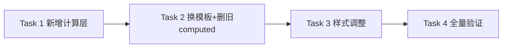

# 控制台「今年消费」月度柱状图 — AI 执行方案

> 本文档是给 AI Agent 读的任务分解和执行流程,包含完整的技术上下文。

## 一、项目上下文

- **涉及前端项目**: frontend-user-v4-console
- **涉及后端模块**: 无(纯前端改动,沿用现有 `/client/invoices` 接口)
- **UI 框架**: TDesign Vue Next + `tdesign-icons-vue-next`(禁止引入 Element Plus)
- **改动文件**: 仅 `frontend-user-v4-console/src/pages/client/dashboard/index.vue` 一个文件
- **关键约束**:
  - 严格遵守 `AGENTS.md`:控制台页面根元素 padding 沿用现有结构;复用 TDesign token 变量,不自造间距/颜色
  - 数据口径与原饼图一致:已支付账单(`status=1`)按 `paid_at`(回退 `created_at`)归月
  - 数据源接口不变:`clientApi.invoices({ page:1, page_size:100, status:1 })`(后端 `page_size` 上限 100,不支持 `date_range`)
  - 不引入新依赖、不新增图表库,沿用页面现有的纯 CSS `.bar-chart` 模式
- **参考文件**:
  - 现有饼图实现(待移除): `frontend-user-v4-console/src/pages/client/dashboard/index.vue` 第 68~90 行模板、第 234~242 行 `SegmentItem`、第 489~519 行 `productConsumptionData`、第 506~516 行 `productSegments`/`donutBackground`、第 396~400 行 `monthLabel`、第 907~985 行 donut 样式
  - 现有柱状图参考(复用模式): 同文件第 95~110 行模板、第 455~485 行 `dailyExpenseData`/`dailyBars`、第 985~1023 行 `.bar-chart` 样式
  - API 定义: `frontend-user-v4-console/src/api/client.ts` 第 168 行 `invoices`

## 二、任务分解

> **重要规则**:
> - 每个 Task 使用 `- [ ] **Task N: {名称}**` 格式(Markdown 复选框)
> - AI Agent 执行时,**完成一个 Task 立即将其 `- [ ]` 改为 `- [X]`**,并同步更新本文档
> - **严禁跳过任何 Task 或攒到最后批量打勾** — 必须完成即打勾,通过验证后才能进入下一个 Task
> - **拆分原则:每个 Task 完成后页面都必须能编译且可用**。新增代码在前,删除旧代码在后,避免出现"删了旧 computed 但模板还引用"的破损中间态。

- [X] **Task 1: 新增月度消费计算层(只增不删,保留旧饼图逻辑)**

| 属性 | 值 |
|------|-----|
| 涉及项目 | frontend-user-v4-console |
| 涉及文件 | src/pages/client/dashboard/index.vue(`<script setup>` 区) |
| 依赖 | 无 |
| 预估改动量 | 小 |

**执行步骤**:

1. 在原 `monthLabel` computed(约第 396~400 行)**下方**新增 `currentYearLabel` computed(暂不删 `monthLabel`,Task 2 再删):
   ```ts
   const currentYearLabel = computed(() => `${new Date().getFullYear()} 年`);
   ```
2. 在原 `productConsumptionData` computed(约第 489 行)**下方**新增 `monthlyConsumptionData` computed:
   ```ts
   const monthlyConsumptionData = computed(() => {
     const now = new Date();
     const year = now.getFullYear();
     const currentMonth = now.getMonth(); // 0-based
     const months: { key: string; label: string; month: number; amount: number; count: number }[] = [];
     for (let m = 0; m <= currentMonth; m += 1) {
       const key = `${year}-${String(m + 1).padStart(2, '0')}`;
       months.push({ key, label: `${String(m + 1).padStart(2, '0')}月`, month: m + 1, amount: 0, count: 0 });
     }

     for (const invoice of paidInvoices.value) {
       const date = String(invoice.paid_at || invoice.created_at || '');
       if (!date.startsWith(`${year}-`)) continue;
       const monthKey = date.slice(0, 7); // YYYY-MM
       const target = months.find((item) => item.key === monthKey);
       if (!target) continue;
       const amount = toNumber(invoice.paid_amount || invoice.amount);
       target.amount = Math.round((target.amount + amount) * 100) / 100;
       target.count += 1;
     }
     return months;
   });
   ```
3. 紧随其后新增 `monthlyBars` 和 `monthlyBarsHasData`:
   ```ts
   const monthlyBars = computed(() => {
     const amounts = monthlyConsumptionData.value.map((item) => item.amount);
     const max = Math.max(...amounts, 1);
     return monthlyConsumptionData.value.map((item) => ({
       ...item,
       height: item.amount > 0 ? `${Math.max(8, Math.round((item.amount / max) * 100))}%` : '0%',
       amountLabel: item.amount > 0 ? formatMoney(item.amount) : '',
       tooltip: `${item.label} · 消费 ¥${formatMoney(item.amount)} · ${item.count} 笔账单`,
     }));
   });

   const monthlyBarsHasData = computed(() => monthlyConsumptionData.value.some((item) => item.amount > 0));
   ```
4. **本 Task 不动模板、不删任何旧 computed**。新 computed 暂未在模板使用,页面仍显示旧饼图。

**关键实现细节**:
- 月份归集键: `paid_at`/`created_at` 取前 7 位 `YYYY-MM`。
- `currentMonth` 用 `now.getMonth()`(0-based),循环 `m = 0..currentMonth` 生成 1 月到当前月。
- 金额取 `paid_amount`,回退 `amount`,用 `toNumber` 转换。
- `formatMoney`、`toNumber`、`paidInvoices` 均已存在,无需新增 import。

**验收标准**:
- [ ] TypeScript 编译通过(新增 computed 未使用不报错)
- [ ] 页面仍正常显示旧饼图(本 Task 不改可见行为)

**Task 完成验证**:
- 构建: `cd frontend-user-v4-console && npm run build`
- 通过后打勾 `[X]` 进入下一个 Task

> **操作流程**: 改代码 → 跑构建 → 构建通过 → 打勾 `[X]` → 进入下一个 Task

- [X] **Task 2: 重写左侧卡片模板 + 删除旧饼图 computed**

| 属性 | 值 |
|------|-----|
| 涉及项目 | frontend-user-v4-console |
| 涉及文件 | src/pages/client/dashboard/index.vue(模板区约第 68~90 行 + script 区旧 computed) |
| 依赖 | Task 1 |
| 预估改动量 | 中 |

**执行步骤**:

1. 定位左侧第一张图表卡片(原「每月产品消费占比」,约第 68~90 行),整段替换为:
   ```vue
   <t-card class="dashboard-card chart-card" :bordered="false">
     <template #title>今年消费</template>
     <template #actions>
       <span class="card-meta">{{ currentYearLabel }}</span>
     </template>

     <t-loading :loading="!invoicesLoaded" text="加载中">
       <div v-if="monthlyBarsHasData" class="bar-chart bar-chart--monthly" aria-label="今年月度消费">
         <t-tooltip
           v-for="bar in monthlyBars"
           :key="bar.key"
           :content="bar.tooltip"
           placement="top"
           show-arrow
         >
           <div class="bar-chart__slot">
             <div class="bar-chart__col" :style="{ height: bar.height }">
               <span v-if="bar.amountLabel" class="bar-chart__value">¥{{ bar.amountLabel }}</span>
               <span class="bar-chart__bar"></span>
             </div>
             <span class="bar-chart__label">{{ bar.label }}</span>
           </div>
         </t-tooltip>
       </div>
       <t-empty v-else description="暂无今年消费数据" />
     </t-loading>
   </t-card>
   ```
2. 右侧「近 30 天每日消费」卡片(约第 92 行起)**保持原样不动**。
3. 删除模板中已不再引用的旧 computed 定义(script 区):
   - `SegmentItem` interface(约第 234~242 行)
   - `segmentColors` 常量数组(约第 506~512 行)
   - `productConsumptionData` computed(约第 489~505 行)
   - `totalConsumptionAmount` computed(紧随 productConsumptionData)
   - `productSegments` computed(约第 514~528 行)
   - `donutBackground` computed(约第 530~534 行)
   - `monthLabel` computed(约第 396~400 行,已被 `currentYearLabel` 替代)
4. 确认 `t-tooltip` 已随 TDesign 全局注册可用(Starter 默认全量注册 TDesign,无需额外 import)。
5. **t-tooltip 布局风险排查**:若构建后目视发现柱子不等分(t-tooltip 给 trigger 加了 wrapper 破坏 `flex:1`),改用外层 div 自包 + tooltip content 插槽:
   ```vue
   <div v-for="bar in monthlyBars" :key="bar.key" class="bar-chart__slot">
     <t-tooltip :content="bar.tooltip" placement="top" show-arrow>
       <div class="bar-chart__col" :style="{ height: bar.height }">
         <span v-if="bar.amountLabel" class="bar-chart__value">¥{{ bar.amountLabel }}</span>
         <span class="bar-chart__bar"></span>
       </div>
     </t-tooltip>
     <span class="bar-chart__label">{{ bar.label }}</span>
   </div>
   ```
   优先尝试方案一(t-tooltip 包 slot),出问题再降级到方案二(slot 自包、tooltip 只包 col)。

**关键实现细节**:
- 卡片 class 沿用 `dashboard-card chart-card`,不新增卡片样式。
- `t-loading` 绑定沿用 `!invoicesLoaded`。
- 柱顶金额 `bar.amountLabel` 仅在 `amount > 0` 时渲染。
- X 轴月份标签全部显示(最多 12 根,无需间隔)。

**验收标准**:
- [ ] 卡片标题「今年消费」、右上角「2026 年」
- [ ] 柱子数 = 当前月份数(2026-06 时 6 根)
- [ ] 有消费的柱子有高度、有金额、有月份标签
- [ ] 悬停 tooltip 显示「X月 · 消费 ¥XXX · N 笔账单」
- [ ] 今年无消费显示「暂无今年消费数据」
- [ ] 右侧每日图不受影响
- [ ] 无 `SegmentItem`/`productSegments` 等未定义/未使用编译错误

**Task 完成验证**:
- 构建: `cd frontend-user-v4-console && npm run build`(含 `vue-tsc --noEmit`)
- 手动验证: `npm run dev`,登录控制台首页,确认柱状图渲染、tooltip、空状态(样式可能还未完善,Task 3 处理)

> **操作流程**: 改代码 → 跑构建 → 构建通过 → 打勾 `[X]` → 进入下一个 Task

- [X] **Task 3: 样式调整(删 donut 样式,新增月度图样式,柱顶金额浮在柱顶上方)**

| 属性 | 值 |
|------|-----|
| 涉及项目 | frontend-user-v4-console |
| 涉及文件 | src/pages/client/dashboard/index.vue(`<style>` 区,约第 740~1023 行) |
| 依赖 | Task 2 |
| 预估改动量 | 小 |

**执行步骤**:

1. 移除 donut 相关样式(约第 896~985 行):`.donut-panel`、`.donut-chart`、`.donut-chart__center`、`.donut-legend`、`.donut-legend__row`、`.donut-legend__dot`、`.donut-legend__name`、`.donut-legend__percent`、`.donut-legend__amount`。注意 `.donut-legend__row, .message-row, .todo-row` 这条共享规则只删 `.donut-legend__row` 选择器,保留 `.message-row, .todo-row`。
2. 保留 `.bar-chart`、`.bar-chart__slot`、`.bar-chart__bar`、`.bar-chart__label`、`.chart-foot`(右侧每日图仍在用)。
3. 在 `.bar-chart__label` 规则之后新增月度图样式:
   ```scss
   .bar-chart--monthly {
     height: 16rem;
     /* 顶部留白:容纳最高柱(100%)的金额标签浮在柱顶上方,不被裁切 */
     padding-top: var(--td-comp-paddingTB-l);
   }

   .bar-chart--monthly .bar-chart__slot {
     cursor: pointer;
   }

   .bar-chart--monthly .bar-chart__col {
     position: relative;
     display: flex;
     flex-direction: column;
     align-items: center;
     justify-content: flex-end;
     width: 60%;
     min-height: 0;
   }

   .bar-chart--monthly .bar-chart__bar {
     width: 100%;
     flex: 1;
     min-height: 0;
   }

   .bar-chart__value {
     position: absolute;
     bottom: 100%;
     left: 50%;
     transform: translateX(-50%);
     padding-bottom: var(--td-comp-margin-xxs);
     color: var(--td-text-color-secondary);
     font: var(--td-font-body-small);
     white-space: nowrap;
   }
   ```

**关键实现细节**:
- **柱顶金额用绝对定位浮在柱顶上方**(`.bar-chart__value { position:absolute; bottom:100% }`),不占柱体高度——避免矮柱子里金额和柱体挤在一起。
- `.bar-chart--monthly` 增加 `padding-top: var(--td-comp-paddingTB-l)`,给最高柱(100%)的金额标签留出上方空间,防止溢出裁切。
- 颜色/字号/间距全部用 TDesign token,禁止硬编码。
- `.bar-chart--monthly .bar-chart__bar { width:100%; flex:1 }` 覆盖原 `.bar-chart__bar { width:68% }`,因带前缀选择器不影响右侧每日图。
- `.bar-chart__label` 原有 `position:absolute; bottom: calc(margin-l * -1)` 对月度图同样适用,无需改动。

**验收标准**:
- [ ] 柱顶金额标签浮在柱体上方,不与柱体重叠
- [ ] 矮柱子(8%最低高度)柱体仍清晰可见,金额不遮挡
- [ ] 最高柱的金额标签未被裁切(顶部留白生效)
- [ ] 月份标签在柱子下方居中
- [ ] 无 donut 残留样式,右侧每日图样式不受影响
- [ ] 浅色/深色 token 下均显示正常

**Task 完成验证**:
- 构建: `cd frontend-user-v4-console && npm run build`
- 手动验证: 刷新控制台首页,目视检查柱状图排版、金额标签位置、月份标签、tooltip,对比右侧每日图未受影响

> **操作流程**: 改样式 → 跑构建 → 构建通过 → 打勾 `[X]` → 进入下一个 Task

- [X] **Task 4: 全量构建验证 + 手动走查**

| 属性 | 值 |
|------|-----|
| 涉及项目 | frontend-user-v4-console |
| 涉及文件 | 无(验证 Task) |
| 依赖 | Task 1、Task 2、Task 3 |
| 预估改动量 | 小 |

**执行步骤**:

1. 执行全量构建:`cd frontend-user-v4-console && npm run build`。
2. 启动开发服务器:`npm run dev`,登录用户控制台首页(`/client/dashboard`)。
3. 走查清单:
   - 卡片标题「今年消费」、右上角「2026 年」。
   - 柱子数量 = 当前月份数(2026-06 时 6 根,1 月~6 月)。
   - 有消费的月份柱顶有金额(浮在柱顶上方)、底部有月份标签。
   - 悬停柱子 tooltip 显示「X月 · 消费 ¥XXX · N 笔账单」。
   - 今年无消费的账号显示「暂无今年消费数据」。
   - 右侧「近 30 天每日消费」卡片完全正常。
   - 顶部概览卡片、待办项、公告等其他区域不受影响。
4. 若涉及重构收口范围,额外执行 `npm run verify:refactor`(本次仅单文件 UI 替换,默认可不跑;如发现 lint 报错再跑)。

**验收标准**:
- [ ] `npm run build` 通过(含 `vue-tsc --noEmit`,0 报错)
- [ ] 上述走查清单全部通过
- [ ] 无 console 报错

**Task 完成验证**:
- 本 Task 即最终验证,通过后打勾 `[X]`。

## 三、任务依赖图



## 四、测试方案

### 功能测试

| 编号 | 测试场景 | 操作步骤 | 预期结果 | 涉及任务 |
|------|---------|---------|---------|---------|
| T1 | 正常年份展示 | 登录有今年多笔已支付账单的用户,进入控制台首页 | 显示 1 月到当前月的柱状图,有消费的月份柱子有高度、金额浮在柱顶上方 | Task1,2,3 |
| T2 | 月份归集正确 | 核对某月柱顶金额 = 该月所有已支付账单 `paid_amount` 之和 | 金额一致(允许分位四舍五入) | Task1 |
| T3 | 悬停 tooltip | 鼠标移到任意柱子 | 弹出「X月 · 消费 ¥XXX · N 笔账单」,N 等于该月已支付账单笔数 | Task2 |
| T4 | 空数据 | 登录今年无任何已支付账单的用户 | 显示「暂无今年消费数据」,不报错 | Task2 |
| T5 | 仅当月有消费 | 1~5 月无消费,仅 6 月有消费 | 前 5 根柱子高度 0、无金额标签,6 月柱子正常,tooltip 笔数正确 | Task1,2 |
| T6 | 跨年不混入 | 去年 12 月的已支付账单不应计入今年 | 去年账单不影响今年任何柱子 | Task1 |
| T7 | 最高柱金额不裁切 | 存在消费远高于其他月的月份 | 该月柱顶金额标签完整可见,不被卡片上边缘裁切 | Task3 |

### 边界测试
- 当前月为 1 月时:仅 1 根柱子,正常显示。
- 单月消费金额远高于其他月:其他月柱子高度按比例压缩,最低 `Math.max(8, ...)%` 保证可见。
- `paid_at` 为空回退 `created_at`:仍能正确归月。

### 回归测试(按 Task 粒度)

> **核心原则: 每完成一个 Task 立即跑其回归测试,不要攒到最后。**

| Task | 回归范围 | 验证操作 | 验证命令 |
|------|---------|---------|---------|
| Task1 | 新增计算层不破坏现有功能 | 构建 + 页面仍显示旧饼图 | `cd frontend-user-v4-console && npm run build` |
| Task2 | 卡片渲染、tooltip、空状态、右侧每日图不受影响 | 构建 + 手动浏览控制台首页 | `cd frontend-user-v4-console && npm run build` |
| Task3 | 样式排版、金额浮顶、token 适配、donut 残留清理 | 构建 + 目视检查 | `cd frontend-user-v4-console && npm run build` |
| Task4 | 全量回归 | 全量构建 + 完整走查清单 | `cd frontend-user-v4-console && npm run build` |

### 全量验证

全部 Task 完成后执行:
- 构建: `cd frontend-user-v4-console && npm run build`
- 手动全流程走查: 登录用户 → 控制台首页 → 核对柱状图、tooltip、空状态、右侧每日图、顶部概览卡片均正常

## 五、执行约束

- **严格遵循 AGENTS.md**: 所有代码变更符合项目规范
- **Task 级回归(防翻车核心)**: 每完成一个 Task 立即跑其回归测试,通过后打勾 `[X]`,再进入下一个 Task。**严禁攒到最后全量测** — 改一点测一点,确保不翻车
- **UI 框架隔离**: TDesign 端禁止引入 Element Plus
- **单文件改动**: 仅改 `src/pages/client/dashboard/index.vue`,不动 API、路由、store、其他页面
- **不引入新依赖**: 沿用现有纯 CSS `.bar-chart` 模式 + TDesign `t-tooltip`,不引入 ECharts/Chart.js
- **token 复用**: 颜色/字号/间距全部用 `--td-*` 变量,禁止硬编码
- **数据源不变**: `clientApi.invoices({ page:1, page_size:100, status:1 })` 保持不变,不调后端、不加接口参数
- **不可做**: 不改右侧「近 30 天每日消费」卡片;不删 `paidInvoices`/`invoicesLoaded`/`currentMonthRange`/数据加载逻辑;不新增年度切换/产品维度/导出能力
- **必须先做**: Task 1(新增计算层,只增不删)→ Task 2(换模板 + 删旧 computed)→ Task 3(样式)→ Task 4(验证),顺序不可调换。每个 Task 完成后页面都必须能编译且可用
- **t-tooltip 布局风险**: 若 t-tooltip 包裹后柱子不等分,降级为方案二(slot 自包、tooltip 只包 col),见 Task 2 步骤 5

## 六、参考文件
- 待改造文件: `frontend-user-v4-console/src/pages/client/dashboard/index.vue`
- 现有柱状图参考(同文件): 第 95~110 行模板、第 455~485 行 computed、第 985~1023 行样式
- API 定义: `frontend-user-v4-console/src/api/client.ts` 第 168 行 `invoices`
- 后端接口约束: `backend/app/Http/Requests/Client/Invoice/IndexRequest.php`(`page_size` 上限 100,无 `date_range`)
