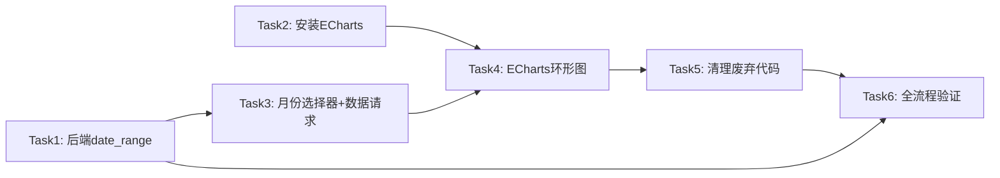

# 控制台每月产品消费占比优化 — AI 执行方案

> 本文档是给 AI Agent 读的任务分解和执行流程，包含完整的技术上下文。

## 一、项目上下文

- **涉及前端项目**: frontend-user-v4-console
- **涉及后端模块**: backend/app/Http/Requests/Client/Invoice/IndexRequest.php, backend/app/Http/Controllers/Client/InvoiceController.php
- **UI 框架**: TDesign Vue Next
- **关键约束**:
  - 禁止混用 Element Plus
  - ECharts 按需引入，禁止全量引入
  - 图标使用 `tdesign-icons-vue-next`
  - 控制台页面间距: `padding: var(--td-comp-paddingTB-l) var(--td-comp-paddingLR-l)`
  - API 调用走 `src/api/client.ts`，禁止直接创建 axios 实例
  - 状态展示复用 `@caiwu/shared/statusConfig` 和 `StatusTag.vue`
- **参考文件**:
  - 现有 Dashboard: `frontend-user-v4-console/src/pages/client/dashboard/index.vue`
  - 管理端 ECharts 示例: `frontend-admin-v3/src/pages/dashboard/base/index.vue`（如有 ECharts 使用）
  - 颜色配置: `frontend-user-v4-console/src/config/color.ts`（`DEFAULT_COLOR_OPTIONS`）
  - 颜色工具: `frontend-user-v4-console/src/utils/color.ts`（`getChartListColor()`）
  - API 定义: `frontend-user-v4-console/src/api/client.ts`

## 二、任务分解

> **重要规则**:
> - 每个 Task 使用 `- [ ] **Task N: {名称}**` 格式（Markdown 复选框）
> - AI Agent 执行时，**完成一个 Task 立即将其 `- [ ]` 改为 `- [X]`**，并同步更新本文档
> - **严禁跳过任何 Task 或攒到最后批量打勾** — 必须完成即打勾，通过验证后才能进入下一个 Task

- [ ] **Task 1: 后端 — 为客户端 invoices 接口增加 date_range 参数支持**

| 属性 | 值 |
|------|-----|
| 涉及项目 | backend |
| 涉及文件 | `app/Http/Requests/Client/Invoice/IndexRequest.php`, `app/Http/Controllers/Client/InvoiceController.php`, 新增迁移文件 |
| 依赖 | 无 |
| 预估改动量 | 小 |

**执行步骤**:

1. **修改 IndexRequest.php** — 在 `rules()` 方法中新增 `date_range` 校验规则:

```php
'date_range'   => ['nullable', 'array', 'size:2'],
'date_range.0' => ['required_with:date_range', 'date'],
'date_range.1' => ['required_with:date_range', 'date'],
```

2. **修改 InvoiceController.php** — 在 `index()` 方法中，`keyword` 筛选逻辑之后、分页之前，增加 `date_range` 筛选:

```php
if (!empty($filters['date_range']) && is_array($filters['date_range']) && count($filters['date_range']) >= 2) {
    $start = trim((string) ($filters['date_range'][0] ?? ''));
    $end   = trim((string) ($filters['date_range'][1] ?? ''));
    if ($start !== '' && $end !== '') {
        $query->whereBetween('created_at', [
            \Carbon\CarbonImmutable::parse($start)->startOfDay(),
            \Carbon\CarbonImmutable::parse($end)->endOfDay(),
        ]);
    }
}
```

3. **新增迁移文件** — 为 `invoices` 表添加复合索引:

```php
// 迁移文件名: 2026_06_21_000001_add_invoices_user_status_created_idx.php
Schema::table('invoices', function (Blueprint $table) {
    $table->index(['user_id', 'status', 'created_at'], 'invoices_user_status_created_idx');
});
```

**关键实现细节**:
- 使用 `created_at` 而非 `paid_at` 做筛选（与 adminList 保持一致，复用索引）
- `date_range` 为可选参数，不传时行为完全不变（向后兼容）
- 前端过滤仍可使用 `paid_at` 做二次过滤（确保只统计已支付账单的支付时间在范围内）

**验收标准**:
- [ ] `GET /client/invoices?date_range[]=2026-05-01&date_range[]=2026-05-31` 返回仅 5 月账单
- [ ] `GET /client/invoices`（不传 date_range）行为与修改前完全一致
- [ ] 新索引已创建

**Task 完成验证**:
完成本 Task 后，**必须立即执行以下最小验证，通过后才能打勾 `[X]` 并进入下一个 Task**:
- 后端: `cd backend && php artisan test --filter=InvoiceController`
- 手动验证: 用 API 工具或 curl 测试 `GET /client/invoices?date_range[]=2026-05-01&date_range[]=2026-05-31` 返回正确过滤数据

---

- [ ] **Task 2: 前端 — 安装 ECharts 依赖并创建按需引入模块**

| 属性 | 值 |
|------|-----|
| 涉及项目 | frontend-user-v4-console |
| 涉及文件 | `package.json`, 新增 `src/utils/echarts.ts` |
| 依赖 | 无 |
| 预估改动量 | 小 |

**执行步骤**:

1. **安装 ECharts**:
```bash
cd frontend-user-v4-console && npm install echarts@5.5.x
```

2. **创建按需引入模块** `src/utils/echarts.ts`:

```typescript
import { PieChart } from 'echarts/charts';
import { LegendComponent, TooltipComponent, GraphicComponent } from 'echarts/components';
import * as echarts from 'echarts/core';
import { CanvasRenderer } from 'echarts/renderers';

echarts.use([PieChart, TooltipComponent, LegendComponent, GraphicComponent, CanvasRenderer]);

export default echarts;
```

3. **确认安装成功**:
```bash
cd frontend-user-v4-console && npm run build
```

**关键实现细节**:
- 使用 `echarts/core` 按需引入，禁止 `import echarts from 'echarts'` 全量引入
- 版本建议 5.5.x（Tree-shaking 更优），但如与 admin-v3 一致性更重要也可锁定 5.4.3
- 引入 `GraphicComponent` 用于环形图中心的自定义文字（月总消费 + 金额）

**验收标准**:
- [ ] `package.json` 中出现 `echarts` 依赖
- [ ] `src/utils/echarts.ts` 创建完成，仅引入 Pie/Tooltip/Legend/Graphic/Renderer
- [ ] `npm run build` 构建通过

**Task 完成验证**:
- 前端: `cd frontend-user-v4-console && npm run build`

---

- [ ] **Task 3: 前端 — Dashboard 增加月份选择器和数据请求逻辑**

| 属性 | 值 |
|------|-----|
| 涉及项目 | frontend-user-v4-console |
| 涉及文件 | `src/pages/client/dashboard/index.vue` |
| 依赖 | Task 1（后端 date_range 支持） |
| 预估改动量 | 中 |

**执行步骤**:

1. **新增月份相关状态** — 在 `<script setup>` 中添加:

```typescript
const selectedMonth = ref<string>(() => {
  const now = new Date();
  return `${now.getFullYear()}-${String(now.getMonth() + 1).padStart(2, '0')}`;
});

const monthOptions = computed(() => {
  const now = new Date();
  return Array.from({ length: 12 }, (_, i) => {
    const d = new Date(now.getFullYear(), now.getMonth() - i, 1);
    const value = `${d.getFullYear()}-${String(d.getMonth() + 1).padStart(2, '0')}`;
    return {
      value,
      label: `${d.getFullYear()}年${d.getMonth() + 1}月`,
    };
  });
});

function getMonthRange(month: string): [string, string] {
  const [year, m] = month.split('-').map(Number);
  const start = new Date(year, m - 1, 1);
  const end = new Date(year, m, 0);
  return [toDateText(start), toDateText(end)];
}
```

2. **修改数据请求逻辑** — 将 `loadDashboard` 中 invoices 请求改为按选中月份请求:

```typescript
// 替换原有的 invoices 请求（原：不带 date_range）
async function loadInvoicesForSelectedMonth() {
  invoicesLoaded.value = false;
  try {
    const [startDate, endDate] = getMonthRange(selectedMonth.value);
    const res = await clientApi.invoices({
      page: 1,
      page_size: 100,
      status: 1,
      date_range: [startDate, endDate],
    });
    paidInvoices.value = resolvePagedList(res);
  } catch {
    paidInvoices.value = [];
  } finally {
    invoicesLoaded.value = true;
  }
}
```

3. **修改 `productConsumptionData` computed** — 从硬编码当月前缀改为基于 `selectedMonth`:

```typescript
const productConsumptionData = computed(() => {
  const prefix = selectedMonth.value; // 原来是硬编码 `${now.getFullYear()}-${String(now.getMonth() + 1).padStart(2, '0')}`
  const map: Record<string, { label: string; amount: number; count: number }> = {};

  for (const invoice of paidInvoices.value) {
    const date = String(invoice.paid_at || invoice.created_at || '');
    if (!date.startsWith(prefix)) continue;
    // ... 其余逻辑不变
  }
  // ... 其余逻辑不变
});
```

4. **修改模板 — 替换静态 monthLabel 为 t-select**:

将:
```html
<template #actions>
  <span class="card-meta">{{ monthLabel }}</span>
</template>
```

替换为:
```html
<template #actions>
  <t-select
    v-model="selectedMonth"
    :options="monthOptions"
    size="small"
    style="width: 140px"
    @change="loadInvoicesForSelectedMonth"
  />
</template>
```

5. **在 `loadDashboard` 中调用 `loadInvoicesForSelectedMonth`** 替换原有 invoices 请求逻辑

**关键实现细节**:
- `t-select` 的 `size="small"` 与卡片标题栏紧凑风格一致
- 月份值格式为 `YYYY-MM`，与日期前缀匹配逻辑一致
- `selectedMonth` 默认当月，首次加载行为不变
- 后端 `date_range` 按 `created_at` 过滤，前端仍用 `paid_at` 前缀二次过滤，确保数据准确性

**验收标准**:
- [ ] 月份选择器显示在卡片标题栏右侧
- [ ] 默认选中当月
- [ ] 切换月份后图表数据正确更新
- [ ] 切换月份后中心文字（月总消费金额）正确更新

**Task 完成验证**:
- 前端: `cd frontend-user-v4-console && npm run build`
- 手动验证: 打开控制台首页，确认月份选择器显示；切换到上个月，确认饼图数据刷新

---

- [ ] **Task 4: 前端 — 替换 CSS 甜甜圈为 ECharts 环形图**

| 属性 | 值 |
|------|-----|
| 涉及项目 | frontend-user-v4-console |
| 涉及文件 | `src/pages/client/dashboard/index.vue` |
| 依赖 | Task 2（ECharts 安装）, Task 3（月份选择器+数据） |
| 预估改动量 | 中 |

**执行步骤**:

1. **引入 ECharts** — 在 `<script setup>` 顶部添加:

```typescript
import echarts from '@/utils/echarts';
```

2. **新增 chart ref 和初始化逻辑**:

```typescript
const donutChartRef = ref<HTMLElement | null>(null);
let chartInstance: echarts.ECharts | null = null;

function initChart() {
  if (!donutChartRef.value) return;
  chartInstance = echarts.init(donutChartRef.value);
  updateChart();
}

function updateChart() {
  if (!chartInstance || !productSegments.value.length) return;

  const total = totalConsumptionAmount.value;
  chartInstance.setOption({
    tooltip: {
      trigger: 'item',
      formatter: '{b}: ¥{c} ({d}%)',
    },
    legend: { show: false },
    series: [{
      type: 'pie',
      radius: ['55%', '80%'],
      center: ['50%', '50%'],
      avoidLabelOverlap: false,
      label: { show: false },
      emphasis: {
        label: { show: false },
        scaleSize: 4,
      },
      itemStyle: {
        borderRadius: 4,
        borderColor: 'var(--td-bg-color-container)',
        borderWidth: 2,
      },
      data: productSegments.value.map((item) => ({
        name: item.label,
        value: item.amount,
        itemStyle: { color: item.color },
      })),
      animationType: 'scale',
      animationEasing: 'cubicOut',
    }],
    graphic: [{
      type: 'text',
      left: 'center',
      top: '38%',
      style: {
        text: '月总消费',
        fontSize: 12,
        fill: 'var(--td-text-color-secondary)',
        textAlign: 'center',
      },
    }, {
      type: 'text',
      left: 'center',
      top: '52%',
      style: {
        text: `¥${formatMoney(total)}`,
        fontSize: 16,
        fontWeight: 'bold',
        fill: 'var(--td-text-color-primary)',
        textAlign: 'center',
      },
    }],
  });
}

// 监听数据变化更新图表
watch(productSegments, () => {
  updateChart();
});

onMounted(() => {
  initChart();
});

onBeforeUnmount(() => {
  chartInstance?.dispose();
  chartInstance = null;
});

// 响应式
const resizeObserver = new ResizeObserver(() => {
  chartInstance?.resize();
});
onMounted(() => {
  if (donutChartRef.value) resizeObserver.observe(donutChartRef.value);
});
onBeforeUnmount(() => {
  resizeObserver.disconnect();
});
```

3. **替换模板** — 将甜甜圈区域:

```html
<div v-if="productSegments.length" class="donut-panel">
  <div class="donut-chart" :style="{ background: donutBackground }">
    <div class="donut-chart__center">
      <span>月总消费</span>
      <strong>{{ formatMoney(totalConsumptionAmount) }}</strong>
    </div>
  </div>
  <div class="donut-legend">
    <div v-for="slice in productSegments" :key="slice.label" class="donut-legend__row">
      <span class="donut-legend__dot" :style="{ background: slice.color }"></span>
      <span class="donut-legend__name">{{ slice.label }}</span>
      <span class="donut-legend__percent">{{ slice.percent }}%</span>
      <span class="donut-legend__amount">¥{{ formatMoney(slice.amount) }}</span>
    </div>
  </div>
</div>
<t-empty v-else description="暂无本月产品消费数据" />
```

替换为:

```html
<div v-if="productSegments.length" class="donut-panel">
  <div ref="donutChartRef" class="donut-echarts"></div>
  <div class="donut-legend">
    <div v-for="slice in productSegments" :key="slice.label" class="donut-legend__row">
      <span class="donut-legend__dot" :style="{ background: slice.color }"></span>
      <span class="donut-legend__name">{{ slice.label }}</span>
      <span class="donut-legend__percent">{{ slice.percent }}%</span>
      <span class="donut-legend__amount">¥{{ formatMoney(slice.amount) }}</span>
    </div>
  </div>
</div>
<t-empty v-else description="暂无本月产品消费数据" />
```

4. **更新样式** — 替换 `.donut-chart` 相关样式为 `.donut-echarts`:

```less
.donut-echarts {
  width: 180px;
  height: 180px;
  flex-shrink: 0;
}
```

移除 `.donut-chart`、`.donut-chart__center`、`.donut-chart::after` 相关样式。

5. **清理废弃代码**:
   - 移除 `donutBackground` computed
   - 移除 `SegmentItem` 中的 `start`、`end` 字段（ECharts 不需要）
   - 移除 `productSegments` 中的 `start`、`end` 计算
   - `segmentColors` 保留（仍用于 ECharts `itemStyle.color` 和图例）

**关键实现细节**:
- ECharts `graphic` 组件渲染中心文字（"月总消费" + 金额），比 CSS 绝对定位更可靠
- `radius: ['55%', '80%']` 保持与原甜甜圈近似的环形效果
- `borderRadius: 4` 给扇区增加圆角，视觉更现代
- 保留外部 HTML 图例（比 ECharts 内置图例更灵活，可精确控制布局和样式）
- `ResizeObserver` 处理容器尺寸变化（比 `window.resize` 更精确）
- 空数据状态仍使用 `<t-empty>`，逻辑不变

**验收标准**:
- [ ] 环形图正确显示各产品消费占比
- [ ] 中心显示"月总消费"和金额
- [ ] 鼠标悬停扇区显示 tooltip（产品名: ¥金额 (百分比%)）
- [ ] 图表有入场动画
- [ ] 右侧图例正确显示色块、产品名、百分比、金额
- [ ] 空数据时显示"暂无本月产品消费数据"
- [ ] 窗口缩放时图表自适应

**Task 完成验证**:
- 前端: `cd frontend-user-v4-console && npm run build`
- 手动验证: 打开控制台首页，确认环形图渲染正确；悬停确认 tooltip；缩放窗口确认自适应

---

- [ ] **Task 5: 前端 — 清理废弃代码和样式**

| 属性 | 值 |
|------|-----|
| 涉及项目 | frontend-user-v4-console |
| 涉及文件 | `src/pages/client/dashboard/index.vue` |
| 依赖 | Task 4 |
| 预估改动量 | 小 |

**执行步骤**:

1. **移除废弃 CSS 类**（如果 Task 4 中有遗漏）:
   - `.donut-chart`
   - `.donut-chart__center`
   - `.donut-chart::after`
   - `.donut-panel` 中与旧甜甜圈相关的特殊布局代码

2. **移除废弃 JS**:
   - `donutBackground` computed（如 Task 4 中未移除）
   - `monthLabel` computed（已被 `selectedMonth` + `monthOptions` 替代）

3. **确认 `SegmentItem` 类型精简**:

```typescript
interface SegmentItem {
  label: string;
  amount: number;
  count: number;
  percent: number;
  color: string;
  // 移除 start, end（ECharts 不需要）
}
```

4. **确认 `productSegments` computed 精简** — 移除 `start`、`end`、`cursor` 计算

**验收标准**:
- [ ] 无残留的 CSS 甜甜圈相关样式
- [ ] 无残留的 `donutBackground`、`monthLabel` computed
- [ ] TypeScript 类型无多余字段
- [ ] `npm run build` 构建通过，无 TypeScript 错误

**Task 完成验证**:
- 前端: `cd frontend-user-v4-console && npm run build`
- 手动验证: 打开控制台首页，确认所有功能正常

---

- [ ] **Task 6: 全流程验证**

| 属性 | 值 |
|------|-----|
| 涉及项目 | frontend-user-v4-console + backend |
| 涉及文件 | 无新改动 |
| 依赖 | Task 1-5 全部完成 |
| 预估改动量 | 无 |

**执行步骤**:

1. **后端验证**: `cd backend && php artisan test`
2. **前端验证**: `cd frontend-user-v4-console && npm run build`
3. **手动全流程走查**:
   - 打开控制台首页，确认默认显示当月消费占比
   - 月份选择器下拉列出近 12 个月
   - 切换到上个月，图表数据正确更新
   - 切换到有数据的月份，环形图正确渲染
   - 切换到无数据的月份，显示空状态
   - 悬停扇区显示 tooltip
   - 缩放窗口图表自适应
   - 图例颜色、百分比、金额正确

**验收标准**:
- [ ] 后端测试全部通过
- [ ] 前端构建通过
- [ ] 手动全流程走查通过

**Task 完成验证**:
- 后端: `cd backend && php artisan test`
- 前端: `cd frontend-user-v4-console && npm run build`
- 手动全流程走查

## 三、任务依赖图



## 四、测试方案

### 功能测试

| 编号 | 测试场景 | 操作步骤 | 预期结果 | 涉及任务 |
|------|---------|---------|---------|---------|
| T1 | 默认展示当月 | 打开控制台首页 | 环形图显示当月消费占比，月份选择器默认当月 | Task3,Task4 |
| T2 | 切换月份 | 选择"2026年3月" | 图表刷新为3月数据，中心金额更新 | Task3,Task4 |
| T3 | 空数据月份 | 选择一个没有消费的月份 | 显示"暂无本月产品消费数据" | Task3,Task4 |
| T4 | 后端date_range过滤 | 请求 `/client/invoices?date_range[]=2026-05-01&date_range[]=2026-05-31` | 仅返回5月账单 | Task1 |
| T5 | 后端兼容性 | 请求 `/client/invoices`（不带date_range） | 行为与修改前一致 | Task1 |
| T6 | ECharts tooltip | 悬停饼图扇区 | 显示"产品名: ¥金额 (百分比%)" | Task4 |
| T7 | 响应式 | 缩放浏览器窗口 | 图表自适应容器尺寸 | Task4 |

### 边界测试

- 极限值: 12 个月前月份仍有数据、单月消费金额极大/极小
- 并发: 快速连续切换月份，确认最终状态正确（防抖处理）
- 权限: 未登录用户无法访问接口

### 回归测试(按 Task 粒度)

| Task | 回归范围 | 验证操作 | 验证命令 |
|------|---------|---------|---------|
| Task1 | 确保现有 invoices 列表功能不受影响 | 请求 `/client/invoices` 确认返回正常 | `cd backend && php artisan test --filter=InvoiceController` |
| Task2 | 确保 ECharts 安装不破坏构建 | 构建通过 | `cd frontend-user-v4-console && npm run build` |
| Task3 | 确保 Dashboard 首页加载正常 | 打开控制台首页确认正常 | `cd frontend-user-v4-console && npm run build` |
| Task4 | 确保环形图正确渲染、柱状图不受影响 | 打开控制台首页确认两个图表正常 | `cd frontend-user-v4-console && npm run build` |
| Task5 | 确保清理后无残留报错 | 构建通过且页面正常 | `cd frontend-user-v4-console && npm run build` |

### 全量验证

全部 Task 完成后执行:
- 后端: `cd backend && php artisan test`
- 前端: `cd frontend-user-v4-console && npm run build`
- 手动全流程走查: 打开控制台首页 → 确认默认当月 → 切换月份 → 确认数据更新 → 确认 tooltip → 确认空数据 → 确认响应式

## 五、执行约束

- **严格遵循 AGENTS.md**: 所有代码变更必须符合项目规范
- **Task 级回归（防翻车核心）**: 每完成一个 Task 立即跑其回归测试，通过后打勾 `[X]`，再进入下一个 Task。**严禁攒到最后全量测** — 改一点测一点，确保不翻车
- **UI 框架隔离**: TDesign 端禁止引入 Element Plus
- **ECharts 按需引入**: 禁止 `import echarts from 'echarts'`，必须使用 `echarts/core` + 按需注册
- **状态复用**: 状态展示使用 `@caiwu/shared/statusConfig`、`StatusTag.vue`
- **请求收敛**: API 调用走 `src/api/client.ts`，禁止直接创建 axios 实例
- **图标统一**: TDesign 端用 `tdesign-icons-vue-next`
- **不可做**:
  - 不改变"近 30 天每日消费"柱状图
  - 不增加点击饼图跳转功能
  - 不增加产品类型/账单类型筛选
  - 不改变按产品名称聚合的数据维度
  - 不引入全量 echarts
- **必须先做**: Task1（后端）和 Task2（ECharts 安装）必须先完成，Task3/Task4 依赖它们
- **公共组件**: 复用 `DEFAULT_COLOR_OPTIONS`（`src/config/color.ts`）和 `getChartListColor()`（`src/utils/color.ts`）为 ECharts 提供色板

## 六、参考文件

- Dashboard 页面: `frontend-user-v4-console/src/pages/client/dashboard/index.vue`
- 后端 InvoiceController: `backend/app/Http/Controllers/Client/InvoiceController.php`
- 后端 IndexRequest: `backend/app/Http/Requests/Client/Invoice/IndexRequest.php`
- 颜色配置: `frontend-user-v4-console/src/config/color.ts`
- 颜色工具: `frontend-user-v4-console/src/utils/color.ts`
- API 定义: `frontend-user-v4-console/src/api/client.ts`
- 共享状态映射: `shared/statusConfig.js`
- 共享组件: `shared/components/`
