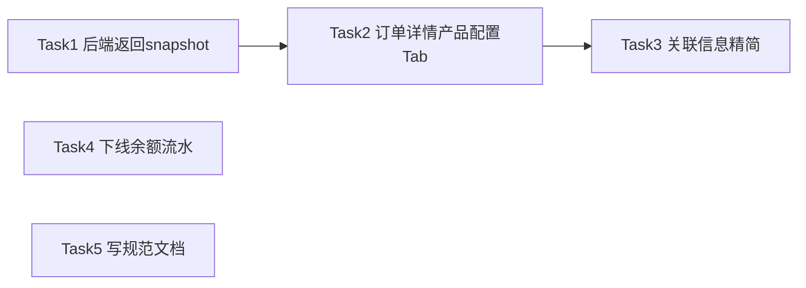

# 订单/账单/充值职责分界与余额流水下线 — AI 执行方案

> 本文档是给 AI Agent 读的任务分解和执行流程，包含完整的技术上下文。

## 一、项目上下文

- **涉及前端项目**: frontend-user-v4-console
- **涉及后端模块**: backend/app/Http/Controllers/Client/OrderController.php
- **UI 框架**: TDesign Vue Next + tdesign-icons-vue-next
- **关键约束**: 严格遵守 AGENTS.md；控制台财务页面禁止统计/指标卡片；页面根元素 padding 用 `var(--td-comp-paddingTB-l) var(--td-comp-paddingLR-l)`；状态展示复用 `@caiwu/shared/statusConfig` 和 `StatusTag.vue`；API 走 `src/api/`，认证走 `src/utils/auth.js`
- **参考文件**:
  - 配置快照翻译工具（已有，直接复用）: `frontend-user-v4-console/src/domains/finance/useRecords.ts`（导出 `flattenSnapshot` / `configValueLabelMap` / `snapshotLabel` / `formatSnapshotItem` / `formatSnapshotValue`）
  - 已接入快照渲染的账单支付页（模板参考）: `frontend-user-v4-console/src/pages/client/invoice-detail/index.vue`（L85-L90 用 `.order-pricing-block` / `.snapshot-line-item` 样式）
  - 管理端订单详情页（职责分界参照）: `frontend-admin-v3/src/pages/finance/orders/detail/index.vue`
  - 后端 Admin 端 transform 参照: `backend/app/Services/Finance/AdminFinanceQueryService.php` L419-L467（`transformOrder` 已返回 config_snapshot / config_pricing_snapshot）
  - Order 模型: `backend/app/Models/Order.php`（$fillable L37-L38 / $casts L56-L57 / 访问器 L120-L148 已就绪）

## 二、任务分解

> **重要规则**:
> - 每个 Task 使用 `- [ ] **Task N: {名称}**` 格式（Markdown 复选框）
> - AI Agent 执行时，**完成一个 Task 立即将其 `- [ ]` 改为 `- [X]`**，并同步更新本文档
> - **严禁跳过任何 Task 或攒到最后批量打勾** — 必须完成即打勾，通过验证后才能进入下一个 Task

- [X] **Task 1: 后端 OrderController 返回 config_snapshot / config_pricing_snapshot 并清理 invoice.payments 冗余**

| 属性 | 值 |
|------|-----|
| 涉及项目 | backend |
| 涉及文件 | backend/app/Http/Controllers/Client/OrderController.php |
| 依赖 | 无 |
| 预估改动量 | 小 |

**执行步骤**:

1. 打开 `backend/app/Http/Controllers/Client/OrderController.php`，定位 `show()` 方法的 `with()` 预加载块（约 L108-L112）
2. 删除 `with()` 中的 `invoice.payments:id,invoice_id,payment_no,gateway,trade_no,amount,status,paid_at` 这一行（不再预加载订单详情的支付明细，支付记录归属充值记录页职责）
3. 定位 `transformOrderDetail()` 方法（约 L156-L219），找到 `$base['invoice'] = ...` 块
4. 删除该块中的 `'payments' => [...]` 整段（约 L201-L210），使 invoice 块闭合于 `'created_at'` 之后
5. 在 `transformOrderDetail()` 的 `return $base;` 之前（约 L212 前）追加两行：
   ```php
   $base['config_snapshot'] = (array) ($order->config_snapshot ?? []);
   $base['config_pricing_snapshot'] = (array) ($order->config_pricing_snapshot ?? []);
   ```
   与 Admin 端 `AdminFinanceQueryService::transformOrder`（L464-L465）完全一致

**关键实现细节**:
- 字段已就绪：orders 表已有 `config_snapshot`(JSON) / `config_pricing_snapshot`(JSON)；Order 模型已声明 `$fillable`/`$casts(array)`/访问器（`App\Support\VersionedJson::tradeSnapshot` 自动加 `_schema_version` / `_schema_type` 戳）
- 不需要改 `with()` 加载 product 关联：`product_name` 已通过 `display_product_name` 访问器在模型层回退解析
- 不需要新增 FormRequest / Resource / 路由：`show()` 用 `Request`，路由已存在
- schema 戳（`_schema_version` / `_schema_type`）原样返回，与 Admin 端保持一致，前端按需忽略
- 旧订单 snapshot 为 null 时：模型访问器已 `?? []` 兜底，transform 再 `(array) (... ?? [])` 双保险返回 `[]`

**验收标准**:
- [ ] `GET /api/client/orders/{id}` 响应 `data.config_snapshot` 为数组（可能含 `_schema_type`）
- [ ] `GET /api/client/orders/{id}` 响应 `data.config_pricing_snapshot` 为数组（含 `items[]` 定价明细）
- [ ] `GET /api/client/orders/{id}` 响应 `data.invoice` 不再含 `payments` 键
- [ ] 旧订单（snapshot 为 null）返回 `[]` 不报错

**Task 完成验证**:
完成本 Task 后，**必须立即执行以下最小验证，通过后才能打勾 `[X]` 并进入下一个 Task**:
- 后端: `cd backend && php artisan test --filter=OrderController`（如无相关测试类，至少跑 `php artisan test --filter=Client`）
- 手动验证: 用测试账号 `2908990438@qq.com` 登录，请求 `GET /api/client/orders/{某新购订单id}`，确认响应含 `config_snapshot` / `config_pricing_snapshot` 且不含 `invoice.payments`

> **操作流程**: 改代码 → 跑本 Task 的回归测试 → 测试通过 → 将本 Task 的 `- [ ]` 改为 `- [X]` → 进入下一个 Task

- [X] **Task 2: 订单详情页新增"产品配置"标签页（仅新购订单显示）**

| 属性 | 值 |
|------|-----|
| 涉及项目 | frontend-user-v4-console |
| 涉及文件 | frontend-user-v4-console/src/pages/client/order-detail/index.vue |
| 依赖 | Task 1（后端需先返回 snapshot 字段） |
| 预估改动量 | 中 |

**执行步骤**:

1. 打开 `frontend-user-v4-console/src/pages/client/order-detail/index.vue`，确认当前是 `<t-tabs>` + 两个 `<t-tab-panel>`（value="basic" / value="related"）的静态结构
2. 在 `<script setup>` 区块 import 处追加：
   ```ts
   import { flattenSnapshot, configValueLabelMap } from '@/domains/finance/useRecords';
   ```
   （`computed` 如未引入则补；`ref` 已有则不动）
3. 在 `activeTab` 定义之后追加三个 computed：
   ```ts
   const showConfigTab = computed(() => {
     const type = String(detail.value?.type || '').toLowerCase();
     return ['new', 'normal'].includes(type);
   });
   const configSnapshotView = computed(() => {
     const row = detail.value;
     if (!row) return [];
     return flattenSnapshot(row.config_snapshot as Record<string, unknown> | undefined, configValueLabelMap(row));
   });
   const pricingSnapshotView = computed(() => flattenSnapshot(detail.value?.config_pricing_snapshot as Record<string, unknown> | undefined));
   ```
4. 在模板 `<t-tab-panel value="related">` **之前**插入新的 `<t-tab-panel>`：
   ```vue
   <t-tab-panel v-if="showConfigTab" value="config" label="产品配置">
     <div v-if="configSnapshotView.length" class="order-pricing-block">
       <section class="order-section">
         <h4 class="order-section-title">配置快照</h4>
         <div class="snapshot-line-list">
           <div v-for="item in configSnapshotView" :key="`cfg-${item.label}`" class="snapshot-line-item">
             <span class="snapshot-line-label">{{ item.label }}</span>
             <strong class="snapshot-line-value">{{ item.value }}</strong>
           </div>
         </div>
       </section>
     </div>
     <div v-if="pricingSnapshotView.length" class="order-pricing-block">
       <section class="order-section">
         <h4 class="order-section-title">配置定价</h4>
         <div class="snapshot-line-list">
           <div v-for="item in pricingSnapshotView" :key="`price-${item.label}`" class="snapshot-line-item">
             <span class="snapshot-line-label">{{ item.label }}</span>
             <strong class="snapshot-line-value">{{ item.value }}</strong>
           </div>
         </div>
       </section>
     </div>
     <div v-if="!configSnapshotView.length && !pricingSnapshotView.length" class="order-detail-empty">暂无配置快照</div>
   </t-tab-panel>
   ```
5. 在 `<style scoped lang="less">` 末尾追加从 `invoice-detail/index.vue` 复制的快照样式（约 70 行，包含 `.order-pricing-block` / `.order-section` / `.order-section-title` / `.snapshot-line-list` / `.snapshot-line-item` / `.snapshot-line-label` / `.snapshot-line-value` 及移动端媒体查询）。**不要**直接 import invoice-detail 的 scoped 样式（scoped 隔离会失效），必须复制到本页 scoped 块内
6. 更新 TypeScript 类型：打开 `frontend-user-v4-console/src/types/client.ts`，在 `OrderRecord` 接口的 `coupon?: OrderCouponInfo | null;` 之后追加：
   ```ts
   config_snapshot?: Record<string, unknown> | null;
   config_pricing_snapshot?: Record<string, unknown> | null;
   ```
   （参照同文件 `InvoiceRecord` L990-L991 的同名字段定义保持一致）

**关键实现细节**:
- `flattenSnapshot` 第二参数 `valueLabelMap` 必传 `configValueLabelMap(row)`：用于把 `config_snapshot` 里的原始 field 值映射成可读 `value_label`（来自 `config_pricing_snapshot.items[]` 的 `field`→`value_label` 映射）
- `pricingSnapshotView` 不传第二参数：配置定价区块直接展示原始值
- `showConfigTab` 用 `computed` 而非 `v-if` 在外层判断：`detail` 异步加载，初始为 null，type 为空 → Tab 不显示；加载完成响应式自动出现。默认 `activeTab='basic'` 不会错位
- 续费/升级订单（type=renew/upgrade）Tab 直接不渲染
- 旧订单无 snapshot 数据时：两个区块均 `v-if="...View.length"` 不渲染，全空时显示"暂无配置快照"
- `type` 字段已用 `.toLowerCase()` + `['new','normal'].includes()`，与 `invoice-detail/index.vue` L317 `isNewPurchaseInvoice` 判断逻辑一致

**验收标准**:
- [ ] 新购订单详情页出现"产品配置"标签页，显示配置快照和配置定价
- [ ] 续费/升级订单详情页不出现"产品配置"标签页
- [ ] 旧订单（无 snapshot）打开"产品配置"显示"暂无配置快照"，不报错
- [ ] `npm run build` 通过（含 `vue-tsc --noEmit` 类型检查）

**Task 完成验证**:
- 前端: `cd frontend-user-v4-console && npm run build`
- 手动验证: `npm run dev` 后用测试账号登录，打开一条新购订单详情确认"产品配置"Tab 出现且数据正确；打开一条续费订单确认 Tab 隐藏；打开旧订单确认"暂无配置快照"兜底

> **操作流程**: 改代码 → 跑本 Task 的回归测试 → 测试通过 → 将本 Task 的 `- [ ]` 改为 `- [X]` → 进入下一个 Task

- [X] **Task 3: 订单详情"关联信息"标签页精简，去掉内联账单金额/已付金额**

| 属性 | 值 |
|------|-----|
| 涉及项目 | frontend-user-v4-console |
| 涉及文件 | frontend-user-v4-console/src/pages/client/order-detail/index.vue |
| 依赖 | Task 2（同一文件，按顺序改） |
| 预估改动量 | 小 |

**执行步骤**:

1. 在 `frontend-user-v4-console/src/pages/client/order-detail/index.vue` 的 `<t-tab-panel value="related">` 内，定位"关联账单"section（约 L82-L108）
2. 删除以下两个 `<div class="detail-kv-item">` 区块：
   - "账单金额"项（显示 `detail.invoice.amount`，约 L93-L97）
   - "已付金额"项（显示 `detail.invoice.paid_amount`，约 L98-L102）
3. **保留**：
   - 账单号 + "查看账单"跳转按钮（约 L83-L92，当前已是 `t-button variant="text" @click="router.push(`/client/invoices/${detail.invoice.id}`)"`，**不要改成 `<a>` 标签**，SPA 内跳转必须用 `router.push`）
   - 账单状态行（如保留请保留，与"查看账单"按钮并列）
4. **保留**整个"关联服务"section（约 L111-L135）和"优惠券"section（约 L137-L148）不动

**关键实现细节**:
- 账单号跳转**必须**用 `router.push`，不能用 `<a href>`：控制台是 SPA，`<a>` 会整页刷新丢失 token 上下文。沿用现有 `router.push` 模式，与 L25"去支付"按钮一致
- 不要删除"关联账单"整个 section，只删金额字段；账单号 + 跳转按钮是订单↔账单的必要互联入口
- 后端 `transformOrderDetail` 仍返回 `invoice.amount` / `invoice.paid_amount`（Task 1 未删这两个字段），前端只是不展示，不影响接口契约

**验收标准**:
- [ ] "关联信息"标签页不再显示"账单金额""已付金额"两行
- [ ] "查看账单"按钮仍在，点击跳转到 `/client/invoices/{id}` 正常
- [ ] "关联服务""优惠券"section 完好无损
- [ ] `npm run build` 通过

**Task 完成验证**:
- 前端: `cd frontend-user-v4-console && npm run build`
- 手动验证: 打开订单详情"关联信息"Tab，确认账单金额/已付金额消失，"查看账单"按钮可跳转

> **操作流程**: 改代码 → 跑本 Task 的回归测试 → 测试通过 → 将本 Task 的 `- [ ]` 改为 `- [X]` → 进入下一个 Task

- [X] **Task 4: 下线余额流水页面 + 路由 + 清理跨页引用（保留 API 方法和类型）**

| 属性 | 值 |
|------|-----|
| 涉及项目 | frontend-user-v4-console |
| 涉及文件 | frontend-user-v4-console/src/pages/client/balance-logs/（整目录删除）、frontend-user-v4-console/src/router/modules/client.ts、frontend-user-v4-console/src/domains/finance/useRecords.ts、frontend-user-v4-console/src/pages/client/dashboard/index.vue |
| 依赖 | 无（可与 Task 1-3 并行，但建议放最后避免冲突） |
| 预估改动量 | 中 |

**执行步骤**:

1. **删除余额流水页面目录**：删除 `frontend-user-v4-console/src/pages/client/balance-logs/` 整个目录（含 `index.vue`）
2. **删除路由注册**：打开 `frontend-user-v4-console/src/router/modules/client.ts`，删除 `ClientBalanceLogs` 路由块（约 L114-L119）：
   ```ts
   {
     path: '/client/balance-logs',
     name: 'ClientBalanceLogs',
     component: () => import('@/pages/client/balance-logs/index.vue'),
     meta: { title: '余额流水', icon: MoneyIcon, requireAuth: true, orderNo: 50 },
   },
   ```
   同时检查该文件顶部 import 是否有 `MoneyIcon` 仅被此路由使用，若是则一并删除未用 import
3. **清理 useRecords.ts 的 BalanceLog 引用**：打开 `frontend-user-v4-console/src/domains/finance/useRecords.ts`：
   - L13 `import type { BalanceLog, PaymentRecord }` 改为 `import type { PaymentRecord }`
   - L16 `type RecordListItem = PaymentRecord | BalanceLog;` 改为 `type RecordListItem = PaymentRecord;`
   - L356 `balanceLogs: (params) => clientApi.balanceLogs(params)` 删除该行
4. **调整 Dashboard 跳转按钮**：打开 `frontend-user-v4-console/src/pages/client/dashboard/index.vue`：
   - L23 `router.push('/client/balance-logs')` 改为 `router.push('/client/payments')`
   - L99 "消费明细"按钮跳转同理改为 `/client/payments`
   - **保留** L231 `BalanceLog` 类型 import / L261 `ref<BalanceLog[]>` / L459 遍历 / L649-L666 `clientApi.balanceLogs(...)` 调用：dashboard 每日消费图表继续用现有接口，只改跳转目标
5. **保留不动**：
   - `frontend-user-v4-console/src/api/client.ts` 的 `clientApi.balanceLogs` / `balanceLogsSummary` 方法（L152-L153）：dashboard 仍在用
   - `frontend-user-v4-console/src/types/client.ts` 的 `BalanceLog` interface（L1152-L1160）：dashboard 仍在用
   - 后端 `/client/balance-logs` 接口：暂不下线

**关键实现细节**:
- **不要删 `clientApi.balanceLogs` API 方法**：dashboard 首页"近 7 天每日消费"图表直接调用它拉数据（L649-L666），删了会打断图表。本次只下线用户可见的页面入口，API 方法和类型保留
- 菜单自动消失：TDesign Starter 根据 `meta.orderNo` 自动生成菜单，删路由块后菜单项自动消失，无需改菜单配置文件
- 路由守卫：`requireAuth: true` 是通用守卫，无针对 `ClientBalanceLogs` 的特殊守卫，删除安全
- `useRecords.ts` 的 `RecordListItem` 联合类型删 `BalanceLog` 后，grep 确认仅 L16 定义、L13 import，无运行时分支判断，安全
- Dashboard 跳转改到 `/client/payments`（充值记录页）：充值记录是用户能看到的资金流入记录，作为"消费明细"的替代入口合理

**验收标准**:
- [ ] 左侧菜单"财务"下不再有"余额流水"项
- [ ] 访问 `/client/balance-logs` 路由 404 或重定向（不再渲染页面）
- [ ] Dashboard "近 7 天每日消费"图表仍能加载（API 未动）
- [ ] Dashboard "查看消费明细"按钮跳转到 `/client/payments`
- [ ] `npm run build` 通过
- [ ] `npm run verify:refactor` 通过

**Task 完成验证**:
- 前端: `cd frontend-user-v4-console && npm run build`
- 重构收口: `cd frontend-user-v4-console && npm run verify:refactor`（本次涉及删路由 + 删页面 + 跨页依赖清理，属重构收口范围）
- 手动验证: `npm run dev` 后确认菜单无"余额流水"；Dashboard 图表正常加载；跳转按钮指向充值记录

> **操作流程**: 改代码 → 跑本 Task 的回归测试 → 测试通过 → 将本 Task 的 `- [ ]` 改为 `- [X]` → 进入下一个 Task

- [X] **Task 5: 把"订单/账单/充值职责分界规范"写入开发记录/规范**

| 属性 | 值 |
|------|-----|
| 涉及项目 | 文档 |
| 涉及文件 | 文档/开发记录/规范/订单账单充值职责分界规范.md（新建） |
| 依赖 | 无（可与 Task 1-4 并行） |
| 预估改动量 | 小 |

**执行步骤**:

1. 确认 `文档/开发记录/规范/` 目录存在，不存在则创建
2. 新建文件 `文档/开发记录/规范/订单账单充值职责分界规范.md`，写入以下内容（已在方案中定稿，直接落盘）：

```markdown
# 订单/账单/充值记录职责分界规范

> 适用范围：用户控制台（frontend-user-v4-console）与管理端（frontend-admin-v3）一致采用本分界。
> 制定日期：2026-06-21
> 制定背景：用户端原先把"产品配置快照"放在账单支付页、订单详情内联账单金额字段，导致职责边界模糊。本规范对齐管理端做法，明确三类记录的职责边界。

## 一、职责定义

### 订单记录（orders）
- **职责**：购买契约。承载"用户买了什么产品、什么配置、什么周期"。
- **核心字段**：订单号、订单类型、状态、金额、产品、计费周期、数量、配置快照、配置定价快照。
- **配置快照归属**：`config_snapshot` 和 `config_pricing_snapshot` 是订单的字段，**在订单详情展示**，不在账单详情展示。
- **订单类型差异化**：
  - 新购订单（type=new/normal）：详情页显示"产品配置"标签页，展示配置快照 + 配置定价
  - 续费订单（type=renew）：详情页不显示"产品配置"标签页（续费不改配置）
  - 升级订单（type=upgrade）：详情页不显示"产品配置"标签页（升降级差异在账单支付页体现）

### 账单记录（invoices）
- **职责**：结算凭证。承载"用户应付多少、实付多少、账单状态、账单行项目"。
- **核心字段**：账单号、账单类型、状态、金额、已付金额、到期日、账单行项目（items）、支付记录。
- **账单详情展示**：账单行项目 + 关联订单跳转 + 支付记录。**不展示产品配置快照**（配置快照属订单职责）。

### 充值记录（payments）
- **职责**：第三方资金流入。承载"用户通过支付宝等第三方支付渠道充了多少钱"。
- **核心字段**：支付单号、交易号、支付渠道、金额、状态、时间。
- **充值详情展示**：支付单本身信息 + 关联账单（保留关联账单区块，便于用户追溯资金去向）。
- **数据范围**：仅第三方支付网关真实资金流入（支付宝充值、支付宝付商品），余额支付/管理员手动开服/免费订单不产生 Payment 记录。

## 二、跨表互联原则

三类记录通过 ID 互联，但**详情层只保留跳转引用，不内联冗余字段**：

| 来源详情 | 关联目标 | 允许的展示方式 |
|---------|---------|--------------|
| 订单详情 | 关联账单 | 账单号 + "查看账单"跳转按钮；**不内联**账单金额、已付金额 |
| 订单详情 | 关联服务 | 服务名、域名、到期时间（可内联，属订单契约一部分） |
| 订单详情 | 支付记录 | **不展示**（支付记录属充值记录页职责） |
| 账单详情 | 关联订单 | 订单号 + 跳转按钮 |
| 账单详情 | 支付记录 | 展示该账单关联的所有 Payment 行（账单是结算凭证，支付明细是其组成部分） |
| 充值详情 | 关联账单 | 保留关联账单区块（账单号、状态、金额、已付） |

## 三、配置快照展示规则

- **字段来源**：`orders.config_snapshot`（JSON）+ `orders.config_pricing_snapshot`（JSON）
- **翻译工具**：用户控制台复用 `src/domains/finance/useRecords.ts` 的 `flattenSnapshot` / `configValueLabelMap` / `snapshotLabel` / `formatSnapshotItem` / `formatSnapshotValue`
- **管理端**：复用 `frontend-admin-v3/src/pages/finance/orders/detail/index.vue` 的 `SNAPSHOT_LABEL_MAP` / `flattenSnapshot`
- **单位追加规则**：`bw*`→Mbps、`memory`→MB、`ip_num`/`ipv6_num`/`quantity`→个（仅对纯数字生效）
- **schema 戳过滤**：`_schema_version` / `_schema_type` 是内部字段，前端展示时忽略
- **空数据兜底**：旧订单无 snapshot 时显示"暂无配置快照"，不报错

## 四、已下线页面

- **余额流水页面**（`/client/balance-logs`）：2026-06-21 下线。理由：账单记录已覆盖充值、消费、新购、退款等所有资金变动场景，余额流水是账户层冗余视角。后端接口 `/client/balance-logs` 暂保留（Dashboard 每日消费图表仍在用）。

## 五、状态枚举来源

三类记录的状态枚举统一来自 `shared/statusConfig.js`：
- 订单状态：`ORDER_STATUS_MAP`（0待付款/1已付款/2开通中/3已完成/4已取消/5已退款）
- 账单状态：`INVOICE_STATUS_MAP`（0未付/1已付/2已取消/3逾期/5已退款）
- 支付状态：`PAYMENT_STATUS_MAP`（0待支付/1成功/2失败/3已退款）

## 六、参考实现

- 管理端订单详情（职责分界基准）：`frontend-admin-v3/src/pages/finance/orders/detail/index.vue`
- 用户控制台订单详情（本规范落地）：`frontend-user-v4-console/src/pages/client/order-detail/index.vue`
- 用户控制台配置快照翻译工具：`frontend-user-v4-console/src/domains/finance/useRecords.ts`
- 后端 Admin 端 transform 参照：`backend/app/Services/Finance/AdminFinanceQueryService.php` `transformOrder`
- 后端 Client 端 transform 实现：`backend/app/Http/Controllers/Client/OrderController.php` `transformOrderDetail`
```

3. 自检文档内容与仓库现状一致：字段名、文件路径、状态枚举值均与 AGENTS.md / 当前代码 / 前期调研结论一致

**验收标准**:
- [ ] `文档/开发记录/规范/订单账单充值职责分界规范.md` 文件存在
- [ ] 文档内容与仓库现状一致（字段名、路径、枚举值）
- [ ] 文档结构清晰，包含职责定义、互联原则、配置快照规则、已下线页面、状态枚举、参考实现六部分

**Task 完成验证**:
- 只改文档：自检内容与仓库现状一致
- 手动验证: 打开文件确认格式正确，路径引用准确

> **操作流程**: 改代码 → 跑本 Task 的回归测试 → 测试通过 → 将本 Task 的 `- [ ]` 改为 `- [X]` → 进入下一个 Task

## 三、任务依赖图



## 四、测试方案

### 功能测试

| 编号 | 测试场景 | 操作步骤 | 预期结果 | 涉及任务 |
|------|---------|---------|---------|---------|
| T1 | 新购订单详情看配置 | 登录用户端 → 订单记录 → 点新购订单详情 → 切到"产品配置"Tab | 显示配置快照（CPU/内存/带宽等）+ 配置定价明细 | Task1,Task2 |
| T2 | 续费订单无配置Tab | 登录用户端 → 订单记录 → 点续费订单详情 | 只有"基础信息""关联信息"两个Tab，无"产品配置" | Task2 |
| T3 | 升级订单无配置Tab | 登录用户端 → 订单记录 → 点升级订单详情 | 同T2 | Task2 |
| T4 | 旧订单无snapshot | 打开一条早期无 snapshot 的订单详情 → 切"产品配置"Tab | 显示"暂无配置快照"，不报错 | Task2 |
| T5 | 关联信息精简 | 订单详情 → "关联信息"Tab | 不显示账单金额、已付金额；"查看账单"按钮可跳转 | Task3 |
| T6 | 账单跳转 | "关联信息"Tab → 点"查看账单" | 跳转到 `/client/invoices/{id}` 账单详情 | Task3 |
| T7 | 余额流水菜单消失 | 登录控制台 → 看左侧菜单"财务" | 无"余额流水"项 | Task4 |
| T8 | 余额流水路由404 | 浏览器直接访问 `/client/balance-logs` | 不再渲染页面 | Task4 |
| T9 | Dashboard图表正常 | 登录控制台首页 → 看"近7天每日消费"图表 | 图表正常加载显示 | Task4 |
| T10 | Dashboard跳转改向 | 控制台首页 → 点"查看消费明细" | 跳转到 `/client/payments` | Task4 |
| T11 | 后端invoice不再返回payments | `GET /api/client/orders/{id}` | `data.invoice` 无 `payments` 键 | Task1 |

### 边界测试
- 旧订单：`config_snapshot` / `config_pricing_snapshot` 为 null → 返回 `[]`，前端显示"暂无配置快照"
- 订单 type 大小写：`New` / `NORMAL` 等非常规大小写 → `showConfigTab` 用 `.toLowerCase()` 兜底
- 空配置快照：`config_snapshot = {}` → `flattenSnapshot` 返回 `[]`，区块 `v-if` 不渲染
- Dashboard 无数据：`balanceLogs` 接口返回空 → 图表显示空状态（已有兜底）

### 回归测试（按 Task 粒度）

> **核心原则: 每完成一个 Task 立即跑其回归测试，不要攒到最后。**

| Task | 回归范围 | 验证操作 | 验证命令 |
|------|---------|---------|---------|
| Task1 | 后端订单详情接口 | 请求 `GET /api/client/orders/{id}` 确认含 snapshot 不含 payments | `cd backend && php artisan test --filter=OrderController` |
| Task2 | 订单详情页配置Tab | 新购/续费/升级/旧订单四种场景手测 | `cd frontend-user-v4-console && npm run build` |
| Task3 | 订单详情关联信息 | 确认账单金额消失、跳转可用 | `cd frontend-user-v4-console && npm run build` |
| Task4 | 余额流水下线 + dashboard | 菜单/路由/dashboard图表/跳转四项手测 | `cd frontend-user-v4-console && npm run build && npm run verify:refactor` |
| Task5 | 规范文档 | 自检文档内容与仓库现状一致 | 人工核对 |

### 全量验证

全部 Task 完成后执行：
- 前端: `cd frontend-user-v4-console && npm run build`
- 重构收口: `cd frontend-user-v4-console && npm run verify:refactor`
- 后端: `cd backend && php artisan test`
- 手动全流程走查:
  1. 登录用户控制台
  2. 订单记录 → 新购订单详情 → "产品配置"Tab 看配置
  3. 续费订单详情 → 确认无"产品配置"Tab
  4. 订单详情"关联信息" → 确认账单金额消失、"查看账单"可跳转
  5. 左侧菜单确认无"余额流水"
  6. Dashboard "近7天每日消费"图表正常 + "查看消费明细"跳到充值记录
  7. 浏览器访问 `/client/balance-logs` 确认 404

## 五、执行约束

- **严格遵循 AGENTS.md**: 所有代码变更必须符合项目规范
- **Task 级回归（防翻车核心）**: 每完成一个 Task 立即跑其回归测试，通过后打勾 `[X]`，再进入下一个 Task。**严禁攒到最后全量测** — 改一点测一点，确保不翻车
- **UI 框架隔离**: TDesign 端禁止引入 Element Plus
- **状态复用**: 状态展示使用 `@caiwu/shared/statusConfig`、`StatusTag.vue`
- **请求收敛**: API 调用走 `src/api/`，禁止直接创建 axios 实例
- **图标统一**: 用 `tdesign-icons-vue-next`
- **SPA 跳转**: 控制台内部跳转必须用 `router.push`，禁止 `<a href>`（会丢 token 上下文）
- **样式隔离**: `invoice-detail` 的快照样式是 scoped，order-detail 不能直接 import，必须复制到本页 scoped 块
- **API 保留**: `clientApi.balanceLogs` / `BalanceLog` 类型**不删**，Dashboard 仍在用
- **后端接口保留**: `/client/balance-logs` 接口暂不下线
- **不可做**:
  - 不改账单详情页、充值记录页、充值详情页
  - 不改订单列表页
  - 不改管理端
  - 不改 Dashboard 图表数据源
  - 续费/升级订单详情不加"产品配置"Tab
  - 不抽 `shared/` 公共快照翻译工具（`useRecords.ts` 已是用户端本地实现，管理端版本语义不同）
- **必须先做**: Task1（后端）→ Task2（前端配置Tab）→ Task3（前端关联信息精简），有依赖顺序
- **公共组件**: 复用 `src/domains/finance/useRecords.ts` 的快照翻译工具

## 六、参考文件
- 管理端订单详情（职责分界基准）: `frontend-admin-v3/src/pages/finance/orders/detail/index.vue`
- 用户控制台配置快照翻译工具: `frontend-user-v4-console/src/domains/finance/useRecords.ts`
- 用户控制台账单支付页（已接入快照，模板参考）: `frontend-user-v4-console/src/pages/client/invoice-detail/index.vue`
- 后端 Admin 端 transform 参照: `backend/app/Services/Finance/AdminFinanceQueryService.php` L419-L467
- 后端 Client 端 Controller（待改）: `backend/app/Http/Controllers/Client/OrderController.php`
- Order 模型（字段已就绪）: `backend/app/Models/Order.php`
- 共享状态映射: `shared/statusConfig.js`
- Dashboard 页（跳转按钮待改）: `frontend-user-v4-console/src/pages/client/dashboard/index.vue`
