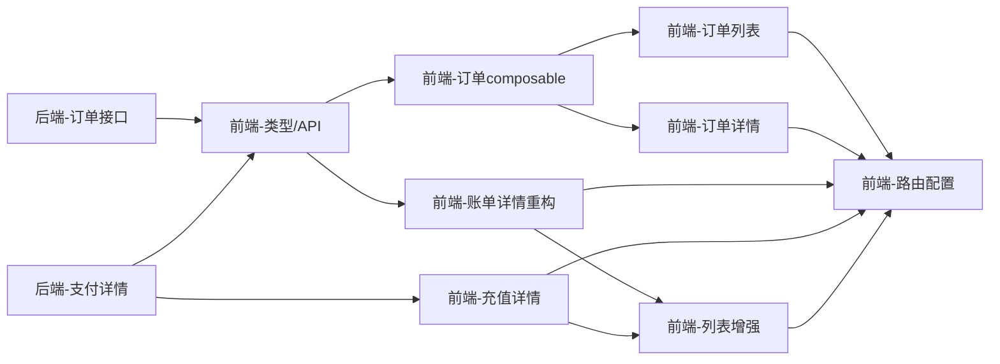

# 财务记录页面 — AI 执行方案

> 本文档是给 AI Agent 读的任务分解和执行流程，包含完整的技术上下文。

## 一、项目上下文

- **涉及前端项目**: frontend-user-v4-console
- **涉及后端模块**: backend（Client/OrderController、Client/PaymentController）
- **UI 框架**: TDesign Vue Next
- **关键约束**: 来自 AGENTS.md 和项目规范的约束
- **参考文件**: 
  - 管理端订单页面: `frontend-admin-v3/src/pages/finance/orders/`
  - 管理端账单页面: `frontend-admin-v3/src/pages/finance/invoices/`
  - 管理端充值页面: `frontend-admin-v3/src/pages/finance/recharges/`
  - 现有账单composable: `frontend-user-v4-console/src/domains/finance/useInvoices.ts`
  - 现有记录composable: `frontend-user-v4-console/src/domains/finance/useRecords.ts`
  - API接口层: `frontend-user-v4-console/src/api/client.ts`
  - 类型定义: `frontend-user-v4-console/src/types/client.ts`
  - 路由配置: `frontend-user-v4-console/src/router/modules/client.ts`

## 二、业务规则说明（关键）

### 订单和账单的关系
- **关系类型**: 1:1（一个订单对应一个账单）
- **数据模型**: Order `hasOne` Invoice，Invoice `belongsTo` Order
- **详情页展示**: 订单详情页展示关联账单信息（账单号、状态、金额），支持跳转

### 取消订单的业务影响
取消未支付的订单后，系统会自动处理（由后端 `OrderService::cancel` 完成）：
1. **关联账单被取消** — 账单状态改为 CANCELLED
2. **待处理支付被关闭** — 所有 PENDING 状态的 Payment 标记为 FAILED
3. **优惠券退回** — 调用 `CouponService::releaseOrderCoupon`
4. **库存释放** — 仅新购订单（type='new'），调用 `Product::increment('stock')`

### 取消账单的业务影响
取消未支付的账单后，系统会自动处理（由后端 `CheckoutService::cancel` 完成）：
1. **待处理支付被关闭** — 所有 PENDING 状态的 Payment 标记为 FAILED
2. **混合支付余额恢复** — 如果使用了余额+第三方混合支付，预留的余额会退回
3. **优惠券退回** — 调用 `CouponService::releaseInvoiceCoupon`
4. **库存释放** — 仅新购账单（type='new'或'normal'）

**注意**: 取消账单时，关联的订单不会被取消（Invoice-first 架构）。

### 订单状态流转
```
PENDING（待付款）→ PAID（已付款）→ PROCESSING（开通中）→ COMPLETED（已完成）
      ↓                                          ↓
CANCELLED（已取消）                        REFUNDED（已退款）
```

**各状态下用户操作权限**:
| 状态 | 可操作 |
|------|--------|
| PENDING | 支付、取消、查看 |
| PAID | 查看 |
| PROCESSING | 查看 |
| COMPLETED | 查看 |
| CANCELLED | 查看 |
| REFUNDED | 查看 |

### 充值记录和账单的关系
- Payment `belongsTo` Invoice（多对一）
- Payment 仅记录第三方真实资金流入（支付宝、微信）
- 充值账单（type=RECHARGE）会关联 Payment

### 默认筛选条件
- 账单记录：全部状态
- 订单记录：全部状态
- 充值记录：全部状态

### 快捷筛选标签
- 最近7天
- 本月
- 待支付
- 全部

## 二、任务分解

> **重要规则**:
> - 每个 Task 使用 `- [ ] **Task N: {名称}**` 格式（Markdown 复选框）
> - AI Agent 执行时，**完成一个 Task 立即将其 `- [ ]` 改为 `- [X]`**，并同步更新本文档
> - **严禁跳过任何 Task 或攒到最后批量打勾** — 必须完成即打勾，通过验证后才能进入下一个 Task

- [X] **Task 1: 后端 — 订单列表和详情接口**

| 属性 | 值 |
|------|-----|
| 涉及项目 | backend |
| 涉及文件 | app/Http/Controllers/Client/OrderController.php, app/Http/Requests/Client/Order/IndexRequest.php, routes/client.php |
| 依赖 | 无 |
| 预估改动量 | 中 |

**执行步骤**:
1. 创建 `app/Http/Controllers/Client/OrderController.php`
2. 创建 `app/Http/Requests/Client/Order/IndexRequest.php`
3. 实现 `index` 方法：订单列表查询（keyword搜order_no，status/type筛选，分页，user_id隔离）
4. 实现 `show` 方法：订单详情（含关联invoice、service、coupon、payments）
5. 实现 `summary` 方法：订单统计（总数、各状态数量、待支付总金额）
6. 实现 `cancel` 方法：取消未支付订单（仅PENDING状态可取消，需事务）
7. 在 `routes/client.php` 注册订单路由组

**关键实现细节**:
- API接口: 
  - `GET /client/orders` — 订单列表
  - `GET /client/orders/summary` — 订单统计（含待支付总金额）
  - `GET /client/orders/{id}` — 订单详情
  - `POST /client/orders/{id}/cancel` — 取消订单
- 参考: `AdminFinanceQueryService::paginateOrders()` 和 `getOrderDetail()`，加user_id作用域隔离
- 状态/枚举: 
  - `ORDER_STATUS_MAP`（0-待支付，1-已支付，2-开通中，3-已完成，4-已取消，5-已退款）
  - `ORDER_TYPE_MAP`（new-新购，renew-续费，addon-附加配置）
- 返回格式: 遵循 `App\Traits\ApiResponse`，成功code=0，分页结构list/total/page/page_size
- **取消订单逻辑**: 复用现有 `OrderService::cancel`，包含账单取消、优惠券退回、库存释放

**返回数据结构示例（订单详情）**:
```json
{
  "code": 0,
  "message": "success",
  "data": {
    "id": 1,
    "order_no": "ORD202606200001",
    "type": "new",
    "status": 0,
    "amount": 100.00,
    "paid_amount": 0,
    "discount": 10.00,
    "quantity": 1,
    "billing_cycle": "monthly",
    "created_at": "2026-06-20 10:00:00",
    "paid_at": null,
    "invoice": {
      "id": 1,
      "invoice_no": "INV202606200001",
      "status": 0,
      "amount": 100.00,
      "paid_amount": 0
    },
    "service": null,
    "coupon": {
      "id": 1,
      "code": "SAVE10",
      "name": "满100减10",
      "type": "discount",
      "value": 10.00
    }
  }
}
```

**验收标准**:
- [ ] 订单列表接口返回正确数据，支持筛选和分页
- [ ] 订单详情接口返回完整关联数据（invoice、service、coupon）
- [ ] 取消订单接口仅允许取消未支付订单
- [ ] 所有接口仅返回当前用户的数据
- [ ] summary接口返回待支付总金额

**Task 完成验证**:
完成本 Task 后，**必须立即执行以下最小验证，通过后才能打勾 `[X]` 并进入下一个 Task**:
- 后端: `cd backend && php artisan test --filter=OrderController`
- 手动验证: 使用Postman或curl测试接口返回格式

> **操作流程**: 改代码 → 跑本 Task 的回归测试 → 测试通过 → 将本 Task 的 `- [ ]` 改为 `- [X]` → 进入下一个 Task

- [X] **Task 2: 后端 — 支付记录详情接口**

| 属性 | 值 |
|------|-----|
| 涉及项目 | backend |
| 涉及文件 | app/Http/Controllers/Client/PaymentController.php, routes/client.php |
| 依赖 | 无 |
| 预估改动量 | 小 |

**执行步骤**:
1. 在现有 `PaymentController` 中新增 `show` 方法
2. 实现单条支付记录详情查询（含关联invoice信息）
3. 在 `routes/client.php` 注册详情路由

**关键实现细节**:
- API接口: `GET /client/payments/{id}` — 支付记录详情
- 参考: 现有 `index` 方法的查询逻辑，增加单条查询
- 返回字段: 支付单号、交易号、金额、渠道、状态、关联账单（invoice_no、invoice_status）、创建时间、支付时间
- **关联账单**: Payment 通过 `invoice_id` 关联 Invoice，详情需返回关联账单基本信息

**验收标准**:
- [ ] 支付记录详情接口返回正确数据
- [ ] 仅返回当前用户的数据

**Task 完成验证**:
完成本 Task 后，**必须立即执行以下最小验证，通过后才能打勾 `[X]` 并进入下一个 Task**:
- 后端: `cd backend && php artisan test --filter=PaymentController`
- 手动验证: 使用Postman或curl测试接口返回格式

- [X] **Task 3: 前端 — 订单类型定义和API方法**

| 属性 | 值 |
|------|-----|
| 涉及项目 | frontend-user-v4-console |
| 涉及文件 | src/types/client.ts, src/api/client.ts |
| 依赖 | Task 1 |
| 预估改动量 | 小 |

**执行步骤**:
1. 在 `src/types/client.ts` 中添加 `OrderRecord`、`OrderListSummary` 类型定义
2. 在 `src/api/client.ts` 中添加订单相关API方法：
   - `orders(params)` — 订单列表
   - `orderDetail(id)` — 订单详情
   - `orderSummary()` — 订单统计
   - `cancelOrder(id)` — 取消订单
   - `paymentDetail(id)` — 支付记录详情

**关键实现细节**:
- 类型定义参考: `AdminFinanceQueryService::transformOrder()` 的返回结构
- API方法参考: 现有 `invoices`、`payments` 的实现模式
- 请求走 `src/utils/request.js`，token存储在 `client_token`

**验收标准**:
- [ ] 类型定义完整，覆盖所有字段
- [ ] API方法正确调用后端接口
- [ ] 无TypeScript类型错误

**Task 完成验证**:
完成本 Task 后，**必须立即执行以下最小验证，通过后才能打勾 `[X]` 并进入下一个 Task**:
- 前端: `cd frontend-user-v4-console && npm run build`

- [X] **Task 4: 前端 — 订单列表composable**

| 属性 | 值 |
|------|-----|
| 涉及项目 | frontend-user-v4-console |
| 涉及文件 | src/domains/finance/useOrders.ts |
| 依赖 | Task 3 |
| 预估改动量 | 中 |

**执行步骤**:
1. 创建 `src/domains/finance/useOrders.ts`
2. 实现订单列表管理逻辑（参照 `useInvoices.ts` 模式）
3. 实现筛选条件管理（keyword、status、type）
4. 实现分页逻辑
5. 实现指标卡片数据（summary）
6. 实现取消订单功能

**关键实现细节**:
- 参考: `useInvoices.ts` 的实现模式
- 筛选条件: keyword（搜order_no）、status（ORDER_STATUS_MAP）、type（ORDER_TYPE_MAP）
- 分页: 默认20条/页，支持切换
- 指标卡片: 待支付订单数、待支付总金额、本月订单总金额
- 快捷筛选: 最近7天、本月、待支付、全部
- 取消订单: 二次确认弹窗，弹窗内容：
  ```
  标题: 取消订单
  正文: 确定取消该订单？取消后不可恢复。
        关联的账单也将被取消，使用的优惠券将退回账户。
        如果是新产品购买，库存将释放。
  确认按钮: 确认取消
  取消按钮: 再想想
  主题: warning
  ```
- 取消成功后: MessagePlugin.success('订单已取消') → 自动刷新列表和汇总

**验收标准**:
- [ ] composable导出完整的订单管理能力
- [ ] 筛选、分页、取消功能正常
- [ ] 类型定义正确，无TypeScript错误

**Task 完成验证**:
完成本 Task 后，**必须立即执行以下最小验证，通过后才能打勾 `[X]` 并进入下一个 Task**:
- 前端: `cd frontend-user-v4-console && npm run build`

- [X] **Task 5: 前端 — 订单列表页面**

| 属性 | 值 |
|------|-----|
| 涉及项目 | frontend-user-v4-console |
| 涉及文件 | src/pages/client/orders/index.vue |
| 依赖 | Task 4 |
| 预估改动量 | 中 |

**执行步骤**:
1. 创建 `src/pages/client/orders/index.vue`
2. 实现页面布局：顶部指标卡片 + 快捷筛选标签 + 筛选区 + 表格
3. 实现指标卡片：待支付订单数、待支付总金额、本月订单总金额
4. 实现快捷筛选标签：最近7天、本月、待支付、全部
5. 实现表格列：订单号、产品/服务、类型、金额、状态、关联账单、时间、操作
6. 实现操作按钮：查看详情、取消订单（仅未支付）、去支付（仅未支付）
7. 实现移动端适配（MobileRecordCard）

**关键实现细节**:
- 参考: `frontend-admin-v3/src/pages/finance/orders/index.vue` 的布局
- UI框架: TDesign Vue Next
- 图标: tdesign-icons-vue-next
- 状态展示: StatusTag组件（@caiwu/shared）
- 移动端: MobileRecordCard组件
- **快捷筛选标签**: 使用 `t-tag` 组件，选中态用 `t-tag` variant="outline" theme="primary"
- **指标卡片**: 使用 `t-card` 组件，布局为横向排列的3个指标卡片
- **关联账单列**: 显示账单号和状态，点击可跳转账单详情页

**验收标准**:
- [ ] 页面正常渲染，数据展示正确
- [ ] 筛选、分页功能正常
- [ ] 操作按钮功能正常
- [ ] 移动端适配正常

**Task 完成验证**:
完成本 Task 后，**必须立即执行以下最小验证，通过后才能打勾 `[X]` 并进入下一个 Task**:
- 前端: `cd frontend-user-v4-console && npm run build`
- 手动验证: 打开页面确认正常显示

- [X] **Task 6: 前端 — 订单详情页面**

| 属性 | 值 |
|------|-----|
| 涉及项目 | frontend-user-v4-console |
| 涉及文件 | src/pages/client/order-detail/index.vue |
| 依赖 | Task 4 |
| 预估改动量 | 中 |

**执行步骤**:
1. 创建 `src/pages/client/order-detail/index.vue`
2. 实现页面布局：顶部操作区 + 概览指标 + 标签页（基础信息、关联信息）
3. 实现基础信息标签页：订单号、类型、状态、金额、计费周期、创建时间、支付时间
4. 实现关联信息标签页：关联账单（可跳转）、服务（可跳转）、优惠券
5. 实现操作按钮：返回列表、取消订单（仅未支付）、去支付（跳转/invoices/:id/pay）
6. 实现面包屑导航：财务中心 > 订单记录 > 订单详情

**关键实现细节**:
- 参考: `frontend-admin-v3/src/pages/finance/orders/detail/index.vue` 的布局
- 页面骨架: 使用RecordDetailPage通用详情页组件
- 指标卡片: 订单金额、已付金额、状态
- 标签页: 基础信息、关联信息
- 操作按钮: 返回列表、取消订单（仅未支付）、去支付（跳转/invoices/:id/pay）

**验收标准**:
- [ ] 页面正常渲染，数据展示正确
- [ ] 标签页切换正常
- [ ] 操作按钮功能正常
- [ ] 跳转支付页面正常

**Task 完成验证**:
完成本 Task 后，**必须立即执行以下最小验证，通过后才能打勾 `[X]` 并进入下一个 Task**:
- 前端: `cd frontend-user-v4-console && npm run build`
- 手动验证: 打开详情页确认正常显示

- [X] **Task 7: 前端 — 账单详情页面重构**

| 属性 | 值 |
|------|-----|
| 涉及项目 | frontend-user-v4-console |
| 涉及文件 | src/pages/client/invoice-detail/index.vue |
| 依赖 | Task 3 |
| 预估改动量 | 中 |

**执行步骤**:
1. 重构 `src/pages/client/invoice-detail/index.vue`
2. 将当前支付流程页改为详情展示页
3. 实现页面布局：顶部操作区 + 概览指标 + 标签页（基础信息、关联信息、支付记录）
4. 保留支付功能入口（去支付按钮跳转到支付页面）
5. 实现操作按钮：返回列表、去支付

**关键实现细节**:
- 当前页面是支付流程页（含支付宝二维码、余额支付等），需要拆分
- 建议保留 `/client/invoices/:id/pay` 为支付页，`/client/invoices/:id` 为详情页
- 详情页展示：账单号、类型、状态、金额、已付金额、待付金额、关联订单、服务、优惠券、支付记录列表
- 支付记录列表：支付单号、渠道、金额、状态、时间
- **取消账单弹窗文案优化**:
  ```
  标题: 取消账单
  正文: 确定取消该账单？取消后不可恢复。
        使用的优惠券将退回账户。
        如果是新产品购买，库存将释放。
  确认按钮: 确认取消
  取消按钮: 再想想
  主题: warning
  ```
- **支付成功页面**: 支付成功后显示成功提示，提供"查看订单"和"返回列表"两个入口
- **支付失败页面**: 支付失败时显示失败提示，提供"重新支付"入口，底部增加"遇到问题？联系客服"链接
- **面包屑导航**: 财务中心 > 账单记录 > 账单详情

**验收标准**:
- [ ] 详情页正常渲染，数据展示正确
- [ ] 支付功能入口正常
- [ ] 不影响现有支付流程

**Task 完成验证**:
完成本 Task 后，**必须立即执行以下最小验证，通过后才能打勾 `[X]` 并进入下一个 Task**:
- 前端: `cd frontend-user-v4-console && npm run build`
- 手动验证: 打开详情页确认正常显示，支付功能正常

- [X] **Task 8: 前端 — 充值详情页面**

| 属性 | 值 |
|------|-----|
| 涉及项目 | frontend-user-v4-console |
| 涉及文件 | src/pages/client/payment-detail/index.vue |
| 依赖 | Task 2 |
| 预估改动量 | 小 |

**执行步骤**:
1. 创建 `src/pages/client/payment-detail/index.vue`
2. 实现页面布局：顶部操作区 + 详情卡片
3. 实现详情展示：支付单号、交易号、金额、渠道、状态、关联账单、创建时间、支付时间
4. 实现操作按钮：返回列表

**关键实现细节**:
- 参考: 现有抽屉详情的展示内容
- 页面骨架: 使用RecordDetailPage通用详情页组件
- 关联账单: 显示账单号、状态、金额，点击可跳转到账单详情页
- **面包屑导航**: 财务中心 > 充值记录 > 充值详情

**验收标准**:
- [ ] 页面正常渲染，数据展示正确
- [ ] 返回列表功能正常
- [ ] 关联账单跳转正常

**Task 完成验证**:
完成本 Task 后，**必须立即执行以下最小验证，通过后才能打勾 `[X]` 并进入下一个 Task**:
- 前端: `cd frontend-user-v4-console && npm run build`
- 手动验证: 打开详情页确认正常显示

- [X] **Task 9: 前端 — 账单和充值列表页面增强**

| 属性 | 值 |
|------|-----|
| 涉及项目 | frontend-user-v4-console |
| 涉及文件 | src/pages/client/invoices/index.vue, src/pages/client/payments/index.vue |
| 依赖 | Task 7, Task 8 |
| 预估改动量 | 中 |

**执行步骤**:
1. 增强 `src/pages/client/invoices/index.vue`
   - 增加顶部指标卡片（待付金额、待付账单数、本月账单数、总账单数）
   - 增加快捷筛选标签（最近7天、本月、待支付、全部）
   - 优化取消账单弹窗文案（告知优惠券退回、库存释放）
   - 修改详情跳转为独立详情页（非抽屉）
   - 移除抽屉详情相关代码
2. 增强 `src/pages/client/payments/index.vue`
   - 增加顶部指标卡片（本月充值金额、总充值金额、成功率）
   - 修改详情跳转为独立详情页（非抽屉）
   - 移除抽屉详情相关代码

**关键实现细节**:
- 指标卡片数据: 使用现有summary API
- **账单指标卡片**: 
  - 待付金额（金额格式化，红色）
  - 待付账单数（数量，蓝色）
  - 本月账单数（数量）
  - 总账单数（数量）
- **充值指标卡片**:
  - 本月充值金额（金额格式化）
  - 总充值金额（金额格式化）
  - 成功率（百分比，如98%）
- 详情跳转: 从抽屉改为路由跳转（/client/invoices/:id、/client/payments/:id）
- 快捷筛选: 使用 `t-tag` 组件，点击切换筛选条件
- 保持现有筛选、分页功能不变
- **移除抽屉相关代码**: 删除 `t-drawer` 组件和 `closeDetail()` 函数，清除 URL 中的 `detail` 查询参数处理逻辑

**验收标准**:
- [ ] 指标卡片正常显示
- [ ] 详情跳转正常
- [ ] 筛选、分页功能正常

**Task 完成验证**:
完成本 Task 后，**必须立即执行以下最小验证，通过后才能打勾 `[X]` 并进入下一个 Task**:
- 前端: `cd frontend-user-v4-console && npm run build`
- 手动验证: 打开页面确认指标卡片和详情跳转正常

- [X] **Task 10: 前端 — 路由配置**

| 属性 | 值 |
|------|-----|
| 涉及项目 | frontend-user-v4-console |
| 涉及文件 | src/router/modules/client.ts |
| 依赖 | Task 5, Task 6, Task 7, Task 8 |
| 预估改动量 | 小 |

**执行步骤**:
1. 在 `src/router/modules/client.ts` 中新增订单记录路由
2. 新增订单详情路由
3. 修改账单详情路由（从重定向改为独立页面）
4. 新增充值详情路由
5. 更新菜单配置（如有需要）

**关键实现细节**:
- 路由路径:
  - `/client/orders` — 订单记录列表
  - `/client/orders/:id` — 订单详情
  - `/client/invoices/:id` — 账单详情（修改现有重定向）
  - `/client/payments/:id` — 充值详情
- 权限码: 使用现有权限码（order.list、invoice.list等）
- 菜单图标: 使用MoneyIcon

**验收标准**:
- [ ] 路由配置正确，页面可正常访问
- [ ] 菜单显示正确
- [ ] 权限控制正常

**Task 完成验证**:
完成本 Task 后，**必须立即执行以下最小验证，通过后才能打勾 `[X]` 并进入下一个 Task**:
- 前端: `cd frontend-user-v4-console && npm run build`
- 手动验证: 点击菜单确认页面跳转正常

## 三、任务依赖图



## 四、测试方案

### 功能测试

| 编号 | 测试场景 | 操作步骤 | 预期结果 | 涉及任务 |
|------|---------|---------|---------|---------|
| T1 | 订单列表查看 | 进入订单记录页面 | 显示订单列表，支持筛选和分页，顶部显示指标卡片 | Task5 |
| T2 | 订单详情查看 | 点击订单进入详情页 | 显示订单完整信息，关联账单可跳转 | Task6 |
| T3 | 取消未支付订单 | 在订单详情页点击取消 | 弹窗显示影响说明，确认后订单和账单状态变为已取消 | Task1,Task6 |
| T4 | 取消订单成功提示 | 取消订单成功后 | 显示成功提示，自动刷新列表和详情 | Task4,Task6 |
| T5 | 跳转支付 | 在订单详情页点击去支付 | 跳转到账单支付页面 | Task6 |
| T6 | 支付成功流程 | 支付成功后 | 显示成功提示，提供"查看订单"和"返回列表"入口 | Task7 |
| T7 | 支付失败流程 | 支付失败时 | 显示失败提示，提供"重新支付"入口，底部有"联系客服"链接 | Task7 |
| T8 | 账单详情查看 | 点击账单进入详情页 | 显示账单完整信息，支付记录列表正常 | Task7 |
| T9 | 取消账单 | 在账单详情页点击取消 | 弹窗显示影响说明，确认后账单状态变为已取消 | Task7,Task9 |
| T10 | 充值详情查看 | 点击充值记录进入详情页 | 显示充值完整信息，关联账单可跳转 | Task8 |
| T11 | 指标卡片显示 | 进入账单/充值/订单列表页 | 顶部显示指标卡片，数据正确 | Task5,Task9 |
| T12 | 快捷筛选 | 点击"最近7天""本月""待支付"标签 | 筛选条件自动切换，列表数据正确 | Task5,Task9 |
| T13 | 移动端适配 | 使用移动端访问 | 显示卡片布局，操作按钮正常 | Task5 |
| T14 | 默认筛选 | 进入列表页 | 默认显示全部状态 | Task5,Task9 |

### 边界测试
- 极限值: 大量数据时分页性能
- 并发: 多个用户同时取消订单
- 权限: 用户只能查看自己的数据

### 回归测试（按 Task 粒度）

> **核心原则: 每完成一个 Task 立即跑其回归测试，不要攒到最后。**
> 这是最小范围的防翻车策略 — 改一点测一点，确保每个 Task 都不会破坏已有功能。

| Task | 回归范围 | 验证操作 | 验证命令 |
|------|---------|---------|---------|
| Task1 | 确保订单接口正常 | 测试接口返回格式 | `cd backend && php artisan test --filter=OrderController` |
| Task2 | 确保支付详情接口正常 | 测试接口返回格式 | `cd backend && php artisan test --filter=PaymentController` |
| Task3 | 确保类型定义正确 | 编译检查 | `cd frontend-user-v4-console && npm run build` |
| Task4 | 确保composable正常 | 编译检查 | `cd frontend-user-v4-console && npm run build` |
| Task5 | 确保订单列表页正常 | 打开页面确认显示，点击快捷标签确认筛选 | `cd frontend-user-v4-console && npm run build` |
| Task6 | 确保订单详情页正常 | 打开详情页确认显示，取消订单确认影响 | `cd frontend-user-v4-console && npm run build` |
| Task7 | 确保账单详情页正常，支付流程不受影响 | 打开详情页确认显示，支付功能正常 | `cd frontend-user-v4-console && npm run build` |
| Task8 | 确保充值详情页正常 | 打开详情页确认显示 | `cd frontend-user-v4-console && npm run build` |
| Task9 | 确保列表增强正常 | 打开页面确认指标卡片，取消账单确认影响 | `cd frontend-user-v4-console && npm run build` |
| Task10 | 确保路由配置正确 | 点击菜单确认跳转 | `cd frontend-user-v4-console && npm run build` |

### 全量验证

全部 Task 完成后执行:
- 前端: `cd frontend-user-v4-console && npm run build`
- 后端: `cd backend && php artisan test`
- 手动全流程走查: 
  1. 登录控制台
  2. 进入订单记录页面，查看列表、指标卡片、快捷筛选、详情、取消、跳转支付
  3. 进入账单记录页面，查看列表、指标卡片、快捷筛选、详情、取消、支付流程
  4. 进入充值记录页面，查看列表、指标卡片、详情、关联账单跳转
  5. 测试取消订单：确认弹窗文案正确，取消成功后列表自动刷新
  6. 测试取消账单：确认弹窗文案正确，取消成功后列表自动刷新
  7. 测试支付流程：从订单详情跳转支付，支付成功后确认提示和跳转入口
  8. 确认所有页面面包屑导航正常
  9. 确认移动端适配正常

## 五、执行约束

- **严格遵循 AGENTS.md**: 所有代码变更必须符合项目规范
- **Task 级回归（防翻车核心）**: 每完成一个 Task 立即跑其回归测试，通过后打勾 `[X]`，再进入下一个 Task。**严禁攒到最后全量测** — 改一点测一点，确保不翻车
- **UI 框架隔离**: TDesign 端禁止引入 Element Plus
- **状态复用**: 状态展示使用 `@caiwu/shared/statusConfig`、`StatusTag.vue`
- **请求收敛**: API 调用走 `src/api/client.ts`，禁止直接创建 axios 实例
- **图标统一**: TDesign 端用 `tdesign-icons-vue-next`
- **取消操作弹窗**: 必须包含影响说明（关联账单取消、优惠券退回、库存释放），不可仅写"确定取消？"
- **取消成功后**: 自动刷新列表和汇总数据，显示成功提示
- **不可做**: 
  - 不做订单退款功能
  - 不做批量操作
  - 不做账单导出
  - 不做充值功能优化
  - 不做搜索历史保存
- **必须先做**: 后端接口（Task1、Task2）是前端的依赖，必须先完成
- **公共组件**: 复用 `StatusTag`、`MobileRecordCard`、`RecordDetailPage`
- **面包屑导航**: 所有详情页必须有面包屑导航（财务中心 > XX记录 > XX详情）
- **快捷筛选**: 账单和订单列表页增加快捷筛选标签（最近7天、本月、待支付、全部）

## 六、参考文件
- 管理端订单页面: `frontend-admin-v3/src/pages/finance/orders/`
- 管理端账单页面: `frontend-admin-v3/src/pages/finance/invoices/`
- 管理端充值页面: `frontend-admin-v3/src/pages/finance/recharges/`
- 现有账单composable: `frontend-user-v4-console/src/domains/finance/useInvoices.ts`
- 现有记录composable: `frontend-user-v4-console/src/domains/finance/useRecords.ts`
- 共享状态映射: `shared/statusConfig.js`
- 共享组件: `shared/components/StatusTag.vue`
