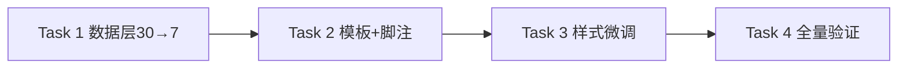

# 控制台「近 7 天每日消费」优化 — AI 执行方案

> 本文档是给 AI Agent 读的任务分解和执行流程,包含完整的技术上下文。

## 一、项目上下文

- **涉及前端项目**: frontend-user-v4-console
- **涉及后端模块**: 无(纯前端改动,沿用现有 `/client/balance-logs` 接口)
- **UI 框架**: TDesign Vue Next + `tdesign-icons-vue-next`(禁止引入 Element Plus)
- **改动文件**: 仅 `frontend-user-v4-console/src/pages/client/dashboard/index.vue` 一个文件
- **关键约束**:
  - 严格遵守 `AGENTS.md`:复用 TDesign token 变量,不自造间距/颜色
  - 数据口径与原柱图一致:余额流水 `change_amount < 0` 取绝对值累加,只改范围 30→7
  - 数据源接口不变:`clientApi.balanceLogs({ date_range: last7DaysRange(), page_size: 200 })`(`page_size` 沿用 200)
  - 不引入新依赖,沿用页面现有的纯 CSS `.bar-chart` 模式 + TDesign `t-tooltip`
  - 每个Task 完成后页面都必须能编译且可用,避免破损中间态
- **参考文件**:
  - 待改造卡片模板: `frontend-user-v4-console/src/pages/client/dashboard/index.vue` 第 92~110 行(右侧「近 30 天每日消费」卡片)
  - 数据计算层: 同文件第 316~320 行 `last30DaysRange`、第 449~485 行 `dailyExpenseData`/`dailyBars`/`dailyBarsHasData`
  - 脚注: 同文件第 109 行 `chart-foot`
  - 数据加载: 同文件第 683 行 `clientApi.balanceLogs({ date_range: last30DaysRange(), page_size: 200 })`
  - 样式: 同文件第 985~1023 行 `.bar-chart` 系列
  - API 定义: `frontend-user-v4-console/src/api/client.ts` 第 152 行 `balanceLogs`
  - 月度柱状图 tooltip 参考(同文件,已落地或并行方案): 左侧「今年消费」卡片 `t-tooltip` 用法

## 二、任务分解

> **重要规则**:
> - 每个 Task 使用 `- [ ] **Task N: {名称}**` 格式(Markdown 复选框)
> - AI Agent 执行时,**完成一个 Task 立即将其 `- [ ]` 改为 `- [X]`**,并同步更新本文档
> - **严禁跳过任何 Task 或攒到最后批量打勾** — 必须完成即打勾,通过验证后才能进入下一个 Task
> - **拆分原则:每个 Task 完成后页面都必须能编译且可用**。本卡片是原地改造(非新增),改动点高度耦合,按"数据层→模板→样式→验证"顺序拆分。

- [X] **Task 1: 改数据计算层(时间范围 30→7,标签每根都显示,新增 tooltip 字段和近7天合计)**

| 属性 | 值 |
|------|-----|
| 涉及项目 | frontend-user-v4-console |
| 涉及文件 | src/pages/client/dashboard/index.vue(`<script setup>` 区) |
| 依赖 | 无 |
| 预估改动量 | 中 |

**执行步骤**:

1. 把 `last30DaysRange` 函数(约第 316~320 行)改名为 `last7DaysRange`,内部偏移从 `-29` 改为 `-6`:
   ```ts
   function last7DaysRange(): string[] {
     const now = new Date();
     const start = new Date(now);
     start.setDate(start.getDate() - 6);
     return [toDateText(start), toDateText(now)];
   }
   ```
2. 同步更新调用处(约第 683 行),把 `last30DaysRange()` 改为 `last7DaysRange()`:
   ```ts
   clientApi.balanceLogs({ date_range: last7DaysRange(), page_size: 200 }),
   ```
3. 改 `dailyExpenseData` computed(约第 449~457 行),把生成 30 天改为生成 7 天,循环 `i` 从 `29` 改为 `6`:
   ```ts
   const days: { date: string; amount: number }[] = [];
   const now = new Date();
   for (let i = 6; i >= 0; i -= 1) {
     const date = new Date(now);
     date.setDate(date.getDate() - i);
     days.push({ date: toDateText(date), amount: 0 });
   }
   ```
   (后续 balanceLogs 归集循环不变,仍按 `change_amount < 0` 取绝对值累加到对应日期。)
4. 改 `dailyBars` computed(约第 459~468 行),`showLabel` 改为每根都显示,并新增 `tooltip` 字段:
   ```ts
   const dailyBars = computed(() => {
     const amounts = dailyExpenseData.value.map((item) => item.amount);
     const max = Math.max(...amounts, 1);
     return dailyExpenseData.value.map((item) => ({
       ...item,
       height: item.amount > 0 ? `${Math.max(8, Math.round((item.amount / max) * 100))}%` : '0%',
       showLabel: true,
       label: `${Number(item.date.slice(5, 7))}/${Number(item.date.slice(8, 10))}`,
       tooltip: `${item.date.slice(5).replace('-', '/')} · 消费 ¥${formatMoney(item.amount)}`,
     }));
   });
   ```
   - `showLabel: true` 让 7 根柱子每根都显示日期标签(7 根不拥挤,无需再隔 7 天标一次)。
   - `tooltip` 字段格式:`MM/DD · 消费 ¥XXX`(如 `06/15 · 消费 ¥128.50`)。
5. 在 `dailyBarsHasData` computed(约第 470 行)**下方**新增近 7 天合计消费 computed:
   ```ts
   const last7DaysConsumptionTotal = computed(() =>
     Math.round(dailyExpenseData.value.reduce((sum, item) => sum + item.amount, 0) * 100) / 100,
   );
   ```
6. **本 Task 不动模板**。完成后页面仍显示原模板,但柱子会从 30 根变 7 根、每根都有标签(因 `showLabel:true` 生效),脚注仍显示旧的「本月累计消费(账单口径)」——这是可接受的中间态,Task 2 会改脚注。

**关键实现细节**:
- `last7DaysRange` 偏移 `-6` 生成近 7 天(含今天),与原 `last30DaysRange` 的 `-29` 逻辑一致,只是天数变短。
- `dailyExpenseData` 的 balanceLogs 归集循环(约第 459~467 行)**不动**,仍按 `change_amount < 0` 取绝对值累加。
- `tooltip` 用 `item.date.slice(5).replace('-', '/')` 把 `YYYY-MM-DD` 转成 `MM/DD`,与 `label` 风格一致。
- `formatMoney` 已从 `@/utils/format` 导入,无需新增。
- `last7DaysConsumptionTotal` 依赖 `dailyExpenseData`,而 `dailyExpenseData` 依赖 `balanceLogsDaily`(在 `balanceLogsRes.status === 'fulfilled'` 时填充),链路正常。

**验收标准**:
- [ ] TypeScript 编译通过,无 `last30DaysRange` 未定义报错(已改名且调用处同步更新)
- [ ] `dailyExpenseData` 返回 7 天数组
- [ ] `dailyBars` 每项 `showLabel` 为 `true`,含 `tooltip` 字段
- [ ] `last7DaysConsumptionTotal` 等于 7 天 amount 之和

**Task 完成验证**:
- 构建: `cd frontend-user-v4-console && npm run build`
- 手动验证: `npm run dev`,确认右侧柱图变成 7 根、每根有日期标签(脚注暂未改,Task 2 处理)
- 通过后打勾 `[X]` 进入下一个 Task

> **操作流程**: 改代码 → 跑构建 → 构建通过 → 打勾 `[X]` → 进入下一个 Task

- [X] **Task 2: 改模板(标题、tooltip 包裹柱子、脚注改口径)**

| 属性 | 值 |
|------|-----|
| 涉及项目 | frontend-user-v4-console |
| 涉及文件 | src/pages/client/dashboard/index.vue(模板区约第 92~110 行) |
| 依赖 | Task 1 |
| 预估改动量 | 小 |

**执行步骤**:

1. 定位右侧第二张图表卡片(原「近 30 天每日消费」,约第 92~110 行),整段替换为:
   ```vue
   <t-card class="dashboard-card chart-card" :bordered="false">
     <template #title>近 7 天每日消费</template>
     <template #actions>
       <t-button theme="primary" variant="text" @click="router.push('/client/balance-logs')">消费明细</t-button>
     </template>

     <t-loading :loading="!balanceLogsLoaded" text="加载中">
       <div v-if="dailyBarsHasData" class="bar-chart bar-chart--daily" aria-label="近 7 天每日消费">
         <t-tooltip
           v-for="bar in dailyBars"
           :key="bar.date"
           :content="bar.tooltip"
           placement="top"
           show-arrow
         >
           <div class="bar-chart__slot">
             <span class="bar-chart__bar" :style="{ height: bar.height }"></span>
             <span v-if="bar.showLabel" class="bar-chart__label">{{ bar.label }}</span>
           </div>
         </t-tooltip>
       </div>
       <t-empty v-else description="暂无消费记录" />
       <p class="chart-foot">近 7 天合计消费 <strong>{{ formatMoney(last7DaysConsumptionTotal) }} 元</strong></p>
     </t-loading>
   </t-card>
   ```
2. 左侧「今年消费」月度柱状图卡片**保持不变**。
3. 确认 `t-tooltip` 已随 TDesign 全局注册可用(Starter 默认全量注册 TDesign,无需额外 import)。
4. **t-tooltip 布局风险排查**:若构建后目视发现 7 根柱子不等分(t-tooltip 给 trigger 加 wrapper 破坏 `flex:1`),降级为外层 div 自包 + tooltip 只包柱体:
   ```vue
   <div v-for="bar in dailyBars" :key="bar.date" class="bar-chart__slot">
     <t-tooltip :content="bar.tooltip" placement="top" show-arrow>
       <span class="bar-chart__bar" :style="{ height: bar.height }"></span>
     </t-tooltip>
     <span v-if="bar.showLabel" class="bar-chart__label">{{ bar.label }}</span>
   </div>
   ```
   优先尝试方案一(t-tooltip 包 slot),出问题再降级到方案二(slot 自包、tooltip 只包 bar)。

**关键实现细节**:
- 卡片 class 沿用 `dashboard-card chart-card`,柱图容器加 `bar-chart--daily` 修饰类(Task 3 用于差异化样式)。
- `t-loading` 绑定沿用 `!balanceLogsLoaded`。
- `t-button`「消费明细」按钮保持不变,仍跳转 `/client/balance-logs`。
- 脚注从 `formatMoney(financeSummary.invoice_payment_out)`(账单口径,本月范围)改为 `formatMoney(last7DaysConsumptionTotal)`(余额流水口径,近7天范围),与柱图口径、范围完全一致。
- `v-if="bar.showLabel"` 保留(虽然 Task 1 已设 `showLabel:true`,保留判断不影响,且未来若调整标签逻辑更灵活)。
- `bar.tooltip` 由 Task 1 的 `dailyBars` computed 提供。

**验收标准**:
- [ ] 卡片标题显示「近 7 天每日消费」
- [ ] 7 根柱子,每根下方有日期标签
- [ ] 鼠标悬停柱子弹出「MM/DD · 消费 ¥XXX」
- [ ] 脚注显示「近 7 天合计消费 ¥XXX 元」,且金额 = 7 根柱子 amount 之和
- [ ] 「消费明细」按钮可点击跳转余额流水页
- [ ] 左侧「今年消费」卡片不受影响
- [ ] 无 `last7DaysConsumptionTotal` 未定义编译错误

**Task 完成验证**:
- 构建: `cd frontend-user-v4-console && npm run build`(含 `vue-tsc --noEmit`)
- 手动验证: `npm run dev`,登录控制台首页,确认标题、tooltip、脚注、按钮跳转

> **操作流程**: 改代码 → 跑构建 → 构建通过 → 打勾 `[X]` → 进入下一个 Task

- [X] **Task 3: 样式微调(7 根柱子场景下间距/高度优化,确认 tooltip 布局)**

| 属性 | 值 |
|------|-----|
| 涉及项目 | frontend-user-v4-console |
| 涉及文件 | src/pages/client/dashboard/index.vue(`<style>` 区,约第 985~1023 行) |
| 依赖 | Task 2 |
| 预估改动量 | 小 |

**执行步骤**:

1. 在 `.bar-chart__label` 规则(约第 1015~1020 行)之后新增每日图专属样式:
   ```scss
   .bar-chart--daily {
     height: 12rem;
   }

   .bar-chart--daily .bar-chart__slot {
     cursor: pointer;
   }

   .bar-chart--daily .bar-chart__bar {
     width: 50%;
   }
   ```
2. 保留 `.bar-chart`、`.bar-chart__slot`、`.bar-chart__bar`(原 `width:68%`)、`.bar-chart__label`、`.chart-foot` 通用样式不动(左侧月度图可能复用 `.bar-chart` 基类,不要破坏)。
3. 目视确认:
   - 7 根柱子等分排列(t-tooltip 未破坏 `flex:1`)。
   - 日期标签居中、不重叠(7 根间距足够)。
   - 柱体颜色 `var(--td-brand-color)`、圆角正常。
   - 脚注 `chart-foot` 样式正常。
4. 若 t-tooltip 包裹后柱子不等分,确认已降级到 Task 2 步骤 4 的方案二,并重新目视。

**关键实现细节**:
- `.bar-chart--daily` 明确每日图高度 12rem(与原 `.bar-chart { height:12rem }` 一致,加修饰类便于未来差异化)。
- `.bar-chart--daily .bar-chart__bar { width:50% }` 覆盖原 `.bar-chart__bar { width:68% }`:7 根柱子场景下柱体更细更优雅(30 根时 68% 会粘连,7 根时 68% 偏粗)。带前缀选择器不影响其他 `.bar-chart` 实例。
- `cursor: pointer` 提示可悬停(配合 tooltip)。
- 颜色/字号/间距全部用 TDesign token,禁止硬编码。

**验收标准**:
- [ ] 7 根柱子等分、不粘连、不重叠
- [ ] 日期标签清晰可读
- [ ] 柱体宽度适中(50%),视觉协调
- [ ] 脚注样式正常
- [ ] 左侧月度图样式不受影响
- [ ] 浅色/深色 token 下均显示正常

**Task 完成验证**:
- 构建: `cd frontend-user-v4-console && npm run build`
- 手动验证: 刷新控制台首页,目视检查柱子排列、标签、tooltip、脚注,对比左侧月度图未受影响

> **操作流程**: 改样式 → 跑构建 → 构建通过 → 打勾 `[X]` → 进入下一个 Task

- [X] **Task 4: 全量构建验证 + 手动走查**

| 属性 | 值 |
|------|-----|
| 涉及项目 | frontend-user-v4-console |
| 涉及文件 | 无(验证 Task) |
| 依赖 | Task 1、Task 2、Task 3 |
| 预估改动量 | 小 |

**执行步骤**:

1. 执行全量构建:`cd frontend-user-v4-console && npm run build`。
2. 启动开发服务器:`npm run dev`,登录用户控制台首页(`/client/dashboard`)。
3. 走查清单:
   - 卡片标题「近 7 天每日消费」,右上角「消费明细」按钮可跳转。
   - 柱子数量 = 7,每根下方有日期标签。
   - 鼠标悬停柱子 tooltip 显示「MM/DD · 消费 ¥XXX」。
   - 脚注「近 7 天合计消费 ¥XXX 元」,金额 = 7 根柱子金额之和(手动核算)。
   - 近 7 天无消费的账号显示「暂无消费记录」。
   - 左侧「今年消费」月度柱状图卡片完全正常。
   - 顶部「本月消费」概览卡片仍显示账单口径金额(不受影响)。
   - 余额流水、账单列表等其他页面不受影响。
4. 若涉及重构收口范围,额外执行 `npm run verify:refactor`(本次仅单文件 UI 调整,默认可不跑;如发现 lint 报错再跑)。

**验收标准**:
- [ ] `npm run build` 通过(含 `vue-tsc --noEmit`,0 报错)
- [ ] 上述走查清单全部通过
- [ ] 无 console 报错

**Task 完成验证**:
- 本 Task 即最终验证,通过后打勾 `[X]`。

## 三、任务依赖图



## 四、测试方案

### 功能测试

| 编号 | 测试场景 | 操作步骤 | 预期结果 | 涉及任务 |
|------|---------|---------|---------|---------|
| T1 | 正常展示 | 登录近 7 天有余额扣款的用户,进入控制台首页 | 显示 7 根柱子,每根有日期标签,有扣款的柱子有高度 | Task1,2,3 |
| T2 | 日期归集正确 | 核对某根柱子 tooltip 金额 = 当天所有 `change_amount<0` 绝对值之和 | 金额一致(允许分位四舍五入) | Task1 |
| T3 | 悬停 tooltip | 鼠标移到任意柱子 | 弹出「MM/DD · 消费 ¥XXX」 | Task2 |
| T4 | 脚注口径一致 | 核对脚注金额 = 7 根柱子 amount 之和 | 完全相等 | Task1,2 |
| T5 | 空数据 | 登录近 7 天无任何余额扣款的用户 | 显示「暂无消费记录」,脚注显示「近 7 天合计消费 ¥0.00 元」 | Task2 |
| T6 | 仅今天有消费 | 前 6 天无扣款,仅今天有 | 前 6 根柱子高度 0,今天那根正常,tooltip 笔数正确 | Task1,2 |
| T7 | 跨范围不混入 | 8 天前的扣款不应计入 | 8 天前流水不影响任何柱子 | Task1 |
| T8 | 消费明细跳转 | 点击右上角「消费明细」按钮 | 跳转 `/client/balance-logs` | Task2 |

### 边界测试
- 今天就是范围起点(刚过午夜):7 根柱子正常生成。
- 单日消费远高于其他天:其他柱子按比例压缩,最低 `Math.max(8, ...)%` 保证可见。
- `change_amount` 为 0 或正数(充值):不计入消费,正确跳过。

### 回归测试(按 Task 粒度)

> **核心原则: 每完成一个 Task 立即跑其回归测试,不要攒到最后。**

| Task | 回归范围 | 验证操作 | 验证命令 |
|------|---------|---------|---------|
| Task1 | 数据层不破坏现有功能,柱图变 7 根 | 构建 + 页面显示 7 根柱子(脚注暂旧) | `cd frontend-user-v4-console && npm run build` |
| Task2 | 标题、tooltip、脚注、按钮跳转、左侧月度图不受影响 | 构建 + 手动浏览控制台首页 | `cd frontend-user-v4-console && npm run build` |
| Task3 | 样式排版、柱子等分、token 适配 | 构建 + 目视检查 | `cd frontend-user-v4-console && npm run build` |
| Task4 | 全量回归 | 全量构建 + 完整走查清单 | `cd frontend-user-v4-console && npm run build` |

### 全量验证

全部 Task 完成后执行:
- 构建: `cd frontend-user-v4-console && npm run build`
- 手动全流程走查: 登录用户 → 控制台首页 → 核对近7天柱图、tooltip、脚注、按钮,并确认左侧月度图、顶部概览卡片、余额流水页均正常

## 五、执行约束

- **严格遵循 AGENTS.md**: 所有代码变更符合项目规范
- **Task 级回归(防翻车核心)**: 每完成一个 Task 立即跑其回归测试,通过后打勾 `[X]`,再进入下一个 Task。**严禁攒到最后全量测** — 改一点测一点,确保不翻车
- **UI 框架隔离**: TDesign 端禁止引入 Element Plus
- **单文件改动**: 仅改 `src/pages/client/dashboard/index.vue`,不动 API、路由、store、其他页面
- **不引入新依赖**: 沿用现有纯 CSS `.bar-chart` 模式 + TDesign `t-tooltip`,不引入 ECharts/Chart.js
- **token 复用**: 颜色/字号/间距全部用 `--td-*` 变量,禁止硬编码
- **数据源不变**: `clientApi.balanceLogs` 接口不变,只改 `date_range` 参数(30 天→7 天),`page_size:200` 保持
- **口径统一**: 脚注必须用 `last7DaysConsumptionTotal`(余额流水口径),禁止继续用 `financeSummary.invoice_payment_out`(账单口径)
- **不可做**: 不改左侧「今年消费」月度柱状图卡片;不删 `financeSummary.invoice_payment_out` 的其他引用(顶部「本月消费」卡片仍在用);不改 `currentMonthRange`;不切换柱图口径为账单;不加柱顶金额标签;不加点击跳转交互
- **必须先做**: Task 1(数据层)→ Task 2(模板+脚注)→ Task 3(样式)→ Task 4(验证),顺序不可调换。每个 Task 完成后页面都必须能编译且可用
- **t-tooltip 布局风险**: 若 t-tooltip 包裹后柱子不等分,降级为方案二(slot 自包、tooltip 只包 bar),见 Task 2 步骤 4

## 六、参考文件
- 待改造文件: `frontend-user-v4-console/src/pages/client/dashboard/index.vue`
- 现有柱状图参考(同文件): 第 92~110 行模板、第 449~485 行 computed、第 985~1023 行样式
- API 定义: `frontend-user-v4-console/src/api/client.ts` 第 152 行 `balanceLogs`
- 后端接口约束: `/client/balance-logs` 支持 `date_range`、`page_size`(上限 200)
