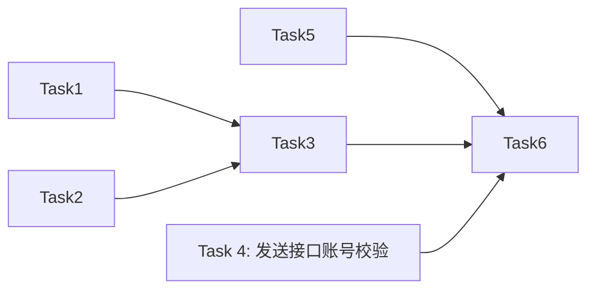

# 用户端验证码登录 — AI 执行方案

> 本文档是给 AI Agent 读的任务分解和执行流程，包含完整的技术上下文。

## 一、项目上下文

- **涉及前端项目**: `frontend-user-v4-console`
- **涉及后端模块**: `AuthController`、`AuthService`、`SendPhoneCodeRequest`、`SendEmailCodeRequest`、路由 `routes/client.php`
- **UI 框架**: TDesign Vue Next（`tdesign-icons-vue-next`）
- **关键约束**: 
  - 禁止混用 Element Plus
  - 状态复用 `@caiwu/shared` 和 `StatusTag.vue`
  - API 调用走 `src/api/auth.ts`，禁止新建 axios 实例
  - 后端控制器薄层，FormRequest 校验，Resource 响应
  - 验证码存储在 Redis（`redis_volatile`），过期时间：短信5分钟、邮箱10分钟
- **参考文件**:
  - 当前登录页: `frontend-user-v4-console/src/pages/client-auth/login.vue`
  - 忘记密码页（验证码 UI 模板）: `frontend-user-v4-console/src/pages/client-auth/forgot-password.vue`
  - 账号工具: `frontend-user-v4-console/src/utils/account.ts`
  - 现有登录接口: `POST /client/login`
  - 现有发送验证码接口: `POST /client/auth/phone-code`、`POST /client/auth/email-code`
  - 极验验证码 composable: `frontend-user-v4-console/src/composables/useGeeTestCaptcha.ts`
  - AuthShell 组件: `frontend-user-v4-console/src/components/auth/AuthShell.vue`

## 二、任务分解

> **重要规则**:
> - 每个 Task 使用 `- [ ] **Task N: {名称}**` 格式（Markdown 复选框）
> - AI Agent 执行时，**完成一个 Task 立即将其 `- [ ]` 改为 `- [X]`**，并同步更新本文档
> - **严禁跳过任何 Task 或攒到最后批量打勾** — 必须完成即打勾，通过验证后才能进入下一个 Task

- [X] **Task 1: 后端 - 新建 LoginByCodeRequest FormRequest**

| 属性 | 值 |
|------|-----|
| 涉及项目 | backend |
| 涉及文件 | 新建 `app/Http/Requests/Client/Auth/LoginByCodeRequest.php` |
| 依赖 | 无 |
| 预估改动量 | 小 |

**执行步骤**:
1. 在 `backend/app/Http/Requests/Client/Auth/` 下新建 `LoginByCodeRequest.php`
2. 继承 `App\Http\Requests\Client\Common\ClientFormRequest`
3. `prepareForValidation`: 归一化 account（内联 LoginRequest 的 prepareForValidation 逻辑，支持 `email`/`phone`/`account` 三种字段名）
4. `rules`: account 必填且格式为有效手机号或邮箱；code 必填、6位数字

**关键实现细节**:
- 参考 `LoginRequest` 的文件结构
- code 校验: `['required', 'string', 'size:6']`

**验收标准**:
- [ ] 文件位于正确路径，命名空间为 `App\Http\Requests\Client\Auth`
- [ ] `authorize()` 返回 `true`（无需认证）
- [ ] account 支持 `email`/`phone`/`account` 三种输入字段名兼容
- [ ] code 为必填 6 位字符串

**Task 完成验证**:
```bash
cd backend && php artisan test --filter=LoginByCodeRequestTest 2>/dev/null || echo "No dedicated test, FormRequest structure validated via Task 3 integration"
```
> 如果没有专属测试类，通过 Task 3 的集成测试验证。

- [X] **Task 2: 后端 - AuthService 新增 clientLoginByCode 方法**

| 属性 | 值 |
|------|-----|
| 涉及项目 | backend |
| 涉及文件 | `app/Services/Auth/AuthService.php` |
| 依赖 | 无 |
| 预估改动量 | 中 |

**执行步骤**:
1. 在 `AuthService` 中新增 `clientLoginByCode` 方法
2. 方法签名: `public function clientLoginByCode(string $account, string $code, string $ip, ?string $userAgent = null): array`
3. 逻辑流程:
   - 用 `AccountIdentifier::detectType` 检测账号类型
   - 用 `findClientByAccount` 查找用户
   - 检查用户 status === 1
   - 暂不在此方法内验证验证码（验证码校验在 Controller 中，因为需要依赖 `VerificationCodeService`，保持 AuthService 职责单一）
   - 创建 Sanctum token
   - 调用 `finishClientLoginAfterResponse` 处理登录后置任务（记录登录时间/IP、发送通知等）
   - 返回 `['token' => ..., 'user' => [...]]` 结构（与 `clientLogin` 返回结构完全一致）

**关键实现细节**:
- 完全复用 `clientLogin` 的返回结构和后置处理逻辑
- 如果找不到用户抛出 `BusinessException('未找到该账号', 40100, 422)`
- 如果用户 status !== 1 抛出 `BusinessException('账号已被禁用', 40300, 403)`
- 返回值结构必须与 `clientLogin` 完全一致

**验收标准**:
- [ ] 方法存在且签名正确
- [ ] 账号不存在时抛出 40100 业务异常
- [ ] 账号禁用时抛出 40300 业务异常
- [ ] 正常登录返回 token + user 信息
- [ ] 登录后触发 `finishClientLoginAfterResponse`（登录时间、IP、通知等）

**Task 完成验证**:
```bash
cd backend && php artisan test --filter=AuthServiceTest 2>/dev/null || php artisan test
```

- [X] **Task 3: 后端 - AuthController 新增 loginByCode 路由和方法**

| 属性 | 值 |
|------|-----|
| 涉及项目 | backend |
| 涉及文件 | `app/Http/Controllers/Client/AuthController.php`、`routes/client.php` |
| 依赖 | Task 1, Task 2 |
| 预估改动量 | 中 |

**执行步骤**:
1. 在 `routes/client.php` 中，在现有的 `/auth/phone-code` 和 `/auth/email-code` 路由附近，新增路由:
   ```php
   Route::post('/auth/login-by-code', [AuthController::class, 'loginByCode'])->middleware('throttle:5,1,client-auth-login-by-code');
   ```
2. 在 `AuthController` 中新增 `loginByCode` 方法:
   - 参数: `LoginByCodeRequest $request`
   - 从 `$request->validated()` 获取 `account` 和 `code`
   - 归一化 account: `AccountIdentifier::normalizeAccount`
   - 检测账号类型: `AccountIdentifier::detectType`
   - 通过 `$this->authService->findClientByAccount` 查找用户（目的：获取用户ID用于验证码校验）
   - 如果找不到用户，返回错误
   - 验证码校验: 先尝试 `verifyPhoneCode/verifyEmailCode('guest', $account, $code)`，失败则用用户ID重试
   - 验证码错误时返回 42200
   - 验证码正确后调用 `$this->authService->clientLoginByCode(...)`
   - 成功后返回 `$this->success($result, '登录成功')`

**关键实现细节**:
- 验证码校验逻辑参考 `resetPassword` 方法（guest + userId 双重尝试）
- 路由命名遵循现有模式：`throttle:5,1,client-auth-login-by-code`
- 不需要风控（GeeTest）检查——验证码本身就是一种安全因子，且发送验证码时已经过 GeeTest
- 不需要 `LoginRiskControlService`——这不走密码登录风控

**验收标准**:
- [ ] `POST /client/auth/login-by-code` 返回 200 并包含 token
- [ ] 验证码错误返回 code=42200
- [ ] 账号不存在返回 code=42200
- [ ] 账号禁用返回 code=40300
- [ ] 限流中间件生效

**Task 完成验证**:
```bash
cd backend && php artisan test --filter=AuthControllerTest 2>/dev/null || php artisan test
```
手动验证: 用 Postman/curl 调用 `POST /client/auth/login-by-code`，传入 `{"account":"13812345678","code":"123456"}`，验证返回格式。

- [X] **Task 4: 后端 - 发送验证码接口增加登录场景的账号校验**

| 属性 | 值 |
|------|-----|
| 涉及项目 | backend |
| 涉及文件 | `app/Http/Controllers/Client/AuthController.php`、`app/Http/Requests/Client/Auth/SendPhoneCodeRequest.php`、`app/Http/Requests/Client/Auth/SendEmailCodeRequest.php` |
| 依赖 | 无（可与 Task 1-3 并行） |
| 预估改动量 | 小 |

**执行步骤**:
1. 修改 `SendPhoneCodeRequest.php`:
   - `rules` 中新增 `purpose` 字段校验: `['nullable', 'string', 'in:login,register,reset,generic']`
2. 修改 `SendEmailCodeRequest.php`:
   - `rules` 中新增 `purpose` 字段校验: 同上
3. 修改 `AuthController::sendPhoneCode` 方法:
   - 在 `ensureGeeTestVerified` 之后、发送短信之前，新增判断:
   - 如果 `$data['purpose'] === 'login'`，用 `$this->authService->findClientByAccount` 查找用户
   - 找不到返回 `$this->error(42200, '手机号未注册')`
   - 找到但 status !== 1 返回 `$this->error(40300, '账号已被禁用')`
4. 修改 `AuthController::sendEmailCode` 方法:
   - 同样的逻辑，错误信息为「邮箱未注册」

**关键实现细节**:
- `purpose` 默认值（未传时）不触发校验，保持向后兼容
- 「忘记密码」场景已有自己的账号校验（在 `resetPassword` 方法中），不需要在 send 端重复
- 「注册」场景不应校验账号存在（因为还没注册）

**验收标准**:
- [ ] `purpose=login` 时，已注册且正常的账号正常发送验证码
- [ ] `purpose=login` 时，未注册账号返回「手机号未注册」/「邮箱未注册」
- [ ] `purpose=login` 时，禁用账号返回「账号已被禁用」
- [ ] 不传 `purpose` 时，行为与原来完全一致（向后兼容）

**Task 完成验证**:
```bash
cd backend && php artisan test
```

- [X] **Task 5: 前端 - 新增 loginByCode API 方法**

| 属性 | 值 |
|------|-----|
| 涉及项目 | frontend-user-v4-console |
| 涉及文件 | `src/api/auth.ts` |
| 依赖 | 无 |
| 预估改动量 | 小 |

**执行步骤**:
1. 在 `src/api/auth.ts` 的 `clientAuthApi` 对象中新增:
   ```typescript
   loginByCode: (data: Record<string, unknown>) => postEnvelope<ClientAuthSessionPayload>('/client/auth/login-by-code', data),
   ```
2. 修改 `sendPhoneCode` 和 `sendEmailCode` 调用处的类型（可选，下游使用时决定传参）

**关键实现细节**:
- 与 `login` 方法结构一致，返回类型也是 `ClientAuthSessionPayload`
- `sendPhoneCode` 和 `sendEmailCode` 无需在 API 层改动——下游调用时传 `purpose: 'login'` 即可

**验收标准**:
- [ ] `clientAuthApi.loginByCode` 方法存在
- [ ] TS 类型检查通过

**Task 完成验证**:
```bash
cd frontend-user-v4-console && npx vue-tsc --noEmit --project tsconfig.json 2>&1 | head -20
```

- [X] **Task 6: 前端 - login.vue 增加验证码登录 Tab 切换和表单**

| 属性 | 值 |
|------|-----|
| 涉及项目 | frontend-user-v4-console |
| 涉及文件 | `src/pages/client-auth/login.vue` |
| 依赖 | Task 5 |
| 预估改动量 | 大 |

**执行步骤**:

### 6.1 增加登录方式 Tab 切换
1. 在 `<auth-shell>` 内的 `<t-form>` 上方新增 `<t-tabs>` 组件:
   ```html
   <t-tabs v-model="loginMode" class="client-auth-tabs">
     <t-tab-panel value="password" label="密码登录" />
     <t-tab-panel value="code" label="验证码登录" />
   </t-tabs>
   ```
2. script 中新增 `const loginMode = ref<'password' | 'code'>('password')`

### 6.2 密码登录表单（现有逻辑包裹）
1. 现有密码登录表单用 `<template v-if="loginMode === 'password'">` 包裹
2. 保持原有所有逻辑不变（account、password、表单校验、提交、showPassword 等）

### 6.3 验证码登录表单（新增）
1. 在 `</template>`（密码登录结束）之后新增 `<template v-if="loginMode === 'code'">`:
2. 表单内容参考 `forgot-password.vue` 的验证码区域:
   ```html
   <t-form ref="codeFormRef" class="client-auth-form" :data="codeForm" :rules="codeRules" label-width="0" @submit="handleCodeLogin">
     <!-- 账号输入 同密码登录的 account 字段 -->
     <t-form-item name="account">
       <div class="client-auth-field">
         <label class="client-auth-label is-required">手机号 / 邮箱</label>
         <t-input v-model="codeForm.account" size="large" clearable placeholder="请输入已注册的手机号或邮箱">
           <template #prefix-icon><user-icon /></template>
         </t-input>
       </div>
     </t-form-item>

     <!-- 验证码输入 + 发送按钮 -->
     <t-form-item name="code">
       <div class="client-auth-field">
         <label class="client-auth-label is-required">验证码</label>
         <div class="client-auth-code-row">
           <t-input v-model="codeForm.code" size="large" maxlength="6" placeholder="请输入验证码" @enter="submitCodeForm" />
           <t-button variant="outline" :disabled="countdown > 0" :loading="sendingCode || captchaLoading" @click="handleSendCode">
             {{ countdown > 0 ? `${countdown}s` : '发送验证码' }}
           </t-button>
         </div>
       </div>
     </t-form-item>

     <t-button block size="large" theme="primary" :loading="codeLoading" @click="submitCodeForm">登录</t-button>
   </t-form>
   ```

### 6.4 script 新增验证码登录相关状态和方法
1. 新增类型定义:
   ```typescript
   interface CodeLoginForm {
     account: string;
     code: string;
   }
   ```
2. 新增响应式变量:
   - `codeForm: CodeLoginForm = reactive({ account: '', code: '' })`
   - `codeFormRef: FormInstanceFunctions<CodeLoginForm>`
   - `codeLoading = ref(false)`
   - `sendingCode = ref(false)`
   - `countdown = ref(0)`
   - `countdownTimer` (同 forgot-password.vue 的 timer 管理)
3. 新增表单校验规则 `codeRules`:
   - account: 同密码登录的 account 校验（detectAccountType）
   - code: 必填、6位
4. 新增 `handleSendCode` 方法（参考 forgot-password.vue 的 `handleSendCode`）:
   - 用 `buildAccountPayload` 解析账号类型
   - 账号格式无效时 `MessagePlugin.warning`
   - 调用 `runWithCaptcha`（复用现有的 `useGeeTestCaptcha` composable）
   - 成功后 `MessagePlugin.success` + `startCountdown()`
   - 错误处理（已处理的错误不弹窗，未处理的显示 message）
   - **关键差异**: 发送时传 `purpose: 'login'`
     ```typescript
     if (accountPayload.accountType === 'phone') {
       await clientAuthApi.sendPhoneCode({ phone: accountPayload.phone, purpose: 'login', captcha });
     } else {
       await clientAuthApi.sendEmailCode({ email: accountPayload.email, purpose: 'login', captcha });
     }
     ```
5. 新增 `handleCodeLogin` 方法:
   - 表单校验通过后
   - `codeLoading = true`
   - 调用 `userStore.clientLoginByCode`（或用 `clientAuthApi.loginByCode` + userStore 处理）
   - 成功后 `router.push(redirectPath)`
   - 失败处理同密码登录的错误处理
6. 新增 `startCountdown` / `clearTimer`（直接从 forgot-password.vue 复制或抽取为 composable）
7. `onBeforeUnmount` 中清理 timer（如果切换到密码登录后离开页面）

### 6.5 修改 userStore 支持验证码登录
1. 在 `src/store/modules/user.ts` 中新增 `clientLoginByCode` action:
   ```typescript
   async clientLoginByCode(data: Record<string, unknown>) {
     const result = await clientAuthApi.loginByCode(data);
     setClientToken(result.token);
     // ... 与 clientLogin 相同的后续处理
   }
   ```
   或者用户可以不新增 store action，直接在 login.vue 中调用 `clientAuthApi.loginByCode` + store 的 token 设置方法。

### 6.6 样式复用
- `.client-auth-code-row` 样式已在全局或 forgot-password 页面样式中定义，确认 login.vue 可用
- Tab 切换无额外样式需求（TDesign Tabs 默认样式足够）

**关键实现细节**:
- 密码登录和验证码登录的 account 字段使用**不同的响应式对象**（`form.account` vs `codeForm.account`），Tab 切换时互不干扰
- `loginMode` 切换时不清空对方表单数据（用户可能在两个 Tab 之间切换）
- 验证码发送时的 `captcha` 参数传递方式与 forgot-password.vue 一致
- `handleCodeLogin` 中登录成功后调用 `userStore.clientLogin` 的后续处理逻辑（redirect 等）
- timer 清理在 `onBeforeUnmount` 中确保

**验收标准**:
- [ ] 页面加载默认显示「密码登录」Tab
- [ ] 点击「验证码登录」Tab 切换到验证码表单
- [ ] 输入无效账号后点击发送验证码，提示「请输入正确的手机号或邮箱」
- [ ] 输入有效账号后点击发送验证码，弹出极验滑块
- [ ] 滑块验证通过后显示「短信/邮箱验证码已发送」，按钮开始 60 秒倒计时
- [ ] 倒计时期间按钮不可点击
- [ ] 输入错误验证码后登录，提示错误
- [ ] 输入正确验证码后登录，跳转到控制台
- [ ] 密码登录功能完全不受影响

**Task 完成验证**:
```bash
cd frontend-user-v4-console && npm run build
```
手动验证: 打开 `http://127.0.0.1:5173/client/login`，完整走一遍验证码登录流程。

## 三、任务依赖图



Task 1、2、4、5 可并行执行。Task 3 依赖 Task 1 和 Task 2。Task 6 依赖 Task 3、4、5。

## 四、测试方案

### 功能测试

| 编号 | 测试场景 | 操作步骤 | 预期结果 | 涉及任务 |
|------|---------|---------|---------|---------|
| T1 | 验证码登录 - 正常流程（手机号） | 切换到验证码登录Tab → 输入已注册手机号 → 发送验证码 → 过滑块 → 输入正确验证码 → 登录 | 登录成功，跳转到控制台 | Task3,Task4,Task6 |
| T2 | 验证码登录 - 正常流程（邮箱） | 同上，使用邮箱 | 登录成功 | Task3,Task4,Task6 |
| T3 | 发送验证码 - 账号未注册 | 输入未注册的手机号 → 发送验证码 | 提示「手机号未注册」 | Task4 |
| T4 | 发送验证码 - 账号已禁用 | 输入已禁用的账号 → 发送验证码 | 提示「账号已被禁用」 | Task4 |
| T5 | 验证码登录 - 验证码错误 | 输入正确账号 → 输入错误验证码 → 登录 | 提示「验证码错误或已过期」 | Task3,Task6 |
| T6 | 验证码登录 - 验证码过期 | 等5分钟后使用旧的短信验证码登录 | 提示「验证码错误或已过期」 | Task3 |
| T7 | 发送验证码 - 倒计时 | 发送验证码后观察按钮状态 | 按钮显示 60s 倒计时，不可点击 | Task6 |
| T8 | 发送验证码 - 无滑块 | 不传 captcha 直接调用发送接口 | 后端返回需要验证码 | Task4 |
| T9 | Tab 切换 | 在密码登录Tab输入内容 → 切换到验证码登录Tab → 切回 | 各自表单内容保持，互不干扰 | Task6 |
| T10 | 密码登录不受影响 | 正常使用密码登录 | 密码登录一切正常 | Task6 |

### 边界测试
- **并发**: 短时间内多次点击发送验证码（限流中间件 `throttle:6,1` 每分钟6次限制）
- **权限**: 发送验证码和验证码登录均无需认证（unauthenticated routes）
- **过期时间**: 短信验证码5分钟过期，邮箱验证码10分钟过期
- **多设备**: 同一账号在不同设备同时发送验证码，各自独立（guest userId）

### 回归测试（按 Task 粒度）

> **核心原则: 每完成一个 Task 立即跑其回归测试，不要攒到最后。**
> 这是最小范围的防翻车策略 — 改一点测一点，确保每个 Task 都不会破坏已有功能。

| Task | 回归范围 | 验证操作 | 验证命令 |
|------|---------|---------|---------|
| Task1 | 新建文件，无回归 | FormRequest 语法正确 | `cd backend && php artisan test` |
| Task2 | 确保 clientLogin 不受影响 | 密码登录仍正常 | `cd backend && php artisan test --filter=AuthServiceTest` |
| Task3 | 确保其他 Auth 路由不受影响 | 密码登录、注册、忘记密码仍正常 | `cd backend && php artisan test --filter=AuthControllerTest` |
| Task4 | 确保注册/忘记密码的发送验证码不受影响 | 注册时仍可正常发送验证码 | `cd backend && php artisan test` |
| Task5 | 确保其他 API 方法不受影响 | 密码登录仍正常调用 | `cd frontend-user-v4-console && npm run build` |
| Task6 | 确保密码登录不受影响 | 密码登录Tab功能完全正常 | `cd frontend-user-v4-console && npm run build` |

### 全量验证

全部 Task 完成后执行:
- 后端: `cd backend && php artisan test`
- 前端: `cd frontend-user-v4-console && npm run build`
- 手动全流程走查:
  1. 打开 `http://127.0.0.1:5173/client/login`
  2. 密码登录 → 正常登录
  3. 切换到验证码登录 → 输入已注册手机号 → 发送验证码 → 输入验证码 → 登录成功
  4. 切换到验证码登录 → 输入已注册邮箱 → 发送验证码 → 输入验证码 → 登录成功
  5. 验证码登录 → 输入未注册账号 → 发送验证码 → 提示未注册
  6. 验证码登录 → 输入错误验证码 → 提示错误
  7. 密码登录 → 输入错误密码 → 确认风控逻辑不变

## 五、执行约束

- **严格遵循 AGENTS.md**: 所有代码变更必须符合项目规范
- **Task 级回归（防翻车核心）**: 每完成一个 Task 立即跑其回归测试，通过后打勾 `[X]`，再进入下一个 Task。**严禁攒到最后全量测** — 改一点测一点，确保不翻车
- **UI 框架隔离**: TDesign Vue Next 端禁止引入 Element Plus
- **状态复用**: 状态展示使用 `@caiwu/shared/statusConfig`、`StatusTag.vue`（本需求不涉及状态展示）
- **请求收敛**: API 调用走 `src/api/auth.ts`，禁止直接创建 axios 实例
- **图标统一**: 使用 `tdesign-icons-vue-next`
- **不可做**:
  - 不修改密码登录的现有逻辑和 UI
  - 不修改注册/忘记密码页面
  - 不新增第三方依赖
  - 不修改 `AuthShell.vue` 组件
  - 管理端不做任何改动
- **必须先做**: Task 2 和 Task 3 的顺序（后端的 Service → Controller → Route）
- **公共组件**: 复用 `useGeeTestCaptcha` composable、`buildAccountPayload`/`detectAccountType`/`normalizeAccountValue` 工具函数、`AuthShell` 布局组件

## 六、参考文件

- 当前登录页: `frontend-user-v4-console/src/pages/client-auth/login.vue`
- 忘记密码页（验证码 UI 模板）: `frontend-user-v4-console/src/pages/client-auth/forgot-password.vue`
- 前端 API 封装: `frontend-user-v4-console/src/api/auth.ts`
- 账号工具函数: `frontend-user-v4-console/src/utils/account.ts`
- 极验验证码 composable: `frontend-user-v4-console/src/composables/useGeeTestCaptcha.ts`
- 用户 Store: `frontend-user-v4-console/src/store/modules/user.ts`
- AuthShell 组件: `frontend-user-v4-console/src/components/auth/AuthShell.vue`
- 后端 Auth 路由: `backend/routes/client.php`
- 后端 AuthController: `backend/app/Http/Controllers/Client/AuthController.php`
- 后端 AuthService: `backend/app/Services/Auth/AuthService.php`
- 后端 LoginRequest: `backend/app/Http/Requests/Client/Auth/LoginRequest.php`
- 后端 SendPhoneCodeRequest: `backend/app/Http/Requests/Client/Auth/SendPhoneCodeRequest.php`
- 后端 SendEmailCodeRequest: `backend/app/Http/Requests/Client/Auth/SendEmailCodeRequest.php`
- 后端 VerificationCodeService: `backend/app/Services/Auth/VerificationCodeService.php`
- 后端 AccountIdentifier: `backend/app/Support/AccountIdentifier.php`
