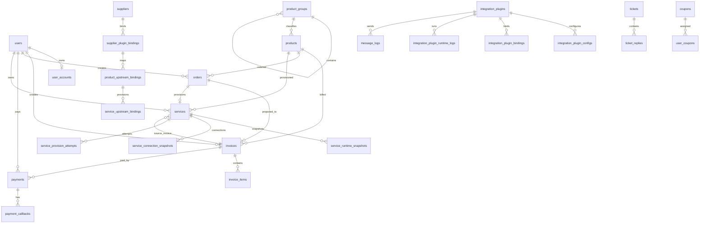

# 数据库文档

- 文档性质：当前数据库业务说明 / 结构索引
- 对齐时间：`2026-07-08`（最后一条 migration：`2026_07_08_050000_add_product_groups_table_comment`，batch 75）
- 数据来源：真实 MySQL `idc` 库、`information_schema`、`php backend/scripts/export_database_structure.php`、Laravel 当前代码
- 完整字段与索引明细：见 `文档/开发文档/数据库/当前数据库结构.md`

## 1. 概览

| 项 | 值 |
| --- | --- |
| 数据库 | `idc` |
| MySQL | `8.0.29` |
| 结构对象数量 | `60`（57 张 BASE TABLE + 3 个 VIEW） |
| 字段数量 | `844` |
| 索引数量 | `297` |
| 数据库级外键 | `78` |
| CHECK 约束 | `0` |
| 视图/过程/函数/触发器/事件/分区 | View `3`；其余 `0` |
| 默认存储引擎 | `InnoDB` |
| server 默认字符集/排序规则 | `utf8mb3` / `utf8_general_ci` |
| 业务表主要排序规则 | `utf8mb4_unicode_ci` |

## 2. 业务域分组

| 业务域 | 表 |
| --- | --- |
| 身份与权限 | `users`、`user_accounts`、`admin_users`、`admin_user_roles`、`roles`、`member_levels`、`personal_access_tokens`、`password_reset_tokens`、`sessions`、`verification_histories` |
| 商品与供应商 | `products`、`product_groups`（`first_product_groups`、`second_product_groups`、`third_product_groups` 为兼容视图）、`suppliers`、`supplier_plugin_bindings`、`product_upstream_bindings` |
| 交易与账单 | `orders`、`invoices`、`invoice_items`、`payments`、`payment_callbacks`、`gateway_logs` |
| 账户与流水 | `account_transactions`、`referral_account_logs` |
| 服务实例 | `services`、`service_upstream_bindings`、`service_runtime_snapshots`、`service_connection_snapshots`、`service_provision_attempts` |
| 优惠券 | `coupon_campaigns`、`coupons`、`user_coupons` |
| 返佣 | `referral_rewards`、`referral_withdrawals` |
| 工单 | `tickets`、`ticket_replies` |
| 内容与媒体 | `content_articles`、`content_categories`、`media_files`、`notice_reads` |
| 通知与日志 | `message_logs`、`notification_templates`、`user_notifications`、`operation_logs`、`activity_logs`、`automation_logs`、`schedule_run_logs`、`schedule_ticks`、`schedule_task_runs`、`archive_audit_logs`、`failed_jobs`、`jobs` |
| 插件系统 | `integration_plugins`、`integration_plugin_configs`、`integration_plugin_bindings`、`integration_plugin_runtime_logs` |
| 系统配置 | `settings`、`migrations` |

## 3. 核心关系



说明：

- 图中只表达核心业务关系。真实库当前有 78 个数据库级外键，更多关系由 Eloquent 关系、业务代码和索引约定维护。
- `orders` 正在退为内部 shadow Order，用户侧新购链路已由 `CheckoutService` 以 Invoice-first 创建账单，再创建内部 Order 供开通/退款链路兼容。
- `payments` 只表达第三方真实资金流入和退款状态，不记录余额/免费/手工开服。
- 上游供应商、商品、服务运行态已从旧字段迁移到绑定/快照表：`supplier_plugin_bindings`、`product_upstream_bindings`、`service_upstream_bindings`、`service_runtime_snapshots`、`service_connection_snapshots`。

## 4. 表体量

| 表 | 估算行数 | 体量（数据 + 索引） | 说明 |
| --- | ---: | ---: | --- |
| `operation_logs` | `120,049` | `78.67 MB` | 当前最大表之一，按运维策略归档 |
| `schedule_run_logs` | `66,493` | `23.58 MB` | 调度运行日志，随 `schedule:run` 增长 |
| `message_logs` | `1,716` | `10.25 MB` | 邮件/短信统一发送日志，按 `channel` 区分渠道，已纳入归档 |
| `activity_logs` | `6,953` | `5.69 MB` | 新操作审计表，承接 `operation_logs` 过渡期双写 |
| `integration_plugin_runtime_logs` | `2,691` | `5.33 MB` | 插件调用运行日志，随上游能力调用增长 |
| `product_upstream_bindings` | `138` | `8.61 MB` | 商品到上游商品的绑定和快照，插件化后成为上游商品关系真源 |
| `products` | `141` | `8.64 MB` | 平台商品、定价和购买配置，旧上游绑定字段已移出 |
| `invoices` | `2,135` | `2.61 MB` | 账单主表 |
| `product_groups` | `51` | `112 KB` | 商品分组自引用树，当前商品分组结构真源 |
| `services` | `120` | `640 KB` | 服务实例表，运行态与连接快照拆到独立表 |
| `orders` | `255` | `448 KB` | 内部影子订单和兼容链路 |
| `payments` | `269` | `400 KB` | 第三方支付记录，支付渠道由 `gateway_key` 与 `plugin_id` 表达 |

## 5. 结构特征

- 所有表已有主键。
- 所有业务表均为 `InnoDB`。
- 57 张基础表中部分核心表已有表注释，完整注释状态以自动结构快照为准。
- JSON 字段集中在商品配置、订单/账单快照、支付回调、通知模板、插件配置、上游绑定快照、服务运行/连接快照、调度任务运行摘要和日志上下文。
- 金额字段大多为 `decimal(12,2)`，符合基本财务精度。
- `users` 表余额列（`balance`、`credit_limit`、`referral_*_amount`）已于 2026-07-04 删除（H1）；所有余额读写通过 `User` 模型 accessor/setter 代理到 `user_accounts`，`user_accounts` 为余额唯一真源。
- `suppliers.interface_type/api_url/api_username/api_key/provider_config` 和 `products.provision_module/supplier_id/supplier_product_id` 已不再作为结构字段存在；供应商账号、商品上游映射和服务上游实例关系以插件绑定表为准。
- `orders`、`invoices`、`payments`、`payment_callbacks`、`products.product_group_id`、`product_groups.parent_id`、`services`、插件配置、上游绑定、权限、内容、优惠券、返佣、工单、通知和实名历史等可补 `*_id` 均已声明数据库级外键。
- `php artisan db:audit-foreign-keys --strict` 用于复核所有 `*_id` 字段；当前结果为 78 个已有 FK、0 个可补 FK、53 个多态/快照/外部标识字段、0 个未分类字段。
- `balance_logs` 表已于 2026-07-04 归档至 `account_transactions`（source_type='balance_log_archive'）并 DROP，流水唯一真源为 `account_transactions`。
- `invoices.order_id → orders` 外键已由 `RESTRICT` 改为 `SET NULL`，允许 orders 物理清理不被阻断。
- `user_coupons` 已删除 1 个完全重复的索引；旧二、三级商品分组物理表已由兼容视图替代，相关重复索引不再存在。
- `referral_withdrawals.trace_id` 已强制 NOT NULL，并回填历史空值，唯一约束从此对所有行有效（M7）。
- `invoices`、`payments`、`services`、`account_transactions` 的历史空 `trace_id` 已于 2026-07-08 通过 `php artisan db:backfill-trace-id --execute --json` 回填；`db:audit-core` 中四项 `trace_id_missing` 均为 `0`，备份文件位于 `backend/storage/app/trace-id-backfills/`。
- `content_articles` 软删除时自动在 slug 末尾追加 `_deleted_{id}` 后缀，恢复时自动还原，解决软删除与 slug 唯一约束的冲突（M2）。
- `operation_logs` 每月归档（保留90天）、`schedule_run_logs` 每周日清理（保留30天）已加入 `routes/console.php` 调度（M5）。
- `schedule_ticks`、`schedule_task_runs` 已加入调度心跳与任务运行明细链路，`schedule_task_runs.schedule_tick_id` 外键指向 `schedule_ticks.id` 且随 tick 删除级联清理。
- `notification_templates` 已成为短信/邮件等通知模板的结构化存储表，默认模板通过迁移和 `EmailNotificationTemplateDefaults` 写入；旧 `settings` 中的通知模板散列键已清理。
- `message_logs` 已于 2026-07-08 合并原 `email_logs`、`sms_logs`、`notification_logs`；邮件/短信写入、后台日志查询、用户日志查询、日志清理、归档和插件回填均已切换到统一表。
- 空库初始化 baseline 只包含结构和 `migrations` 记录；`backend/scripts/install_db.py` 会在迁移后补默认 `settings`、通知模板和管理员账号。
- `users.email` 和 `users.phone` 已改为 NOT NULL，历史 NULL 值以占位格式回填，唯一约束从此全面有效（H3）。
- `servers` 空表（0行，无代码引用）已于 2026-07-04 DROP（L3）。
- `OperationLogService.write()` 已加入 `activity_logs` 过渡期双写（L4）；`InvoiceService` 的两处直写也已改为走 `OperationLogService`，写入失败静默降级。`activity_logs` 经一个完整账期验收后，移除 `operation_logs` 写入路径。
- `payments.callback_raw`：被 `UserService` 退款判断和重复付款检测逻辑主动读取，属于业务数据字段而非纯日志，不可移除（M6 保留）。
- `product_groups` 已于 2026-07-08 重建为自引用树，`products.product_group_id` 通过外键指向 `product_groups.id`；旧三张商品分组物理表和 `products.first/second/third_product_group_id` 物理列已删除。
- `first_product_groups`、`second_product_groups`、`third_product_groups` 当前是兼容视图，只为现有商品管理和前端字段契约投影层级数据，不再作为结构真源。
- `service_runtime_snapshots` 保留为服务运行态快照，承载资源、指标和上游 payload；`service_connection_snapshots` 保留为连接凭据/入口快照，涉及敏感字段存在性和控制台展示；`service_provision_attempts` 保留为开通尝试追加日志，三者写入时机、保留语义和查询索引不同，本轮不合并。
- `operation_logs` 仍是当前主操作日志，`activity_logs` 是新审计表并由 `OperationLogService` 双写；需完成一个完整账期验收和后台查询切换后，再单独迁移停写 `operation_logs`。
- `schedule_run_logs` 服务于现有调度日志查询和清理；`schedule_task_runs` 绑定 `schedule_ticks`，表达心跳调度中的单任务运行状态。二者语义和生命周期不同，本轮只记录后续统一计划，不执行合并。

## 6. 当前特殊对象

| 对象类型 | 数量 |
| --- | ---: |
| View | `3` |
| Routine / Function | `0` |
| Trigger | `0` |
| Event | `0` |
| Partition | `0` |

## 7. 完整结构明细

完整字段、索引、外键和表清单不在本文重复维护，统一以自动生成文档为准：

- `文档/开发文档/数据库/当前数据库结构.md`

需要刷新时执行：

```bash
php backend/scripts/export_database_structure.php
```
