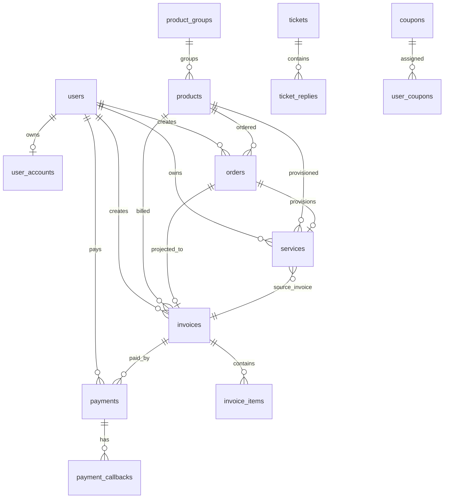

# 数据库文档

- 文档性质：当前数据库业务说明 / 结构索引
- 生成时间：`2026-06-16 01:05:58 +08:00`
- 数据来源：真实 MySQL `idc` 库、`information_schema`、`php backend/scripts/export_database_structure.php`、Laravel 当前代码
- 完整字段与索引明细：见 `文档/开发文档/数据库/当前数据库结构.md`

## 1. 概览

| 项 | 值 |
| --- | --- |
| 数据库 | `idc` |
| MySQL | `8.0.29` |
| 表数量 | `47` |
| 字段数量 | `618` |
| 索引数量 | `220` |
| 数据库级外键 | `11` |
| CHECK 约束 | `0` |
| 视图/过程/函数/触发器/事件/分区 | 均为 `0` |
| 默认存储引擎 | `InnoDB` |
| server 默认字符集/排序规则 | `utf8mb3` / `utf8_general_ci` |
| 业务表主要排序规则 | `utf8mb4_unicode_ci` |

## 2. 业务域分组

| 业务域 | 表 |
| --- | --- |
| 身份与权限 | `users`、`user_accounts`、`admin_users`、`admin_user_roles`、`roles`、`member_levels`、`personal_access_tokens`、`password_reset_tokens`、`sessions`、`verification_histories` |
| 商品与供应商 | `products`、`product_groups`、`suppliers`、`servers` |
| 交易与账单 | `orders`、`invoices`、`invoice_items`、`payments`、`payment_callbacks`、`gateway_logs` |
| 账户与流水 | `balance_logs`、`account_transactions`、`referral_account_logs` |
| 服务实例 | `services` |
| 优惠券 | `coupon_campaigns`、`coupons`、`user_coupons` |
| 返佣 | `referral_rewards`、`referral_withdrawals` |
| 工单 | `tickets`、`ticket_replies` |
| 内容与媒体 | `content_articles`、`content_categories`、`media_files`、`notice_reads` |
| 通知与日志 | `notification_logs`、`email_logs`、`sms_logs`、`user_notifications`、`operation_logs`、`activity_logs`、`automation_logs`、`schedule_run_logs`、`failed_jobs`、`jobs` |
| 系统配置 | `settings`、`migrations` |

## 3. 核心关系



说明：

- 图中只表达核心业务关系。真实库只有 11 个数据库级外键，更多关系目前由 Eloquent 关系、业务代码和索引约定维护。
- `orders` 正在退为内部 shadow Order，用户侧新购链路已由 `CheckoutService` 以 Invoice-first 创建账单，再创建内部 Order 供开通/退款链路兼容。
- `payments` 应只表达第三方真实资金流入，但历史库仍存在 `balance/manual` 记录，已在审查报告中列为重构事项。

## 4. 表体量

| 表 | 估算行数 | 体量 | 说明 |
| --- | ---: | ---: | --- |
| `operation_logs` | `97,640` | `66.67 MB` | 当前最大表，已有归档命令但 180 天 dry-run 为 0 |
| `products` | `139` | `9.59 MB` | JSON 配置和商品快照相关字段较重 |
| `notification_logs` | `1,191` | `6.81 MB` | 通知日志，需随运行增长纳入归档 |
| `invoices` | `1,839` | `1.20 MB` | 账单主表 |
| `services` | `110` 估算 | `0.58 MB` | InnoDB 估算行数，实际状态聚合显示更多，后续以精确统计为准 |
| `orders` | `240` | `0.41 MB` | 正在成为内部影子订单 |
| `payments` | `239` | `0.38 MB` | 含历史 `balance/manual` 记录 |

## 5. 结构特征

- 所有表已有主键。
- 所有业务表均为 `InnoDB`。
- 47 张表均缺少表注释。
- JSON 字段共 31 个，集中在商品配置、订单/账单快照、支付回调、日志上下文。
- 金额字段大多为 `decimal(12,2)`，符合基本财务精度，但仍需统一领域单位和源头。
- `users` 与 `user_accounts` 同时承载余额字段，属于账户投影/双写结构。
- `orders`、`invoices`、`payments`、`payment_callbacks`、`services` 已有部分核心外键，其他大量 `*_id` 是逻辑外键。

## 6. 当前特殊对象

| 对象类型 | 数量 |
| --- | ---: |
| View | `0` |
| Routine / Function | `0` |
| Trigger | `0` |
| Event | `0` |
| Partition | `0` |

## 7. 完整结构明细

完整字段、索引、外键和表清单不在本文重复维护，统一以自动生成文档为准：

- `文档/开发文档/数据库/当前数据库结构.md`

需要刷新时执行：

```bash
php backend/scripts/export_database_structure.php
```
