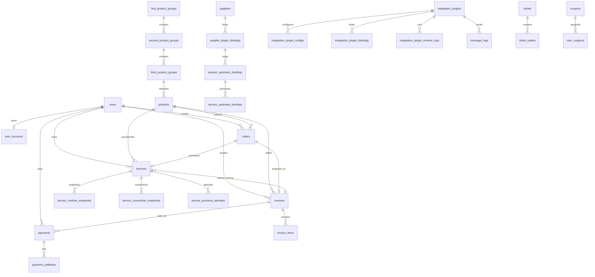

# 数据库文档

- 文档性质：当前数据库业务说明 / 结构索引
- 对齐时间：`2026-07-17 01:26:14 +08:00`
- 数据来源：`migration-output/idc-current-table-structure.md`（实库 `idc` DDL 快照）+ Laravel 当前代码
- 完整字段与索引明细：见 `文档/开发文档/数据库/当前数据库结构.md`

## 1. 概览

| 项 | 值 |
| --- | --- |
| 数据库 | `idc` |
| 结构对象数量 | `60`（本快照全部按 BASE TABLE 记录） |
| 字段数量 | `830` |
| 索引数量 | `299` |
| 数据库级外键 | `80` |
| 默认存储引擎 | `InnoDB` |
| 业务表主要排序规则 | `utf8mb4_unicode_ci` |

## 2. 业务域分组

| 业务域 | 表 |
| --- | --- |
| 身份与权限 | `users`、`user_accounts`、`admin_users`、`admin_user_roles`、`roles`、`member_levels`、`personal_access_tokens`、`password_reset_tokens`、`sessions`、`verification_histories` |
| 商品与供应商 | `products`、`first_product_groups`、`second_product_groups`、`third_product_groups`、`suppliers`、`supplier_plugin_bindings`、`product_upstream_bindings` |
| 交易与账单 | `orders`、`invoices`、`invoice_items`、`payments`、`payment_callbacks`、`gateway_logs` |
| 账户与流水 | `account_transactions`、`referral_account_logs` |
| 服务实例 | `services`、`service_upstream_bindings`、`service_runtime_snapshots`、`service_connection_snapshots`、`service_provision_attempts` |
| 优惠券 | `coupon_campaigns`、`coupons`、`user_coupons` |
| 返佣 | `referral_rewards`、`referral_withdrawals` |
| 工单 | `tickets`、`ticket_replies` |
| 内容与媒体 | `content_articles`、`content_categories`、`media_files`、`notice_reads` |
| 通知与日志 | `message_logs`、`notification_templates`、`user_notifications`、`operation_logs`、`activity_logs`、`automation_logs`、`schedule_run_logs`、`schedule_ticks`、`schedule_task_runs`、`archive_audit_logs`、`failed_jobs`、`jobs` |
| 插件系统 | `integration_plugins`、`integration_plugin_configs`、`integration_plugin_bindings`、`integration_plugin_runtime_logs` |
| 代理/插件扩展 | `agent_applications` |
| 系统配置 | `settings`、`migrations` |

## 3. 核心关系



说明：

- 图中只表达核心业务关系。真实库当前有 `80` 个数据库级外键，更多关系由 Eloquent 关系、业务代码和索引约定维护。
- 本轮文档基线来自 `migration-output/idc-current-table-structure.md`：商品分组仍为 `first_product_groups` / `second_product_groups` / `third_product_groups` 三张物理表，**未包含** `product_groups` 自引用表。
- `orders` 正在退为内部 shadow Order，用户侧新购链路已由 `CheckoutService` 以 Invoice-first 创建账单，再创建内部 Order 供开通/退款链路兼容。
- `payments` 只表达第三方真实资金流入和退款状态，不记录余额/免费/手工开服。
- 上游供应商、商品、服务运行态由绑定/快照表承载：`supplier_plugin_bindings`、`product_upstream_bindings`、`service_upstream_bindings`、`service_runtime_snapshots`、`service_connection_snapshots`。
- `agent_applications` 属于 ZJMF Bridge 插件扩展表，随插件迁移存在。

## 4. 结构特征

- 所有业务表均为 `InnoDB`。
- JSON 字段集中在商品配置、订单/账单快照、支付回调、通知模板、插件配置、上游绑定快照、服务运行/连接快照、调度任务运行摘要和日志上下文。
- 金额字段大多为 `decimal(12,2)`。
- `user_accounts` 为余额唯一真源；`account_transactions` 为账户流水真源。
- `referral_account_logs` 仍在本快照中存在，但业务写入路径已主要收敛到 `account_transactions`（推荐流水查询读 AccountTransaction）。
- `operation_logs` 与 `activity_logs` 仍处于过渡期双写：`OperationLogService` 同时写入两表。
- `message_logs` 统一承接邮件/短信发送日志，通过 `channel` 区分渠道。
- `services.provision_data` 与服务上游绑定/快照表并存，运行时由投影层合并读取。
- 完整字段、索引、外键明细不在本文重复维护，统一以：
  - `文档/开发文档/数据库/当前数据库结构.md`
  - 源快照 `migration-output/idc-current-table-structure.md`

## 5. 刷新方式

```bash
# 方式 A：从 migration-output 快照同步到项目文档
php migration-output/_sync_structure_docs.php

# 方式 B：直接从实库 information_schema 重刷结构明细
php backend/scripts/export_database_structure.php
```

> 注意：方式 B 会按实库实时状态覆盖 `当前数据库结构.md` 的格式与统计；若要以 migration-output 快照为准，使用方式 A。
