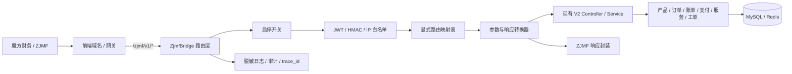

# ZJMF 对接 Caiwu 中间层方案

- 文档性质：实施前设计方案 / 对接规范
- 适用范围：第三方“魔方财务 / ZJMF”调用 Caiwu 现有财务、产品、订单、账单、支付、服务和内容能力
- 对齐日期：2026-07-07
- 关联参考：
  - `文档/开发文档/集成/魔方财务API文档.md`
  - `文档/开发文档/集成/本地对接说明.md`
  - `文档/开发文档/后端/API格式规范.md`
  - `文档/开发文档/后端/API直接重构方案.md`
  - `文档/开发文档/后端/后端API清单.md`
  - `文档/开发文档/架构/产品类型与一级菜单重构方案.md`

## 1. 结论摘要

本方案在 Caiwu 后端新增一个可拆卸的原生中间层入口：

```text
https://{FRONTEND_URL}/zjmf/v1/*
```

生产上如果 `FRONTEND_URL` 指向前端域名，应由 Nginx / 网关把 `/zjmf/v1/*` 反向代理到后端 Laravel；Laravel 内部只注册路径 `/zjmf/v1/*`，不要把 `FRONTEND_URL` 写成后端路由前缀。

重要边界：

- 对接基准为当前活跃后端接口：`/api/v2/admin/*`、`/api/v2/client/*`、`/api/v2/site/*`。
- ZJMF 中间层不做盲目通配代理，而是通过显式映射表复用现有 Controller / Service / Resource / 支付回调能力。
- 商品域必须按当前结构处理：固定业务 `product_type`、一级菜单 `first_product_groups`、二级分类 `second_product_groups`、三级分类 `third_product_groups`、商品 `products` 分层转换，不能再把一级菜单 `code` 当业务产品类型使用。
- 现有 `backend/plugins/servers/mofang_finance/` 是 Caiwu 调用魔方财务上游的数据面插件；本文方案是魔方财务调用 Caiwu 的入站兼容层，二者方向相反，不能混用 provider key 或职责。
- `mofang_finance_api` 必须继续保持独立 provider key，禁止别名成 `hosting_panel_api`。

## 2. 目标与非目标

### 2.1 目标

- 为 ZJMF 提供稳定入口 `/zjmf/v1/*`，兼容魔方财务官方 `/v1/*` 调用风格。
- 复用 Caiwu 当前接口能力，覆盖产品类型、一级菜单、二三级分类、商品、订单、账单、支付、财务流水、服务状态、续费、升降级、工单、内容等核心域。
- 提供可插拔开关，停用后不影响现有 `/api/v2/*`、前端、支付回调、调度和上游插件运行。
- 在边界层完成请求参数转换、鉴权签名转换、响应格式转换、错误码转换和审计日志。
- 对支付、账单、回调、财务流水保持事务、幂等、签名校验和脱敏日志。

### 2.2 非目标

- 不引入第三方插件或额外包。
- 不重写现有财务、订单、支付、服务开通业务。
- 不开放任意管理端能力给 ZJMF；管理型接口必须经过 scope 白名单。
- 不为了 ZJMF 修改现有 `/api/v2/*` 响应契约。
- 不把当前上游魔方插件改造成入站网关。
- 不新增历史别名或长期代理入口；对外只承诺 `/zjmf/v1/*`。

## 3. 当前接口体系审查

### 3.1 路由结构

当前 Laravel 路由由 `backend/bootstrap/app.php` 注册：

| 路由文件 | 当前前缀 | 主要职责 | 鉴权概况 |
| --- | --- | --- | --- |
| `backend/routes/api.php` | `/api/*`，其中站点接口为 `/api/v2/site/*` | 官网公开配置、首页、内容、产品、报价、库存、健康检查 | 多数公开，报价有限流 |
| `backend/routes/v2-client.php` | `/api/v2/client/*` | 用户登录注册、账单、订单、支付、充值、服务、工单、消息、实名、推介 | 登录注册公开；业务接口走 Sanctum + `ensure.client`；支付/实名回调走签名中间件 |
| `backend/routes/v2-admin.php` | `/api/v2/admin/*` | 管理端用户、产品、订单、账单、财务、供应商、插件、设置、日志、权限 | Sanctum + `ensure.admin` + `permission:{code}` |
| `backend/routes/web.php` | Web 路由 | 安全资源查看等少量 Web 能力 | 按现有控制器处理 |

接口审查以当前 Laravel 路由文件、`文档/开发文档/后端/后端API清单.md` 和后端 API 规范文档为准；旧接口快照不作为本方案对接依据。

### 3.2 鉴权方式

现有系统鉴权：

- 管理端：`Authorization: Bearer {admin_token}`，Laravel Sanctum，叠加 `ensure.admin` 和权限码。
- 用户端：`Authorization: Bearer {client_token}`，Laravel Sanctum，叠加 `ensure.client`。
- 回调类接口：签名中间件先验签，再进入控制器和业务服务。
- ZJMF 官方参考使用 `authorization: JWT {token}` 风格，JWT 有效期约 2 小时。

中间层必须把 ZJMF 的 `JWT` 或系统级 HMAC 凭证转换为 Caiwu 内部可识别的用户身份 / 系统身份，不能把 Caiwu Sanctum token 直接暴露给第三方。

### 3.3 数据格式

Caiwu 当前标准响应：

```json
{
  "code": 0,
  "message": "操作成功",
  "data": {},
  "timestamp": 1760000000
}
```

分页结构固定放在 `data` 内：

```json
{
  "list": [],
  "total": 0,
  "page": 1,
  "page_size": 20
}
```

ZJMF / 魔方财务参考接口更偏向：

- `status` / 状态码表达成功失败。
- 列表可能使用 `page`、`limit`、`keywords`、`orderby` 等字段。
- 金额多为字符串小数或带中文单位的展示字段。
- 时间常使用 Unix 时间戳。
- 产品服务状态使用 `Pending`、`Active`、`Suspended`、`Cancelled`、`Fraud`、`Deleted` 等英文枚举。

因此中间层要做双向转换：

- 入站：ZJMF 参数转换为 Caiwu FormRequest / Service 入参。
- 出站：Caiwu Resource 转换为 ZJMF 字段和状态码。

### 3.4 错误码规范

Caiwu：

- 成功固定 `code = 0`。
- 失败保持统一外层，`code != 0`。
- 校验错误为 `42200`，字段错误在 `data.errors`。
- 未登录 / 过期通常为 `40100`。
- 无权限通常为 `40300`。
- 回调验签失败可使用 `40001` 并覆盖 HTTP 状态。
- 第三方原始错误只能进入脱敏日志，不能直接返回给调用方。

ZJMF 中间层对外返回建议兼容魔方财务习惯：

```json
{
  "status": 200,
  "msg": "success",
  "data": {}
}
```

其中 `status = 200` 表示业务成功；非 200 表示业务失败。内部仍保留 Caiwu `code`，写入日志和 `trace_id`，不暴露堆栈或第三方原始错误。

### 3.5 商品结构基准

当前商品结构已经拆分“业务产品类型”和“运营菜单分类”。ZJMF Bridge 对外兼容魔方财务字段时，内部必须按以下模型取数和转换：

```text
产品类型 product_type
  固定业务枚举，决定购买页、控制台页、开通/续费/升降级能力和状态映射。

一级菜单 first_product_groups
  官网和后台产品导航入口。每个一级菜单绑定一个 product_type。
  code 是菜单自身标识，不能默认等同于 product_type。

二级分类 second_product_groups
  归属于一级菜单，用于组织商品分组。

三级分类 third_product_groups
  归属于二级分类，用于更细的商品分组。

商品 products
  绑定 first_product_group_id、second_product_group_id，可选 third_product_group_id。
  有效 product_type 来自所属一级菜单绑定的 product_type。

订单 / 账单 / 服务
  下单、账单生成和开通时保存 product_type_snapshot，后续按快照或服务绑定类型处理。
```

固定业务产品类型只允许以下 8 类：

| product_type | 展示名 | Bridge 用途 |
| --- | --- | --- |
| `cloud_server` | 云服务器 | 默认计算型购买页、控制台、开通和续费能力 |
| `game_cloud` | 游戏云 | 游戏云模板和状态动作 |
| `cloud_desktop` | 云电脑 | 云桌面购买和控制台能力 |
| `bare_metal` | 裸金属 | 裸金属规格、机房、带宽能力 |
| `cdn` | CDN | CDN 域名、流量、刷新/预热能力 |
| `physical_machine` | 物理机 | 物理机运维信息和服务动作 |
| `web_hosting` | 虚拟主机 | 空间、数据库、域名绑定能力 |
| `other` | 其他 | 插件驱动产品，必须由上游插件声明 schema 和能力 |

Bridge 商品域取值规则：

- 输出给 ZJMF 的业务类型统一使用固定 `product_type`，不要输出旧 `vps`、`dedicated`、`domain`、`hosting` 或菜单自定义 `code` 作为业务类型。
- 一级菜单标识单独保留为 `first_product_group_code` / `menu_code`；ZJMF 的 `first_group.id/name` 对应 Caiwu `first_product_groups.id/name`。
- ZJMF 的 `group_id` 对应 Caiwu 当前有效商品分组，优先三级分类 `third_product_groups.id`，没有三级时使用二级分类 `second_product_groups.id`，同时内部保留 `effective_product_group_level` 防止二级/三级 ID 混淆。
- 读取历史数据时，优先使用 `first_product_groups.product_type`；缺失时才按旧菜单 code 映射：`vps -> cloud_server`、`dedicated -> game_cloud`、`domain -> cloud_desktop`、`type_iwjqnj -> bare_metal`、`other(CDN 菜单) -> cdn`、`type_ipragu -> other`、`type_tgynng -> physical_machine`、`type_1/hosting -> web_hosting`。
- `products.product_type`、`products.service_type_code` 和订单/账单/服务快照只作为业务类型冗余或历史读取依据；新写入链路必须从一级菜单绑定的 `product_type` 解析。
- 旧 `product_groups` 表不是 ZJMF 分类树来源；Bridge 分类树必须来自 `first_product_groups`、`second_product_groups`、`third_product_groups` 或现有 V2 商品查询服务。

## 4. 总体架构



模块定位：

- `ZjmfBridge` 是入站兼容层，只处理协议适配，不承载业务规则。
- 业务处理继续落在现有 Service，例如财务、订单、支付、服务控制台、工单等服务。
- 支付回调继续走已有签名中间件和 `PaymentService` 幂等逻辑。
- 现有上游插件 `backend/plugins/servers/mofang_finance/` 不参与入站路由注册。

## 5. 建议文件布局

```text
backend/
  config/
    zjmf_bridge.php
  routes/
    zjmf.php
  app/
    Http/
      Middleware/
        ZjmfBridgeEnabled.php
        VerifyZjmfSignature.php
        ResolveZjmfActor.php
        LogZjmfBridgeRequest.php
      Controllers/
        Zjmf/
          BridgeController.php
          AuthController.php
          PaymentNotifyController.php
    Services/
      ZjmfBridge/
        ZjmfRouteMap.php
        ZjmfDispatcher.php
        ZjmfResponseFactory.php
        ZjmfErrorMapper.php
        ZjmfTokenService.php
        ZjmfSignatureService.php
        Mappers/
          ProductMapper.php
          CartMapper.php
          InvoiceMapper.php
          OrderMapper.php
          PaymentMapper.php
          LedgerMapper.php
          ServiceMapper.php
          TicketMapper.php
          ContentMapper.php
    Logging/
      ZjmfBridgeLogger.php
```

注册方式：

- 在 `bootstrap/app.php` 的路由注册处按配置加载 `routes/zjmf.php`。
- `routes/zjmf.php` 统一加前缀 `/zjmf/v1`。
- 路由组使用 `api` middleware，并额外叠加 `zjmf.enabled`、`zjmf.log`、`zjmf.auth`。
- 不注册系统级定时任务、不污染上游插件目录、不修改现有 `/api/v2/*` 路由。

## 6. 可插拔配置

### 6.1 环境变量

```env
ZJMF_BRIDGE_ENABLED=false
ZJMF_BRIDGE_BASE_PATH=/zjmf/v1
ZJMF_BRIDGE_MODE=strict
ZJMF_BRIDGE_SECRET=
ZJMF_BRIDGE_TOKEN_TTL=7200
ZJMF_BRIDGE_ALLOWED_IPS=
ZJMF_BRIDGE_SIGNATURE_TOLERANCE=300
ZJMF_BRIDGE_LOG_CHANNEL=zjmf_bridge
ZJMF_BRIDGE_WRITE_ENABLED=false
ZJMF_BRIDGE_ADMIN_SCOPE_ENABLED=false
```

说明：

| 配置 | 默认值 | 说明 |
| --- | --- | --- |
| `ZJMF_BRIDGE_ENABLED` | `false` | 总开关；关闭后返回 404 或 503，不能影响主系统 |
| `ZJMF_BRIDGE_BASE_PATH` | `/zjmf/v1` | 路由前缀 |
| `ZJMF_BRIDGE_MODE` | `strict` | `strict` 只允许映射表内接口；禁止通配转发 |
| `ZJMF_BRIDGE_SECRET` | 空 | HMAC 签名密钥或 JWT 签发密钥，生产必须配置 |
| `ZJMF_BRIDGE_TOKEN_TTL` | `7200` | ZJMF JWT 有效期，单位秒 |
| `ZJMF_BRIDGE_ALLOWED_IPS` | 空 | 逗号分隔 IP 白名单，生产建议开启 |
| `ZJMF_BRIDGE_SIGNATURE_TOLERANCE` | `300` | 时间戳偏移容忍秒数 |
| `ZJMF_BRIDGE_LOG_CHANNEL` | `zjmf_bridge` | 单独日志 channel |
| `ZJMF_BRIDGE_WRITE_ENABLED` | `false` | 写操作总开关，首期可只开放读接口 |
| `ZJMF_BRIDGE_ADMIN_SCOPE_ENABLED` | `false` | 是否允许系统级管理查询能力 |

### 6.2 Settings 配置

敏感配置可落 `settings`：

| group | key | 类型 | 说明 |
| --- | --- | --- | --- |
| `zjmf_bridge` | `enabled` | bool | 运行时启停 |
| `zjmf_bridge` | `secret` | encrypted string | 签名密钥 |
| `zjmf_bridge` | `allowed_ips` | string | IP 白名单 |
| `zjmf_bridge` | `scopes` | json | 允许的接口域 |
| `zjmf_bridge` | `write_enabled` | bool | 写操作开关 |

优先级建议：

```text
.env 默认值 < settings 运行时配置 < 紧急熔断缓存
```

## 7. 调用链路

### 7.1 登录态接口

```text
ZJMF
  -> POST /zjmf/v1/login_api
  -> AuthController 校验账号密码 / API 凭证
  -> Caiwu 用户认证服务
  -> ZjmfTokenService 签发短期 JWT
  -> 返回 authorization token

ZJMF
  -> GET /zjmf/v1/user
  -> VerifyZjmfSignature / ResolveZjmfActor
  -> 调用现有用户资料、余额、认证状态服务
  -> UserMapper 转为魔方字段
```

### 7.2 账单支付链路

```text
ZJMF
  -> POST /zjmf/v1/cart/checkout 或 POST /zjmf/v1/invoices/{id}/fund
  -> Bridge 参数转换
  -> 复用 InvoiceWorkflowController / PaymentService / CheckoutService
  -> 生成 invoice / payment / order
  -> 返回 ZJMF invoiceid、orderid、payment、pay_html
```

### 7.3 支付回调链路

```text
支付网关 / ZJMF
  -> POST /zjmf/v1/payment/notify/{gateway}
  -> VerifyZjmfSignature
  -> PaymentNotifyController
  -> 复用现有 verify.payment.callback / PaymentService
  -> 幂等落 payment_callbacks、payments、invoices、account_transactions
  -> 返回 success / fail 或 ZJMF JSON
```

回调不得绕过：

- 支付插件的验签能力。
- `PaymentService` 的幂等、锁、事务、账单支付后续派发。
- 现有审计字段，如 `trace_id`、`ip_address`、`operator_*`、`actor_*`。

## 8. 路由映射规则

### 8.1 映射原则

- 使用显式映射表，不使用 `{any}` 盲转。
- 每个 ZJMF 路由记录：HTTP 方法、外部路径、内部目标、权限 scope、读写类型、幂等键策略、字段映射器。
- 只读接口可首期开启；写接口受 `ZJMF_BRIDGE_WRITE_ENABLED` 控制。
- 管理查询接口受 `ZJMF_BRIDGE_ADMIN_SCOPE_ENABLED` 和 scope 控制。
- 字段缺失时返回 ZJMF 兼容错误，不自动创造业务数据。
- 内部目标优先调用 Service；必要时可以复用 Controller 行为，但不能重复实现业务流程。

### 8.2 公共与站点接口

| ZJMF 路径 | 方法 | Caiwu 目标 | 说明 |
| --- | --- | --- | --- |
| `/gateway` | GET | `/api/v2/client/recharge/gateways` 或支付网关服务 | 支付方式列表 |
| `/products` | GET | `/api/v2/site/products` + 商品层级 Resource | 商品概要，输出固定 `product_type`、一级菜单、有效二/三级分组、价格、库存 |
| `/productsconfig` | GET | `/api/v2/site/products/{product}` + `/api/v2/site/product-purchase-context` | 商品详情、配置项、购买上下文和插件能力 |
| `/products/total` | POST | `/api/v2/site/products/{product}/quote` | 价格试算 |
| `/hosts/cates` | GET | `/api/v2/site/product-types` + `/api/v2/site/product-groups` + children | 产品分类树；一级为菜单，二/三级为分组，业务类型单独输出 `product_type` |
| `/knowledgebase` | GET | `/api/v2/site/help-articles` | 帮助中心列表 |
| `/knowledgebase/{id}` | GET | `/api/v2/site/help-articles/{article}` | 帮助详情 |
| `/news` | GET | `/api/v2/site/notices` | 新闻 / 公告列表 |
| `/news/{id}` | GET | `/api/v2/site/notices/{article}` | 新闻 / 公告详情 |
| `/downloads` | GET | 暂无直接目标 | 如需开放，映射媒体/附件能力；首期建议返回空列表或 501 |
| `/captcha`、`/code` | GET/POST | `/api/v2/client/auth/captcha-*`、`phone-code`、`email-code` | 按 Caiwu 当前验证码能力适配 |

### 8.3 会员与认证接口

| ZJMF 路径 | 方法 | Caiwu 目标 | 说明 |
| --- | --- | --- | --- |
| `/login_api` | POST | `/api/v2/client/login` | API 登录并签发 ZJMF JWT |
| `/login` | GET | `/api/v2/client/auth/captcha-config` | 返回支持登录方式 |
| `/login` | POST | `/api/v2/client/login` 或 `/auth/login-by-code` | 登录 |
| `/register` | GET | 站点配置 + 验证码配置 | 返回注册方式 |
| `/register` | POST | `/api/v2/client/register` | 注册 |
| `/pwreset` | GET/POST | `/api/v2/client/auth/reset-password` | 找回密码 |
| `/user` | GET | `/api/v2/client/auth/info` + 余额服务 | 用户资料、余额、默认网关 |
| `/user` | PUT | `/api/v2/client/auth/profile` | 修改资料 |
| `/password` | PUT | `/api/v2/client/password` | 修改密码 |
| `/phone_bind` | PUT | `/api/v2/client/auth/phone` | 手机绑定 |
| `/email_bind` | PUT | `/api/v2/client/auth/email` | 邮箱绑定 |
| `/login_notice` | PUT | `/api/v2/client/auth/notification-preferences` | 登录提醒 |
| `/real_name_auth` | GET | `/api/v2/client/verification/status` | 实名信息 |
| `/real_name_auth/person` | POST | `/api/v2/client/verification/init` | 个人认证 |
| `/real_name_auth/company` | POST | 视 Caiwu 企业实名能力决定 | 无等价能力时返回 501 |
| `/real_name_auth/status` | GET | `/api/v2/client/verification/status` | 认证状态 |

### 8.4 购物车、订单和账单

| ZJMF 路径 | 方法 | Caiwu 目标 | 说明 |
| --- | --- | --- | --- |
| `/cart/products` | POST | CheckoutService 草稿 / 报价能力 | Caiwu 无长期购物车时用短期缓存购物车 |
| `/cart` | GET | 短期购物车缓存 + 网关列表 | 返回当前待结算项目 |
| `/cart/products/{position}` | DELETE | 短期购物车缓存 | 删除条目 |
| `/cart/clear` | DELETE | 短期购物车缓存 | 清空 |
| `/cart/promo` | POST/DELETE | 优惠券 / 报价能力 | 应用或移除优惠码 |
| `/cart/checkout` | POST | `/api/v2/client/invoices` 或 CheckoutService | 创建订单/账单 |
| `/orders` | GET | `/api/v2/client/orders` | 订单列表 |
| `/orders/{id}` | GET | `/api/v2/client/orders/{id}` | 订单详情 |
| `/invoices` | GET | `/api/v2/client/invoices` | 账单列表 |
| `/invoices/{id}` | GET | `/api/v2/client/invoices/{id}` | 账单详情 |
| `/invoices/combines` | POST | 账单合并能力 | 当前无等价能力时返回 501 |
| `/invoices/{id}/fund` | POST | `/api/v2/client/invoices/{id}/pay/balance` | 使用余额 |
| `/invoices/{id}/fund` | DELETE | 暂无等价能力 | Caiwu 不建议删除已记录资金动作；返回 501 |
| `/invoices/{id}/credit` | POST | 暂无等价能力 | 如无信用额系统，返回 501 |
| `/invoices/{id}/status` | GET | `/api/v2/client/invoices/{id}/pay/alipay/status` + InvoiceService | 支付状态 |

### 8.5 支付、充值和流水

| ZJMF 路径 | 方法 | Caiwu 目标 | 说明 |
| --- | --- | --- | --- |
| `/pay` | POST | `/api/v2/client/invoices/{id}/pay/alipay` 或 mix | 发起三方支付 |
| `/funds` | GET | `/api/v2/client/recharge/gateways` + `/api/v2/client/payments` | 充值页信息和交易流水 |
| `/funds` | POST | `/api/v2/client/recharge` | 账户充值 |
| `/transactions/funds` | GET | `/api/v2/client/finance/ledger` | 财务流水 |
| `/payments` | GET | `/api/v2/client/payments` | 支付记录 |
| `/payments/{id}` | GET | `/api/v2/client/payments/{id}` | 支付详情 |
| `/payment/notify/{gateway}` | POST | `/api/v2/client/payment/notify/{gateway}` | 支付回调，必须验签和幂等 |
| `/payment/alipay/notify` | POST | `/api/v2/client/payment/alipay/notify` | 支付宝回调，返回 `success` / `fail` |
| `/reconcile/payments` | GET | Admin finance/payment query Service | 对账查询，系统 scope |
| `/reconcile/invoices` | GET | Admin invoice query Service | 账单对账，系统 scope |
| `/finance/ledger/sync` | GET/POST | LedgerService | 流水同步，系统 scope |

### 8.6 产品服务管理

| ZJMF 路径 | 方法 | Caiwu 目标 | 说明 |
| --- | --- | --- | --- |
| `/hosts` | GET | `/api/v2/client/services` | 产品服务列表 |
| `/hosts/{id}` | GET | `/api/v2/client/services/{id}` | 服务详情 |
| `/hosts/{id}/renew` | GET | `/api/v2/client/services/{id}/renewals` | 续费预览 |
| `/hosts/{id}/renew` | POST | `/api/v2/client/services/{id}/renewals` | 创建续费订单 |
| `/hosts/{id}/renew` | PUT | `/api/v2/client/services/{id}/renewals/auto` | 自动续费开关 |
| `/hosts/renew/batch` | GET/POST | 批量续费服务 | 当前无等价能力时先返回 501 |
| `/hosts/{id}/cancel` | GET/POST/DELETE | `/api/v2/client/orders/{order}/cancellations` 或服务取消申请能力 | 需按实际取消模型二次确认 |
| `/hosts/{id}/actions/upgrade` | GET | `/api/v2/client/services/{id}/upgrades` | 升降级预览 |
| `/hosts/{id}/actions/upgrade` | POST | `/api/v2/client/services/{id}/upgrades/orders` | 创建升降级订单 |
| `/hosts/{id}/actions/upgradeconfig` | GET/POST | `/api/v2/client/services/{id}/upgrades/quotes` 等 | 配置项升降级 |
| `/hosts/{id}/logs` | GET | `/api/v2/client/services/{id}/operation-logs` | 服务日志 |
| `/hosts/{id}/module` | GET | `/api/v2/client/services/{id}/module-status` + 能力清单 | 模块能力 |
| `/hosts/{id}/module/status` | GET | `/api/v2/client/services/{id}/module-status` | 上游状态 |
| `/hosts/{id}/module/repassword` | PUT | `/api/v2/client/services/{service}/password-resets` | 重置密码 |
| `/hosts/{id}/module/reinstall` | GET | `/api/v2/client/services/{id}/reinstallations/options` | 重装选项 |
| `/hosts/{id}/module/reinstall` | PUT | `/api/v2/client/services/{service}/reinstallations` | 重装 |
| `/hosts/{id}/module/on` | PUT | `/api/v2/client/services/{service}/power-actions` | 开机 |
| `/hosts/{id}/module/off` | PUT | `/api/v2/client/services/{service}/power-actions` | 关机 |
| `/hosts/{id}/module/reboot` | PUT | `/api/v2/client/services/{service}/power-actions` | 重启 |
| `/hosts/{id}/module/vnc` | GET | `/api/v2/client/services/{id}/vnc` | VNC，必须短期 token |
| `/hosts/{id}/module/charts` | GET | `/api/v2/client/services/{id}/monitor` | 监控图表 |
| `/hosts/{id}/nat-forwardings` | GET/POST/DELETE | `/api/v2/client/services/{id}/nat-forwardings` | NAT 转发 |
| `/hosts/{id}/security-groups` | GET/POST/DELETE | `/api/v2/client/services/{id}/security-groups` | 安全组 |

### 8.7 工单、推介、消息和日志

| ZJMF 路径 | 方法 | Caiwu 目标 | 说明 |
| --- | --- | --- | --- |
| `/tickets` | GET | `/api/v2/client/tickets` | 工单列表 |
| `/tickets/page` | GET | `/api/v2/client/tickets/service-options` | 提交页选项 |
| `/tickets` | POST | `/api/v2/client/tickets` | 提交工单 |
| `/tickets/{id}` | GET | `/api/v2/client/tickets/{id}` | 工单详情 |
| `/tickets/{id}/reply` | POST | `/api/v2/client/tickets/{id}/replies` | 回复 |
| `/affiliates` | GET/PUT | `/api/v2/client/referral/overview` | 推介计划 |
| `/affiliates/withdraw` | POST | `/api/v2/client/referral/withdrawals` | 申请提现 |
| `/affiliates/withdraw_record` | GET | `/api/v2/client/referral/withdrawals` | 提现记录 |
| `/affiliates/record` | GET | `/api/v2/client/referral/rewards` | 推介奖励 |
| `/affiliates/user` | GET | 暂无直接目标 | 需要后端确认是否开放注册用户明细 |
| `/message` | GET | `/api/v2/client/notifications` + `/feed` | 消息中心 |
| `/message/{id}` | PUT | `/api/v2/client/notifications/{id}/read-state` | 阅读消息 |
| `/message/{id}` | DELETE | 暂无直接目标 | 当前不建议物理删除消息 |
| `/log/system` | GET | `/api/v2/admin/logs/system` | 系统 scope，默认不开 |
| `/log/login` | GET | `/api/v2/admin/logs/admin-logins` 或用户操作日志 | 系统 scope，默认不开 |
| `/log/api` | GET | `/api/v2/admin/logs/api` | 系统 scope，默认不开 |

## 9. 字段转换规则

### 9.1 分页

入站：

| ZJMF 参数 | Caiwu 参数 | 规则 |
| --- | --- | --- |
| `page` | `page` | 小于 1 时归一为 1 |
| `limit` | `page_size` | 默认 20，最大 100 |
| `keywords` | `keyword` / `search` | 按内部接口实际字段映射 |
| `orderby` | `sort` | 只允许白名单字段 |

出站：

```json
{
  "status": 200,
  "msg": "success",
  "data": {
    "list": [],
    "page": 1,
    "limit": 20,
    "count": 0
  }
}
```

内部不新增 `per_page`；ZJMF 外层如需 `limit`，只在 Bridge 出站层转换。

### 9.2 金额

| Caiwu | ZJMF | 说明 |
| --- | --- | --- |
| decimal string `100.00` | `100.00` | 金额计算保留字符串小数 |
| cents / integer | decimal string | 如内部使用分，统一除以 100 并格式化 |
| display amount | `total_desc` / `amount_in` | 展示字段可追加 `元`，但计算字段不能带单位 |

### 9.3 时间

| Caiwu | ZJMF | 说明 |
| --- | --- | --- |
| ISO datetime / Carbon | Unix timestamp | 输出秒级时间戳 |
| null | `0` 或空字符串 | 按魔方字段语义决定 |

### 9.4 状态映射

服务状态：

| Caiwu 状态 | ZJMF 状态 | 展示 |
| --- | --- | --- |
| `pending` / `opening` | `Pending` | 待开通 |
| `active` / `running` | `Active` | 已激活 |
| `suspended` | `Suspended` | 已暂停 |
| `cancelled` | `Cancelled` | 已取消 |
| `deleted` | `Deleted` | 已删除 |
| `fraud` | `Fraud` | 有欺诈 |

账单状态：

| Caiwu 状态 | ZJMF 状态 |
| --- | --- |
| `paid` | `Paid` |
| `unpaid` | `Unpaid` |
| `cancelled` | `Cancelled` |
| `refunded` | `Refunded` |
| `overdue` | `Overdue` |
| `draft` | `Draft` |

支付状态：

| Caiwu 状态 | ZJMF 状态码 | 说明 |
| --- | --- | --- |
| paid / success | `1000` | 支付成功 |
| failed / closed | `1001` | 支付失败 |
| pending / processing | `200` | 处理中，需轮询 |

### 9.5 ID 字段

| ZJMF 字段 | Caiwu 字段 |
| --- | --- |
| `uid` | `user_id` |
| `invoiceid` / `invoice_id` | `invoice.id` |
| `orderid` / `order_id` | `order.id` |
| `hostid` / `host_id` | `service.id` |
| `productid` / `pid` | `product.id` |
| `trans_id` | `payment_no` / `transaction_no` |

### 9.6 商品结构

入站参数：

| ZJMF 参数 | Caiwu 解析 | 规则 |
| --- | --- | --- |
| `first_group_id` | `first_product_groups.id` | 一级菜单 ID，只用于限定菜单范围 |
| `group_id` | `second_product_groups.id` 或 `third_product_groups.id` | 必须结合查询上下文解析层级；Bridge 内部记录 `effective_product_group_level` |
| `product_id` / `pid` | `products.id` | 商品 ID |
| `type` / `product_type` | 固定业务 `product_type` | 只作为筛选条件；先走固定 8 类校验，再走旧值映射 |
| `configoption` | `config_options` / 报价服务参数 | 不直接信任前端配置项，必须按当前商品配置 schema 白名单过滤 |

出站字段：

| Caiwu 字段 | ZJMF 字段 | 规则 |
| --- | --- | --- |
| `first_product_group_id` / `first_product_group_name` | `first_group.id` / `first_group.name` | 表示一级菜单 |
| `first_product_group_code` | `first_group.code` 或 `first_group.custom_fields.menu_code` | 仅菜单标识，不作为业务产品类型 |
| `product_type` / `product_type_label` | `product.type` / `product.product_type` / `custom_fields.product_type_label` | 输出固定 8 类业务类型；ZJMF 原 `type` 字段可放同值 |
| `second_product_group_id/name` | `group.parent_id/name` 或自定义字段 | 二级分类 |
| `third_product_group_id/name` | `group.id/name` | 有三级分类时作为有效商品分组 |
| `effective_product_group_id` / `effective_product_group_level` | `group.id` + `group.custom_fields.level` | 防止二级和三级 ID 混淆 |
| `pricing` / `pricing_entries` | `cycle` / `product_price` / `setup_fee` | 周期和金额按 9.2 金额规则输出 |
| `config_options` | `custom_fields` / `config_options` | 按魔方字段兼容输出，同时保留 Caiwu 配置项 ID 用于报价 |

`/hosts/cates` 建议输出保持 ZJMF 必需字段 `id/name`，并在可扩展字段中补充：

```json
{
  "id": 1,
  "name": "云服务器",
  "code": "vps",
  "product_type": "cloud_server",
  "product_type_label": "云服务器",
  "children": [
    {
      "id": 11,
      "name": "通用型",
      "level": 2
    }
  ]
}
```

如果对接方要求严格的魔方原始结构，不接受扩展字段，则把 `code`、`product_type`、`product_type_label`、`level` 放入 `custom_fields`，但内部映射仍按上述规则执行。

## 10. 鉴权与签名策略

### 10.1 用户态 JWT

兼容魔方财务头部：

```http
authorization: JWT {token}
```

策略：

- `/login_api` 登录成功后由 `ZjmfTokenService` 签发短期 JWT。
- JWT payload 只包含最小必要字段：`sub`、`uid`、`scope`、`iat`、`nbf`、`exp`、`jti`、`ip_hash`。
- JWT 不直接等同 Sanctum token；服务端解析后绑定内部 user。
- 退出或风控时通过 Redis 黑名单吊销 `jti`。

### 10.2 系统态 HMAC

用于对账、流水同步、支付状态查询等系统对系统接口：

```http
X-ZJMF-App-Id: {app_id}
X-ZJMF-Timestamp: 1760000000
X-ZJMF-Nonce: 6bfe...
X-ZJMF-Signature: hex(hmac_sha256(canonical_string, secret))
```

签名串：

```text
METHOD
/zjmf/v1/path
canonical_query
sha256(raw_body)
timestamp
nonce
```

校验：

- timestamp 偏移不超过 `ZJMF_BRIDGE_SIGNATURE_TOLERANCE`。
- nonce 通过 Redis `Cache::add` 做重放保护，TTL 至少 10 分钟。
- body hash 以原始请求体计算，避免 JSON 重排导致签名不一致。
- IP 白名单优先于业务处理执行。
- 签名失败返回统一错误，不进入业务服务。

### 10.3 Scope

建议 scope：

| Scope | 能力 |
| --- | --- |
| `profile.read` | 用户资料 |
| `product.read` | 产品、分类、库存、报价 |
| `invoice.read` | 账单查询 |
| `invoice.write` | 创建账单、取消账单 |
| `payment.read` | 支付记录和支付状态 |
| `payment.write` | 发起支付、充值 |
| `payment.callback` | 支付回调 |
| `ledger.read` | 财务流水 |
| `service.read` | 服务列表和状态 |
| `service.operate` | 电源、重装、重置密码、VNC |
| `ticket.read` | 工单查询 |
| `ticket.write` | 工单提交和回复 |
| `system.reconcile` | 对账查询 |
| `admin.audit.read` | 管理日志，只允许明确授权 |

## 11. 异常处理与日志

### 11.1 错误码映射

| Caiwu code / 异常 | ZJMF status | HTTP | 说明 |
| --- | --- | --- | --- |
| `0` | `200` | 200 | 成功 |
| `40100` | `401` | 401 | 未登录或 JWT 过期 |
| `40300` | `403` | 403 | 无 scope / 无权限 |
| `40001` | `401` | 401 | 签名失败 |
| `409xx` | `409` | 409 | 重放、幂等冲突 |
| `42200` | `422` | 422 | 参数错误 |
| `404xx` | `404` | 404 | 资源不存在 |
| 第三方失败 | `500` / `503` | 502/503 | 转为内部中文提示 |
| 未映射接口 | `501` | 501 | 未实现或未开放 |
| 模块关闭 | `503` | 503 | Bridge disabled |

错误示例：

```json
{
  "status": 422,
  "msg": "参数验证失败",
  "data": {
    "errors": {
      "invoiceid": ["账单ID不能为空"]
    },
    "trace_id": "zjmf_01H..."
  }
}
```

### 11.2 日志字段

单独 channel：`zjmf_bridge`。

每次请求记录：

- `trace_id`
- `request_id`
- `method`
- `path`
- `mapped_target`
- `actor_type`
- `actor_id`
- `app_id`
- `scope`
- `ip`
- `user_agent`
- `status`
- `http_status`
- `latency_ms`
- `idempotency_key`
- `signature_result`
- `error_code`

脱敏规则：

- 不记录明文 token、password、secret、private key、身份证完整号。
- 请求体只记录字段名和脱敏摘要；支付回调原文可单独加密存储或只保留 hash。
- 第三方原始错误只进内部日志，返回给 ZJMF 的 `msg` 必须是简体中文可读错误。

### 11.3 审计增强

最小实现可只用日志 channel + 现有业务审计表。

企业增强建议新增只追加审计表：

```text
zjmf_bridge_request_logs
  id
  trace_id
  app_id
  actor_type
  actor_id
  method
  path
  mapped_target
  request_hash
  response_status
  http_status
  latency_ms
  ip_address
  user_agent
  created_at
```

该表只记录摘要，不存敏感原文。回滚时可保留历史审计，不影响主业务。

## 12. 部署说明

### 12.1 后端部署

1. 发布代码。
2. 写入 `.env`，默认保持关闭：

```env
ZJMF_BRIDGE_ENABLED=false
ZJMF_BRIDGE_SECRET=生产强随机密钥
ZJMF_BRIDGE_ALLOWED_IPS=第三方出口IP
```

3. 如新增配置文件：

```bash
php artisan config:clear
php artisan route:clear
php artisan config:cache
php artisan route:cache
```

4. 灰度开启：

```env
ZJMF_BRIDGE_ENABLED=true
ZJMF_BRIDGE_WRITE_ENABLED=false
```

5. 只读接口验收通过后再开启写操作：

```env
ZJMF_BRIDGE_WRITE_ENABLED=true
```

### 12.2 Nginx / 网关

同域部署示例：

```nginx
location ^~ /zjmf/v1/ {
    proxy_pass http://127.0.0.1:8000;
    proxy_set_header Host $host;
    proxy_set_header X-Real-IP $remote_addr;
    proxy_set_header X-Forwarded-For $proxy_add_x_forwarded_for;
    proxy_set_header X-Forwarded-Proto $scheme;
}
```

如果 ZJMF 直接调用后端域名，可不经过前端域名，但对外文档仍统一写：

```text
https://{FRONTEND_URL}/zjmf/v1/*
```

### 12.3 CORS

ZJMF 属于服务端调用时不需要 CORS。

如果将来允许浏览器从前端域名直接请求 `/zjmf/v1/*`，需要把 `backend/config/cors.php` 的 `paths` 从当前 `api/*`、`sanctum/csrf-cookie` 扩展到 `zjmf/*`。默认不建议开启浏览器调用。

## 13. 测试方案

### 13.1 单元测试

覆盖：

- `ZjmfErrorMapperTest`
- `ZjmfResponseFactoryTest`
- `ProductMapperTest`
- `InvoiceMapperTest`
- `PaymentMapperTest`
- `LedgerMapperTest`
- `ServiceMapperTest`
- `ZjmfSignatureServiceTest`
- `ZjmfTokenServiceTest`

重点断言：

- 分页 `page_size` 到 `limit` 的转换。
- 金额小数字符串不丢精度。
- 时间戳转换正确。
- 状态枚举映射稳定。
- 敏感字段不会出现在响应。

### 13.2 Feature 测试

按域覆盖：

- Bridge 关闭时 `/zjmf/v1/*` 返回 404 或 503。
- 未登录访问用户态接口返回 ZJMF 兼容 `401`。
- JWT 过期、黑名单、IP 不匹配、scope 不足。
- HMAC 签名成功、签名失败、timestamp 过期、nonce 重放。
- `/zjmf/v1/products` 映射产品列表。
- `/zjmf/v1/hosts/cates` 输出一级菜单 + 二/三级分类树，`product_type` 为固定 8 类，菜单 `code` 不冒充业务类型。
- `/zjmf/v1/productsconfig` 输出商品详情、配置项、有效分组和购买上下文。
- `/zjmf/v1/products/total` 映射报价。
- `/zjmf/v1/user` 映射用户资料和余额。
- `/zjmf/v1/invoices`、`/zjmf/v1/invoices/{id}` 映射账单。
- `/zjmf/v1/pay` 发起支付并返回 `pay_html`。
- `/zjmf/v1/invoices/{id}/status` 查询支付状态。
- `/zjmf/v1/transactions/funds` 映射财务流水。
- `/zjmf/v1/hosts`、`/zjmf/v1/hosts/{id}` 映射服务列表和详情。
- 服务电源、重装、重置密码等写操作在开关关闭时拒绝。
- 支付回调重复请求只处理一次。

### 13.3 回归测试

后端改动后执行：

```bash
cd backend
php artisan test
```

如只改中间层首期，可以先跑：

```bash
cd backend
php artisan test --filter=ZjmfBridge
php artisan test --filter=PaymentCallback
php artisan test --filter=Invoice
php artisan test --filter=Payment
```

支付相关必须额外确认：

- Payment 记录不得物理删除。
- 余额支付不创建第三方 Payment。
- 第三方真实资金流入才创建 Payment。
- 回调必须验签、幂等、落日志。

### 13.4 联调用例

| 场景 | 步骤 | 期望 |
| --- | --- | --- |
| 登录 | `POST /zjmf/v1/login_api` | 返回 JWT，有效期约 2 小时 |
| 产品列表 | `GET /zjmf/v1/products` | 返回可售产品和分页 |
| 产品分类 | `GET /zjmf/v1/hosts/cates` | 返回一级菜单、二/三级分类和固定 `product_type` |
| 报价 | `POST /zjmf/v1/products/total` | 返回总价和周期 |
| 下单 | 加购物车后 `POST /cart/checkout` | 返回 `invoiceid` / `orderid` |
| 余额支付 | `POST /invoices/{id}/fund` | 余额足够则支付完成，否则继续支付 |
| 三方支付 | `POST /pay` | 返回二维码、跳转 URL 或表单 |
| 支付状态 | `GET /invoices/{id}/status` | 成功返回 `1000` |
| 充值 | `POST /funds` | 生成充值 Payment |
| 流水同步 | `GET /transactions/funds` | 返回充值、消费、退款等流水 |
| 服务查询 | `GET /hosts/{id}` | 返回服务状态、IP、到期时间 |
| 续费 | `GET/POST /hosts/{id}/renew` | 生成续费订单 |
| 电源操作 | `PUT /hosts/{id}/module/reboot` | 派发服务操作并返回结果 |
| 工单 | `POST /tickets`、`POST /tickets/{id}/reply` | 工单创建和回复成功 |
| 重放攻击 | 重复 nonce 请求 | 第二次返回 409 |
| 签名错误 | 修改 body 后重放签名 | 返回 401 |

## 14. 回滚方案

### 14.1 快速熔断

首选回滚：

```env
ZJMF_BRIDGE_ENABLED=false
```

执行：

```bash
cd backend
php artisan config:clear
php artisan route:clear
```

效果：

- `/zjmf/v1/*` 立即不可用。
- `/api/v2/*`、前端、现有支付回调、上游魔方插件不受影响。

### 14.2 网关回滚

从 Nginx / 网关移除：

```nginx
location ^~ /zjmf/v1/ { ... }
```

或临时返回维护：

```nginx
location ^~ /zjmf/v1/ {
    return 503;
}
```

### 14.3 写操作降级

如只需保留查询：

```env
ZJMF_BRIDGE_WRITE_ENABLED=false
```

所有 `POST`、`PUT`、`PATCH`、`DELETE` 业务写操作返回 503 / 403，只读接口继续工作。

### 14.4 数据回滚

中间层不应直接写新业务表。

如新增审计表：

- 审计表只追加，不参与主交易。
- 回滚代码时可保留表和数据。
- 如需删除，单独走数据库变更评审，不作为紧急回滚的一部分。

如 ZJMF 调用已创建真实订单、账单、Payment：

- 不允许直接删库回滚。
- 按现有订单取消、账单取消、退款、冲正流程处理。
- Payment 记录只允许状态变更，禁止物理删除。

## 15. 分阶段实施计划

### P0：合同和骨架

- 新增 `config/zjmf_bridge.php`。
- 新增 `routes/zjmf.php`。
- 新增启停、日志、签名、actor 解析中间件。
- 新增响应工厂和错误映射。
- 实现 `/zjmf/v1/health` 或 `/zjmf/v1/ping` 内部探针。
- 默认 `ZJMF_BRIDGE_ENABLED=false`。

验收：

- 关闭时不暴露入口。
- 开启后仅健康检查可用。
- 签名失败不进入业务层。

### P1：只读查询

- 产品类型、一级菜单、二三级分类、商品详情、报价、库存。
- 用户资料、余额。
- 账单、订单、支付记录、财务流水。
- 服务列表、服务详情、模块状态。
- 帮助、新闻、消息列表。

验收：

- 不写任何订单、账单、Payment。
- 响应字段兼容 ZJMF。
- 大响应有分页和字段白名单。

### P2：交易写入

- 登录 / 注册 / 找回密码。
- 购物车短期缓存。
- 下单、创建账单。
- 余额支付、三方支付、充值。
- 支付状态查询。
- 支付回调。

验收：

- 交易链路走现有 Service。
- 回调验签、幂等、日志完整。
- 资金记录和现有前端看到的账单状态一致。

### P3：服务操作和工单

- 续费、升降级、流量包。
- 电源、重装、重置密码、VNC。
- NAT、安全组。
- 工单创建、回复、关闭。

验收：

- 高风险服务操作必须有独立 scope。
- VNC 只返回短期 token，不返回长期凭据。
- 操作日志能按 `trace_id` 串联。

### P4：对账和运营查询

- 资金流水同步。
- 账单对账。
- 支付状态批量查询。
- 管理日志只读查询。

验收：

- 只给系统态 HMAC 凭证。
- 默认不开放管理域。
- 所有导出 / 大列表有分页和最大窗口限制。

## 16. 验收标准

- `/zjmf/v1/*` 可独立启停。
- Bridge 关闭时主系统接口不受影响。
- 所有开放路由都有显式映射表、scope、读写标记和测试。
- 用户态不暴露 Sanctum token。
- 系统态 HMAC 有 timestamp、nonce、body hash 和 replay cache。
- 支付回调必须验签、幂等、落日志。
- 错误响应对 ZJMF 兼容，对内部日志保留 Caiwu `code` 和 `trace_id`。
- 产品、账单、订单、支付、流水、服务、工单核心链路完成联调。
- 商品分类联调必须证明一级菜单 `code`、固定 `product_type`、二/三级有效分组不会混淆。
- 回滚只需关闭配置或网关，不需要改动现有业务表。

## 17. 待确认事项

以下事项需要和业务 / 对接方确认后才能进入开发：

- ZJMF 调用方最终使用用户态 JWT、系统态 HMAC，还是二者并存。
- 魔方财务要求的成功响应是否必须为 `status=200`，还是可接受 Caiwu 标准 `code=0`。
- 企业实名认证是否必须支持；当前用户实名能力需核对是否覆盖企业认证。
- 购物车是否必须持久化；如非必须，建议用 Redis 短期缓存。
- 账单合并、信用额、资源下载、API 日志等无等价接口是否需要首期开放。
- 服务取消申请的业务模型：取消订单、取消服务、还是提交工单审批。
- 对账接口的数据窗口、分页上限和允许查询的历史范围。
